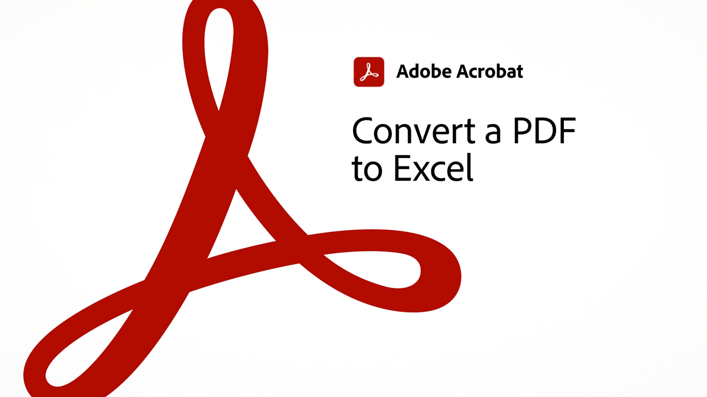
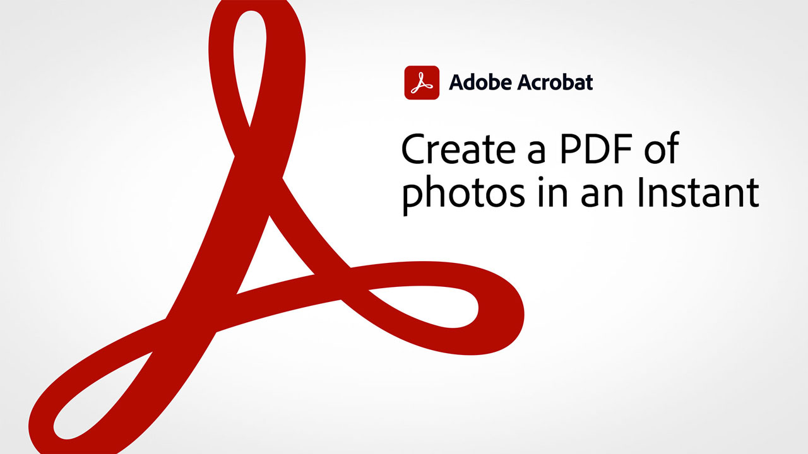

# 60 秒のAcrobatの概要

60 秒のAcrobatには、Acrobatの新しいトリックを 1 分以内に習得できる簡単なチュートリアルが用意されています。 これらのタスクベースのヒントを使用して、Acrobatの隠れた機能の一部をロック解除することで、PDFファイルを操作するための新しいスキルを身につけることができます。 1 つ目のチュートリアルで答えをすぐに見つけたり、5 つ目のチュートリアルで文書の生産性を高めたりしながら、コーヒーブレイクを楽しむ時間を確保できます。

## 60 秒のAcrobat tutorials

## 編集

<table style="table-layout:fixed">
<tr>
   <td>
    
    

    <a href="edit.md"><strong>Acrobat Web でのPDFの編集</strong></a>
    

    <em>PDFをダウンロードしなくても、テキストや画像を簡単に編集できます</em>
     
  </td>
  <td>
    
    

     <a href="textrecognition.md"><strong>スキャンした認識ファイルのテキストPDF</strong></a>
    

    <em>スキャンしたPDFを変換して、PDF</em>
     
  </td>
  <td>
    
    

    <a href="combine-to-one-pdf.md"><strong>ファイルを 1 つのPDFに</strong></a>
    

    <em>複数の異なる種類のファイルを 1 つのファイルに結合して、新規ドキュメントをすばやく作成するPDF</em>
     
  </td>
   <td>
    
    

    <a href="organize.md"><strong>ページを瞬時に整理</strong></a>
    

    <em>ページを整理ツールを使用して、PDFを俯瞰する方法を説明します</em>
     
  </td>
</tr>
<tr>
  <td>
    
    

    <a href="editphoto.md"><strong>PDFで写真を編集</strong></a>
    

    <em>Photoshopを使用して、PDFの写真に高度な編集を加える方法について説明します</em>
     
  </td>
  <td>
    
    

    <a href="editgraphic.md"><strong>PDF</strong></a>
    

    <em>Illustratorを使用して、PDFのグラフィックに高度な編集を加える方法について説明します</em>
     
  </td>
  <td>
      
        

         
  </td>
  <td>
      
        

         
  </td>
</tr>
</table>

## 変換

<table style="table-layout:fixed">
<tr>
  <td>
    
    

    <a href="convert-pdf-word.md"><strong>PDFを Word に変換</strong></a>
    

    <em>PDFファイルを完全に編集可能なMicrosoft Word 文書に変換</em>
     
  </td>
 <td>
    
    

    <a href="convert-pdf-excel.md"><strong>Excel へのPDFの変換</strong></a>
    

    <em>PDFファイルを完全に編集可能なMicrosoft Excel ドキュメントに変換する</em>
     
  </td>
  <td>
    
    

    <a href="convert-pdf-powerpoint.md"><strong>PowerPoint へのPDFの変換</strong></a>
    

    <em>PDFファイルを完全に編集可能なMicrosoft PowerPoint ドキュメントに変換する</em>
     
  </td>
  <td>
    
    

    <a href="exportwordphone.md"><strong>Export PDFから Word へ</strong></a>
    

    <em>Acrobatモバイル版アプリで、PDFファイルを編集可能なMicrosoft Word 文書に変換できます</em>
     
  </td>
</tr>
</table>

## 作成

<table style="table-layout:fixed">
<tr>
  <td>
    
    

     <a href="word-to-pdf.md"><strong>Microsoft Word からのPDFの作成</strong></a>
    

    <em>Microsoft Word からのPDFの作成</em>
     
  </td>
  <td>
    
    

     <a href="create-from-acrobat.md"><strong>AcrobatからのPDFの作成</strong></a>
    

    <em>AcrobatデスクトップPDF内で、Microsoft 365 ファイルからアプリケーションを作成できます</em>
     
  </td>
  <td>
    
    

     <a href="wordform.md"><strong>フォームフィールドを含むPDFに Word を変換する</strong></a>
    

    <em>Word のファイルとフォームをPDFに変換し、フォームフィールドを自動的に作成</em>
     
  </td>
  <td>
      
      

      <a href="photo.md"><strong>写真のPDFを瞬時に作成</strong></a>
      

      <em>複数のJPGをAcrobatアイコンにドラッグ&amp;ドロップするだけでPDFを作成できます</em>
       
  </td>
</tr>
<tr>
  <td>
    
    

    <a href="phone.md"><strong>スマートフォンで PPT ファイルをPDFに変換</strong></a>
    

    <em>PowerPoint の電子メールの添付ファイルをスマートフォンのPDFに変換する方法</em>
     
  </td>
  <td>
      
      

      <a href="optimize.md"><strong>効率的なPDFファイルの簡単な作成</strong></a>
      

      <em>Optimize PDFツールを使用して、PDFファイル</em>
       
  </td>
  <td>
      
        

         
  </td>
  <td>
      
        

         
  </td>
</tr>
</table>

## 署名

<table style="table-layout:fixed">
<tr>
  <td>
    
    

    <a href="sign.md"><strong>紙の文書に電子サインする</strong></a>
    

    <em>Adobe Scanを使用して印刷フォームに署名する方法について説明します。</em>
     
  </td>
  <td>
      
        

         
  </td>
  <td>
      
        

         
  </td>
  <td>
      
        

         
  </td>
</tr>
</table>

## 保護

<table style="table-layout:fixed">
<tr>
  <td>
    
    

    <a href="protect.md"><strong>パスワードでPDFファイルをProtect</strong></a>
    

    <em>PDFをProtectして、PDFを開くか編集するためにパスワードが必要となるようにする</em>
     
  </td>
  <td>
    
    

    <a href="redaction.md"><strong>墨消し：正しい方法</strong></a>
    

    <em>PDFから機密情報を削除する適切な方法</em>
     
  </td>
  <td>
      
        

         
  </td>
  <td>
      
        

         
  </td>
</tr>
</table>

## 共有とレビュー

<table style="table-layout:fixed">
<tr>
  <td>
    
    

    <a href="share-comment.md"><strong>注釈用のPDFを共有</strong></a>
    

    <em>ひとつのファイルで複数の人からPDFをすばやく収集し、フィードバックを共有する方法を説明します</em>
     
  </td>
  <td>
    
    

    <a href="share-comment-teams.md"><strong>Teams でのPDFファイルの共有とコメント</strong></a>
    

    <em>Microsoft Teams</em>
     
  </td>
  <td>
    
    

    <a href="summarize-comments.md"><strong>概要によるPDFコメントの解決</strong></a>
    

    <em>注釈ファイル内のすべての注釈とマークアップの概要を作成する方法についてPDFします</em>
     
  </td>
   <td>
    
    

    <a href="indesign.md"><strong>PDFコメントの読み込みInDesign</strong></a>
    

    <em>Acrobatの共有レビューの後に、PDFのコメントをInDesignに読み込む方法について説明します。</em>
     
  </td>
</tr>
</table>

## 準備

<table style="table-layout:fixed">
<tr>
  <td>
    
    

    <a href="accessible.md"><strong>AcrobatでアクセシブルなPDF</strong></a>
    

    <em>アクセス可能なPDFの確認</em>
     
  </td>
 <td>
    
    

    <a href="conform.md"><strong>標準形式にPDFを最適化する</strong></a>
    

    <em>PDF/X、PDF/A、PDF/E など、PDFの標準的な基準に照らしてPDFの内容を検証する方法を説明します</em>
     
  </td>
  <td>
      
        

         
  </td>
  <td>
      
        

         
  </td>
</tr>
</table>

## その他のトピック

<table style="table-layout:fixed">
<tr>
  <td>
    
    

     <a href="compare.md"><strong>PDF比較</strong></a>
    

    <em>Acrobatでファイルを比較ツールを使用して、2 つのPDFファイルの違いを確認する方法を説明します</em>
     
  </td>
 <td>
    
    

     <a href="search.md"><strong>複数のPDFファイルの一括検索</strong></a>
    

    <em>PDFファイルで検索を開始し、「詳細検索」を開いてフォルダーファイル全体をPDFします</em>
     
  </td>
  <td>
      
        

         
  </td>
  <td>
      
        

         
  </td>
</tr>
</table>