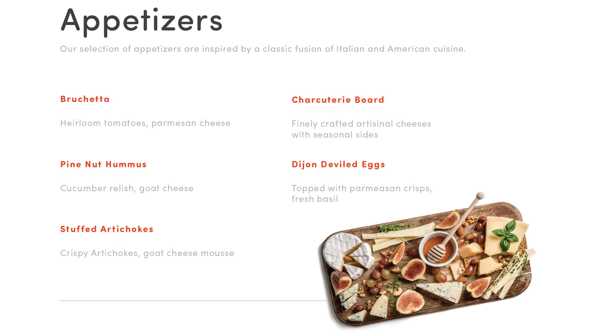

# 60秒のAcrobatの概要

60秒のAcrobatには、Acrobatで新しいトリックを1分以内に学ぶのに役立つ一口サイズのチュートリアルが用意されています。 これらのタスクベースのヒントは、Acrobatの隠れた機能のロックを解除することで、PDFファイルを操作するための新しいスキルを身に付けるのに役立ちます。 回答を素早く得るには1つ、文書の生産性を向上させるには5つ見ることができます。それでも、休憩を楽しむ時間はあります。

## 60秒のAcrobatチュートリアル

## 編集

<table style="table-layout:fixed">
<tr>
   <td>
    
    

    <a href="edit.md"><strong>Acrobat WebでPDFを編集</strong></a>
    

    Acrobat webで編集する方法を学ぶ
     
  </td>
  <td>
    
    

    <a href="textrecognition.md"><strong>スキャンしたPDFファイルのテキストを認識する</strong></a>
    

    スキャンした画像からテキストを認識する方法を学ぶ
     
  </td>
  <td>
    
    

    <a href="combine-to-one-pdf.md"><strong>ファイルを1つのPDFに結合</strong></a>
    

    ファイルを1つのPDFにすばやく結合する方法を説明します
     
  </td>
   <td>
    
    

    <a href="organize.md"><strong>スナップでページを整理する</strong></a>
    

    PDF内のページをすばやく整理する方法を説明します
     
  </td>
</tr>
<tr>
  <td>
    
    

    <a href="editphoto.md"><strong>PDF内の写真を編集する</strong></a>
    

    PDF内の写真を編集する方法を学ぶ
  </td>
  <td>
    
    

    <a href="editgraphic.md"><strong>PDF内のグラフィックを編集する</strong></a>
    

    PDFでグラフィックを編集する方法を学ぶ
  </td>
  <td>
      
        

         
  </td>
  <td>
      
        

         
  </td>
</tr>
</table>

## 変換

<table style="table-layout:fixed">
<tr>
  <td>
    
    

    <a href="convert-pdf-word.md"><strong>PDFをWordに変換</strong></a>
    

    PDFをWord形式に変換する方法を学ぶ
  </td>
 <td>
    
    

    <a href="convert-pdf-excel.md"><strong>PDFをExcelに変換</strong></a>
    

    PDFをExcel形式に変換する方法を説明します
  </td>
  <td>
    
    

    <a href="convert-pdf-powerpoint.md"><strong>PDFをPowerPointに変換</strong></a>
    

    PDFをPowerPoint形式に変換する方法
  </td>
  <td>
    
    

    <a href="exportwordphone.md"><strong>携帯電話からWordにExport PDF</strong></a>
    

    スマートフォンからWordにPDFを書き出す方法を説明します
  </td>
</tr>
</table>

## 作成

<table style="table-layout:fixed">
<tr>
  <td>
    
    

    <a href="word-to-pdf.md"><strong>Microsoft WordからPDFを作成</strong></a>
    

    Wordから直接PDFを作成する方法を学ぶ
  </td>
  <td>
    
    

    <a href="create-from-acrobat.md"><strong>AcrobatからPDFを作成</strong></a>
    

    Acrobat内からPDFを作成する方法について説明します
  <td>
    
    

    <a href="wordform.md"><strong>Wordをフォームフィールドを含むPDFに変換</strong></a>
    

    WordファイルをPDFに変換し、フォームフィールドを自動生成する
  </td>
  <td>
    
    

    <a href="photo.md"><strong>瞬時に写真のPDFを作成する</strong></a>
    

    複数の写真のPDFの作成
  </td>
</tr>
<tr>
  <td>
    
    

    <a href="phone.md"><strong>携帯電話でPPTファイルをPDFに変換</strong></a>
    

    PowerPointファイルをスマートフォンのPDFに変換
  </td>
  <td>
    
    

    <a href="optimize.md"><strong>スナップでより効率的なPDFファイルを作成する</strong></a>
    

    PDFファイルを簡単に最適化
  </td>
  <td>
      
        

         
  </td>
  <td>
      
        

         
  </td>
</tr>
</table>

## 署名

<table style="table-layout:fixed">
<tr>
  <td>
    
    

    <a href="sign.md"><strong>紙の文書に電子サインを行う</strong></a>
    

    紙の文書に電子サインする方法を説明します。
  </td>
  <td>
      
        

         
  </td>
  <td>
      
        

         
  </td>
  <td>
      
        

         
  </td>
</tr>
</table>

## 保護

<table style="table-layout:fixed">
<tr>
  <td>
    
    

    <a href="protect.md"><strong>PDFファイルをパスワードでProtectする</strong></a>
    

    パスワードでPDFを保護する方法を説明します
  </td>
  <td>
    
    

    <a href="redaction.md"><strong>墨消し：正しい方向</strong></a>
    

    PDFの機密情報を適切な方法で墨消しする方法を説明します
  </td>
  <td>
      
        

         
  </td>
  <td>
      
        

         
  </td>
</tr>
</table>

## 共有とレビュー

<table style="table-layout:fixed">
<tr>
  <td>
    
    

    <a href="share-comment.md"><strong>コメント用にPDFを共有</strong></a>
    

    他のユーザーがコメントできるようにPDFを共有する方法
  </td>
  <td>
    
    

    <a href="share-comment-teams.md"><strong>TeamsでPDFファイルを共有してコメントを追加する</strong></a>
    

    Microsoft TeamsでのPDFファイルの共有とコメント
  </td>
  <td>
    
    

    <a href="summarize-comments.md"><strong>PDFのコメントを「要約」と並べ替える</strong></a>
    

    すべてのコメントを1つのPDFにまとめる
  </td>
   <td>
    
    

    <a href="indesign.md"><strong>PDFのコメントをInDesignに読み込む</strong></a>
    

    PDFのすべてのコメントをInDesignする方法を説明します。
  </td>
</tr>
</table>

## ダウンロードの準備

<table style="table-layout:fixed">
<tr>
  <td>
    
    

    <a href="accessible.md"><strong>アクセス可能なPDFの作成をAcrobatに依頼</strong></a>
    

    PDFに世界中からアクセスできるようにする方法を説明します
  </td>
 <td>
    
    

    <a href="conform.md"><strong>PDFを標準の書式に準拠させる</strong></a>
    

    PDFを特定の標準に準拠させる方法を学ぶ
  </td>
  <td>
      
        

         
  </td>
  <td>
      
        

         
  </td>
</tr>
</table>

## その他のトピック

<table style="table-layout:fixed">
<tr>
  <td>
    
    

    <a href="compare.md"><strong>PDF比較で相違点を見つける</strong></a>
    

    2つのPDFの違いをすばやく比較する方法を説明します
  </td>
 <td>
    
    

    <a href="search.md"><strong>一度に複数のPDFファイルを検索する</strong></a>
    

    複数のPDFファイルを検索する方法
  </td>
  <td>
      
        

         
  </td>
  <td>
      
        

         
  </td>
</tr>
</table>