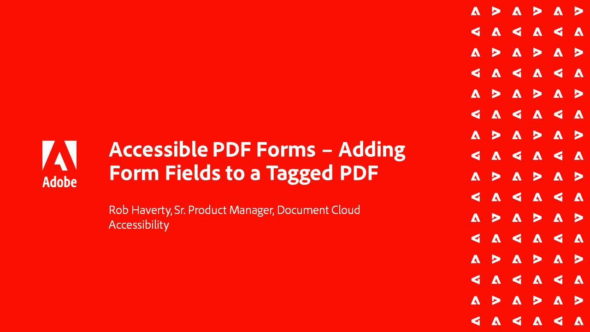

# Acrobatアクセシビリティシリーズ

この6つのパートで構成されるオンデマンドウェビナーシリーズでは、アクセシビリティの基本から、PDFファイルのタグ付けの詳細へと進みます。 各セッションには、練習用のファイルが用意されています。

<table style="table-layout:fixed">
<tr>
  <td>
    
    

    <a href="accessibilitysession1.md"><strong>PDFのアクセシビリティの概要</strong></a>
    

    <em>このオンデマンドセッションでは、PDFをアクセス可能にする方法、アクセス可能なPDFで動作するようにAcrobat Proを設定する方法、およびソース文書からPDFへの変換プロセスについて説明します</em>
     
  </td>
  <td>
    
    

    <a href="accessibilitysession2.md"><strong>アクセスできないPDFを修復しています</strong></a>
    

    <em>このオンデマンドセッションでは、Word文書を変換するワークフロー、および概要ウェビナーで示されたAcrobat Proツールを使用して基本的なタグ付けの問題を修正するワークフローについて学習します</em>
     
  </td>  
  <td>
    
    

    <a href="accessibilitysession3.md"><strong>複合テーブル</strong></a>
    

    <em>このオンデマンドセッションでは、アクセシビリティのPDFを修正する際に発生する、より一般的で困難な問題の1つ、複雑なテーブルを扱います</em>
     
  </td>
</tr>
<tr>
  <td>
    
    

    <a href="accessibilitysession4.md"><strong>スキャンされた文書と複雑なリスト</strong></a>
    

    <em>このオンデマンドセッションでは、スキャンされた文書や複雑なリストなど、頻繁に発生する、より複雑な問題が解決されます</em>
     
  </td>
  <td>
    
    

    <a href="accessibilitysession5.md"><strong>タグ付きPDFにフォームフィールドを追加しています</strong></a>
    

    <em>このオンデマンドセッションでは、以前にタグ付けされたPDFにフォームフィールドを追加します</em>
     
  </td>  
  <td>
    
    

    <a href="accessibilitysession6.md"><strong>タグなしPDFにフォームフィールドを追加しています</strong></a>
    

    <em>このオンデマンドセッションでは、手動フォームフィールドおよび追加のフォームフィールドプロパティの作成について詳しく説明します</em>
     
  </td> 
</tr>
</table>
