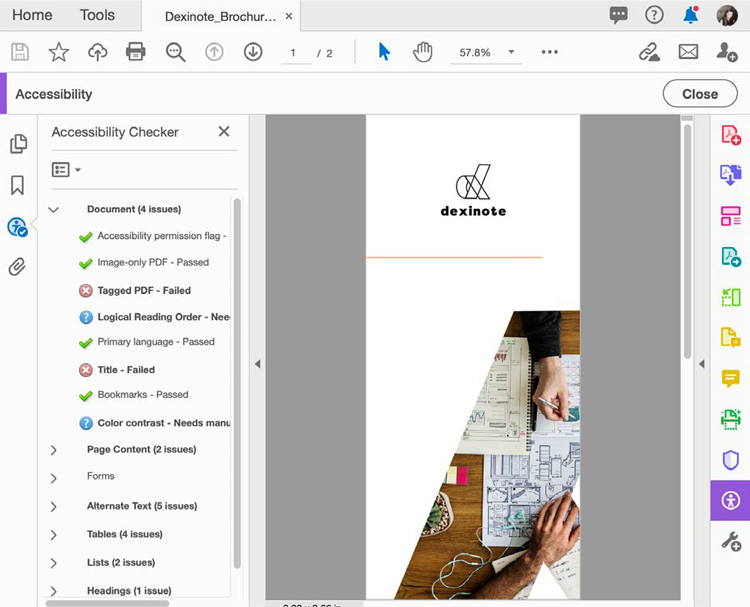

# Check PDF accessibility

Learn how to check if your PDF is universally accessible to people with disabilities. これには、運動障害、視覚障害、低視力、聴覚障害、難聴、または認知障害を持つ人々によるアクセスが含まれます。

>[!NOTE]
>
>Acrobat Pro DCでのみ使用できます。

## アクセシビリティチェック

1. 選択 **[!UICONTROL アクセシビリティ]** を選択します。

   

1. 選択 **[!UICONTROL アクセシビリティチェック]** をクリックします。

   

1. ドロップダウンからカテゴリを選択し、チェックリストから項目を選択します。

   完全なレポートを作成するには、すべてのチェックボックスをオンのままにします。

1. 選択 **[!UICONTROL チェック開始]** 」をクリックしてレポートを開始します。

   

   左側のナビゲーションパネルが開き、レポートの結果が表示されます。 Expand a section to see the details.

   

また、 [!UICONTROL アクセシブルにする] 」アクションを「 [Action Wizard](https://experienceleague.adobe.com/docs/document-cloud-learn/acrobat-learning/advanced-tasks/action.html) 」ツールを使用します。このツールでは、基本的な一連の手順を実行して、アクセシブルなPDFを作成します。

## アクセシビリティの問題の修正

In the accessibility report window, right-click on an item to bring up the context menu. The context menu for any item that failed the accessibility check gives you the option to fix the issue.

>[!NOTE]
>
>Some issues cannot be fixed automatically and need your manual intervention to correct the problem. そのような場合は、>Acrobatにより、修正内容を示すダイアログボックスが表示されます。

Select the PDF icon to download the *Check PDF accessibility* tutorial.

.
