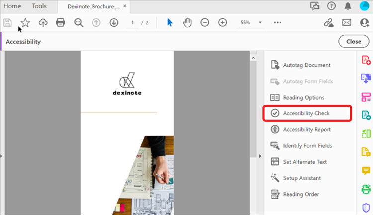

# アクセシブルなPDFファイルの準備

既存のアクセシビリティファイルのアクセシビリティをチェックする方法についてPDFします。 この **[!UICONTROL 完全チェック/アクセシビリティチェック]** ツールを使用して、文書がPDF/UA や WCAG 2.0 などのアクセシビリティ標準に準拠しているかどうかを確認します。 **[!UICONTROL アクセシビリティレポート]** に、アクセシビリティチェックの結果をまとめます。

>[!NOTE]
>
>Acrobat Pro DCでのみ使用できます。

## Acrobat Pro DC [!UICONTROL アクセシビリティチェック] （完全チェック）

1. Acrobat Pro DCで、 **[!UICONTROL アクセシビリティ]** を選択します。

   

1. 右側のパネルで、「 **[!UICONTROL 完全チェック]**&#x200B;を選択します。

   

1. ダイアログボックスで、ドロップダウンからカテゴリを選択し、チェックリストから項目を選択します。

   完全なレポートを作成するには、すべてのチェックボックスをオンのままにします。

1. クリック **[!UICONTROL チェック開始]** 」をクリックしてレポートを開始します。

   

   左側のナビゲーションパネルが開き、レポート結果が表示されます。

1. セクションを展開して詳細を表示します。

   

また、 [!UICONTROL アクセシブルにする] 」アクションを「 [Action Wizard](https://experienceleague.adobe.com/docs/document-cloud-learn/acrobat-learning/advanced-tasks/action.html) 」ツールを使用して、アクセシブルなツールを作成するための基本的な手順をPDFします。

## アクセシビリティの問題の修正

アクセシビリティレポートウィンドウで、項目を右クリックしてコンテキストメニューを表示します。 アクセシビリティチェックに失敗したアイテムのコンテキストメニューには、問題を修正するオプションが表示されます。

*注意：一部の問題は自動的に修正されず、問題を修正するには手動での操作が必要です。 そのような場合、Acrobatは、修正内容を示すダイアログボックスを表示します。*

をクリックして、 *アクセシブルなPDFファイルの準備* チュートリアル

を選択します。
