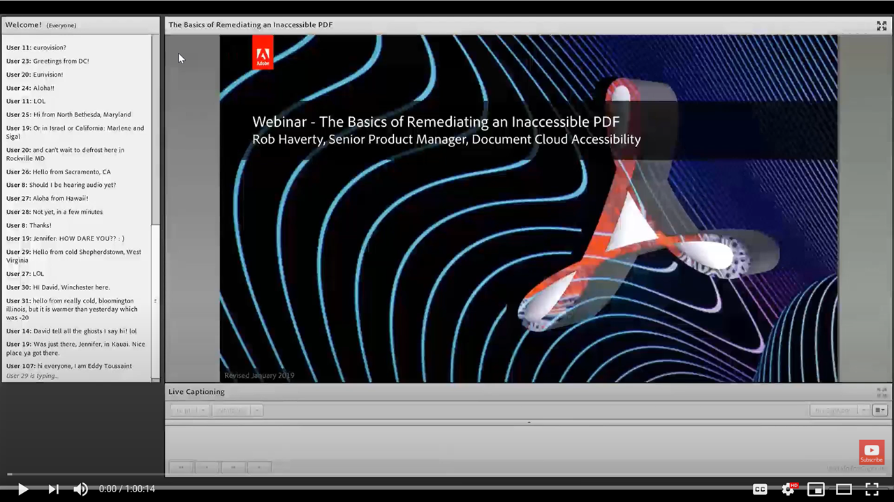

# アクセスできないPDFの修復

このオンデマンドセッションでは、Word文書を変換するワークフロー、および概要ウェビナーで示されたAcrobat Pro（PremiumまたはStudio）ツールを使用して基本的なタグ付けの問題を修正するワークフローについて学習します。

[ここ](../assets/accessibilitysession2.zip)をクリックして、ハンズオンセッションファイルのzipフォルダーをダウンロードします。

画像を選択して、別のブラウザータブにビデオを表示します。

{target="_blank"}
