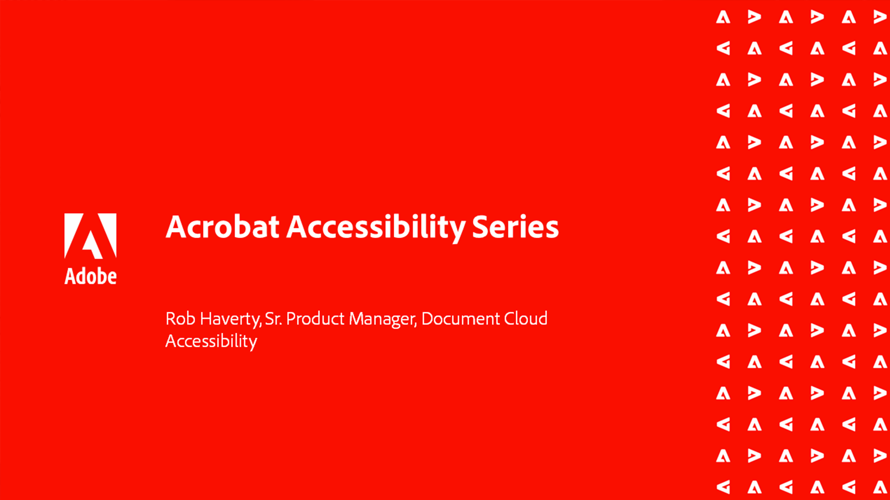

# 高度なタスクの概要

Acrobatの高度なツールで基本を超えることができます。 日常的な作業の繰り返し、機密情報の削除、大きなファイルの削減と最適化、フォームデータの迅速な収集、ユニバーサルアクセスが可能なPDFファイルの作成などを行うアクションを作成する方法について説明します。

## 新機能

* [SEO （検索エンジン最適化）のOptimize PDF](optimizeseo.md)
PDFを最適化して、検出可能性と検索エンジンのランキングをweb上で向上させる方法を説明します

## 高度なタスクチュートリアル

<table style="table-layout:fixed">
<tr>
  <td>
    
  </td>
  <td>
    
  </td>
  <td>
    
  </td>
  <td>
    
  </td>
</tr>
<tr>
 <td>
    
  </td>
  <td>
    
  </td>
  <td>
    
  </td>
 <td>
    
  </td>
</tr>
<tr>
  <td>
    
  </td>
  <td>
    
  </td>
 <td>
    
  </td>
  <td>
    
  </td>
</tr>
<tr>
 <td>
    
  </td>
 <td>
    
  </td>
  <td>
   
    

     
  </td> 
  <td>
   
    

     
  </td>  
</tr>
</table>
