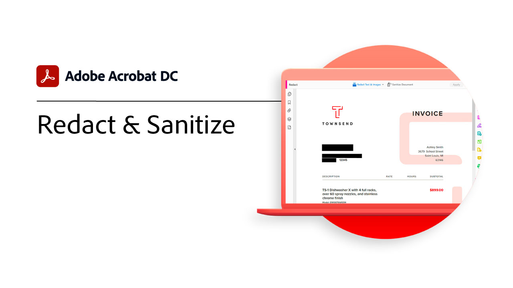

# 高度なタスクの概要

Acrobatの高度なツールで、さらに高度な編集が可能です。 日常的な作業の繰り返し、機密情報の削除、大きなファイルの削減と最適化、フォームデータの迅速な収集、ユニバーサルアクセス可能なPDFファイルの作成などを行うアクションの作成方法を説明します。

## 新機能

* [SEO(Search Engine Optimization) のOptimize PDF](optimizeseo.md)
Web 上での検索可能性と検索エンジンのランキングを向上させるためにPDFを最適化する方法について説明します

## 高度なタスクチュートリアル

<table style="table-layout:fixed">
<tr>
  <td>
    
    

    <a href="bookmarks.md"><strong>ブックマークとハイパーリンクの追加</strong></a>
    

    <em>ブックマークとハイパーリンクを追加して、ナビゲーションとインタラクションを改善する方法について説明します</em>
     
  </td>
  <td>
    
    

    <a href="optimizescan.md"><strong>スキャンした文書の最適化</strong></a>
    

    <em>スキャンした文書を補正して、表示や検索の操作性を向上させるPDFの方法について説明します</em>
     
  </td>
  <td>
    
    

    <a href="custom.md"><strong>カスタムコマンドとツール</strong></a>
    

    <em>カスタムコマンドとツールを使用して、文書ワークフローの生産性を向上</em>
     
  </td>
  <td>
    
    

    <a href="advancedforms.md"><strong>高度なフォームフィールド</strong></a>
    

    <em>プロフェッショナルなPDF forms</em>
     
  </td>
</tr>
<tr>
 <td>
    
    

    <a href="optimizeseo.md"><strong>SEO(Search Engine Optimization) のOptimize PDF</strong></a>
    

    <em>PDFを最適化して、Web 上での検出可能性と検索エンジンのランキングを向上</em>
     
  </td>
  <td>
    
    

    <a href="workforms.md"><strong>フォームフィールドの操作</strong></a>
    

    <em>様々なタイプのフォームフィールドの追加、フォームフィールドプロパティの設定、セキュリティの追加をおこなって、高品質でプロフェッショナルなフォームを作成できます</em>
     
  </td>
  <td>
    
    

    <a href="enhance.md"><strong>PDF</strong></a>
    

    <em>グラフィックの機能強化や自動番号付けを追加して、PDFを一変させましょう</em>
     
  </td>
 <td>
    
    

    <a href="compare.md"><strong>2 つのPDFの違いを検出</strong></a>
    

    <em>2 つのファイル間の差異をすばやく正確にPDFする</em>
     
  </td>
</tr>
<tr>
  <td>
    
    

    <a href="action.md"><strong>Action Wizard</strong></a>
    

    <em>アクションを使用して一連のコマンドを 1 つまたは複数のファイルに自動的に適用することで、時間とキーストロークを節約できます</em>
     
  </td>
  <td>
    
    

    <a href="redact.md"><strong>墨消しと削除</strong></a>
    

    <em>個人情報や機密情報をPDFから完全に削除</em>
     
  </td>
 <td>
    
    

    <a href="reduce.md"><strong>ファイルサイズの縮小と最適化</strong></a>
    

    <em>共有、投稿、アーカイブの品質を損なうことなく、大きなファイルを削減し、PDFを最適化できます</em>
     
  </td>
  <td>
    
    

    <a href="formdata.md"><strong>フォームデータの操作</strong></a>
    

    <em>フォームデータを単一のスプレッドシートにコンパイル</em>
     
  </td>
</tr>
<tr>
 <td>
    
    

    <a href="accessibility.md"><strong>アクセシビリティPDFのチェック</strong></a>
    

    <em>障害を持つユーザーがPDFに誰もがアクセスできるかどうかを確認する</em>
     
  </td>
 <td>
    
    

    <a href="accessibility-series.md"><strong>Acrobat Accessibility series</strong></a>
    

    <em>この 6 部構成のオンデマンド型オンラインセミナーシリーズでは、アクセシビリティの基本からPDFファイルのタグ付けまで網羅しています</em>
     
  </td>
  <td>
   
    

     
  </td> 
  <td>
   
    

     
  </td>  
</tr>
</table>
