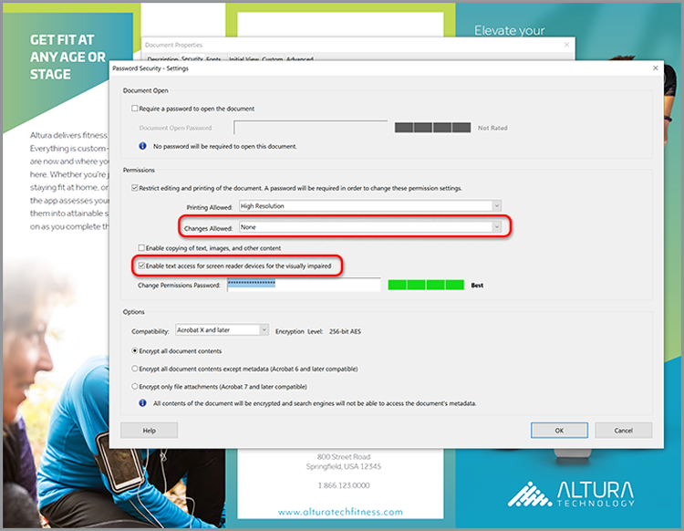

# SEO（検索エンジン最適化）のOptimize PDF

PDFを最適化して、web上での検出可能性と検索エンジンのランキングを向上させる方法について説明します。

## 1.固有のコンテンツを作成する

Webページ上のPDFとは異なる情報コンテンツを作成します。

+++固有のコンテンツを作成する方法の詳細を表示

PDFコンテンツは一意であり、次のように構造化されている必要があります。

* キーワードで始まる単一の主見出し/タイトルを使用する
* 階層構造で編成されたキーワード小見出しを使用する
* キーワードとリストを含む短い段落を使用する
* ハイパーリンクを使用してwebサイトやその他のwebサイトに内部および外部のコンテンツを追加する
* 25ページを超えるドキュメントのハイパーリンクされた目次の追加
* スキャンしたすべての文書に対して[テキスト認識](https://experienceleague.adobe.com/en/docs/document-cloud-learn/acrobat-learning/getting-started/scan-and-ocr)を実行する
* モバイル対応のPDFを構築
PDFのモバイル表示エクスペリエンスを確認するには、[Acrobat Readerモバイルアプリ](https://www.adobe.com/acrobat/mobile/acrobat-reader.html)でファイルを開き、Liquid Modeをオンにします。 必要に応じて、ナビゲーションを向上させるために追加の小見出しを含めます。

  

+++

  

## 2.ドキュメントプロパティを追加する

PDFファイルには、webページと同様に、タイトルとメタ説明が含まれます。

+++文書のプロパティを追加する方法の詳細を表示

キー&#x200B;**[!UICONTROL 文書のプロパティ]**&#x200B;を次のように追加します：

1. **[!UICONTROL ファイル/プロパティ]**&#x200B;を選択するか、キーボードショートカット&#x200B;*Ctrl + D* (Windows)または&#x200B;*Cmd + D* (Mac)を使用して、「**[!UICONTROL 説明]**」タブを選択します。
1. **[!UICONTROL タイトル：]**&#x200B;フィールドに、キーワードに最適化されたタイトルを入力します。
1. **[!UICONTROL 作成者：]**&#x200B;フィールドで、組織内の特定の個人が識別されていないことを確認してください。
1. ドキュメントのキーワードに最適化された概要を&#x200B;**[!UICONTROL 件名：]**フィールドに入力します。
学習、発見、探索など、行動を明確に示す動詞を使用して、概要の作成を試みます。
1. **[!UICONTROL 追加のメタデータ]**&#x200B;を選択し、必要に応じて著作権またはパブリックドメインの情報を追加します。

   

+++

  

## &#x200B;3. PDFにタグを付ける

PDF内のコンテンツをタグ付けすると、障害を持つユーザーがファイル[にアクセス可能](https://experienceleague.adobe.com/en/docs/document-cloud-learn/acrobat-learning/accessibility-tutorials/accessibility-overview)になるだけでなく、SEOも向上します。

+++PDFにタグを付ける方法の詳細を表示

次のようにPDFにタグを付けます。

1. **[!UICONTROL ツール]**&#x200B;センターで&#x200B;**[!UICONTROL アクセシビリティ]**&#x200B;を選択します。
1. 右側のパネルで「**[!UICONTROL 文書に自動タグ付け]**」を選択します。
1. 左側のペイン&#x200B;**[!UICONTROL 認識レポート]**&#x200B;で、修復のヒントに従います。
1. 必要に応じて&#x200B;**[!UICONTROL 代替テキストの設定]**&#x200B;を実行します。
1. キーワードを使用して、**[!UICONTROL 代替テキスト]**&#x200B;で画像を説明します。

   

+++

>[!NOTE]
>
>Acrobat Pro、Premium、Studioのみで使用できます。

  

## &#x200B;4. Web用に準備する

PDFをWeb表示用に準備し、[PDFのファイルサイズを小さくして](https://www.adobe.com/jp/acrobat/online/compress-pdf.html){target="_blank"}最適化します。

+++Web用にPDFを準備する方法の詳細

Web用にPDFを準備するには、次の手順を実行します。

Web用にPDFを準備するには、**[!UICONTROL ファイル/その他の形式で保存/PDFのサイズを縮小]**&#x200B;を選択します。

この手順を実行すると、ファイルサイズが小さくなり、PDF内の&#x200B;**高速Webビュー**&#x200B;が有効になります。 **Web表示用に最適化**&#x200B;を使用すると、ファイル全体をストリーミングまたはダウンロードする前に、ファイルを直ちに開いて表示し、検索することができます。これにより、最適なエンドユーザーエクスペリエンスが実現します。 **[!UICONTROL 文書のプロパティ]**&#x200B;を開き(*WindowsではCtrl + D*、Macでは&#x200B;*Cmd + D*)、**高速Webビュー**&#x200B;が有効かどうかを確認します。

>[!TIP]
>
>Acrobat Pro（PremiumまたはStudio）を使用している場合は、Action Wizardツールで「 Webおよびモバイル用に最適化」を実行します。 この操作により、カラーがsRGBに変換され、フォントが埋め込まれ、ブラウザーやモバイルデバイス間でPDFの表示が統一されます。

+++

  

## 5.キーワードファイル名を作成する

+++キーワードファイル名の作成方法の詳細を表示する

次のように、キーワードファイル名を作成します。

PDFがWebに公開されると、ファイル名がURLの一部になります。 キーワードに最適化したタイトルをファイル名に一致させることをお勧めします。 検索に適した名前にするには、小文字を使用し、句読点やハッシュを使用せず、ストップワード（a、an、the、and、it、for、or、but、in、your、our、theyなど）を避けます。 別の単語を使用する場合は、単語間にハイフンまたはアンダースコアを追加します。

+++

  

## &#x200B;6. PDFの保護

最後に、承認されていない変更を防ぐために、[お使いのPDFを保護](https://www.adobe.com/jp/acrobat/online/password-protect-pdf.html){target="_blank"}します。

+++PDFを保護する方法の詳細を表示

次のようにPDFを保護します。

1. **[!UICONTROL 文書のプロパティ]** (Windowsでは&#x200B;*Ctrl + D*、Macでは&#x200B;*Cmd + D*)を開き、「**[!UICONTROL セキュリティ]**」タブを選択します。
1. **[!UICONTROL ドキュメントの印刷と編集を確認してください。 これらの設定を変更するにはパスワードが必要です。]**
1. [**[!UICONTROL 許可された変更：]**]で、[**[!UICONTROL なし]**]を選択します。
1. **[!UICONTROL 「スクリーンリーダーデバイスのテキストアクセスを有効にする」をオンにして、視覚障害者をサポートします。]**
1. 強力なパスワードを入力して確認します。
1. 「**[!UICONTROL OK]**」を選択し、ファイルを保存します。

   

+++

これで、PDFをweb上に公開する準備が整いました。キーワードのランキングが最適になり、エンドユーザーとの対話が可能になります。
