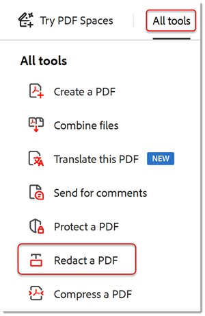

# 墨消しと非表示情報

墨消しツールを使用して、個人情報や機密情報をPDFから完全に削除する方法について説明します。 非表示情報ツールを使用して、コメント、メタデータ、非表示レイヤーなど、ファイルに表示されない情報を削除します。

>[!NOTE]
>
>Acrobat Proでのみ利用可能です。

[!BADGE 組織への影響]
お客様のデータ保護、リスク管理

## テキストと画像を墨消し

1. **[!UICONTROL 墨消し]**&#x200B;を[!UICONTROL ツール]中央または右側のパネルから選択します。

   を墨消し

1. 「**[!UICONTROL テキストと画像を墨消し]** **>** **[!UICONTROL プロパティ]**」を選択して、墨消しボックスの色やテキストオーバーレイなど、墨消しの外観をカスタマイズします。

   を墨消し

情報を墨消しするには、最初に項目を削除対象としてマークしてから、墨消しを適用します。 ページ全体または選択したコンテンツを墨消しできます。

1. **[!UICONTROL 「ページを墨消し」]**&#x200B;を選択し、墨消しするページまたはページ範囲を選択して、「**[!UICONTROL OK]**」を選択します。

   を墨消し

または、カーソルを使用して、墨消しするコンテンツを選択します。 選択したコンテンツの上にカーソルを置くと、墨消しのプレビューが表示されます。

   

1. **[!UICONTROL テキストと画像を墨消し]** **>** **[!UICONTROL テキストと墨消しを検索]**&#x200B;を選択して、墨消しする特定のコンテンツを検索します。

検索ボックスを使用して、特定の単語または語句を検索します。

1. **[!UICONTROL パターン]**&#x200B;を選択して特定の種類を検索します of 情報を入力し、チェックボックスをオンにして、**[!UICONTROL テキストの検索と削除]**&#x200B;を選択します。

   

1. [!UICONTROL 墨消し]の上部メニューで「**[!UICONTROL 適用]**」を選択して、マークされた墨消しを適用し、墨消しされたファイルを保存します。

   を墨消し

## 非表示情報をすべて削除

1. [!UICONTROL 墨消し]の上部メニューで「**[!UICONTROL 非表示情報をすべて削除]**」を選択します。

1. 「**[!UICONTROL OK]**」を選択して、非表示の情報の削除を確認します。 または、**[!UICONTROL ここをクリック]**&#x200B;して、非表示の情報を選択して削除します。

   

>[!TIP]
>
>墨消しプロセスを高速化するには、[Action Wizard](../advanced-tasks/action.md)を確認してください。

>[!TIP]
>
>このビデオは、Experience Leagueで無料で利用できる再生リスト[Adobe Acrobatで高度なタスクを実行](https://experienceleague.adobe.com/en/playlists/acrobat-peform-advanced-tasks)の一部です。
