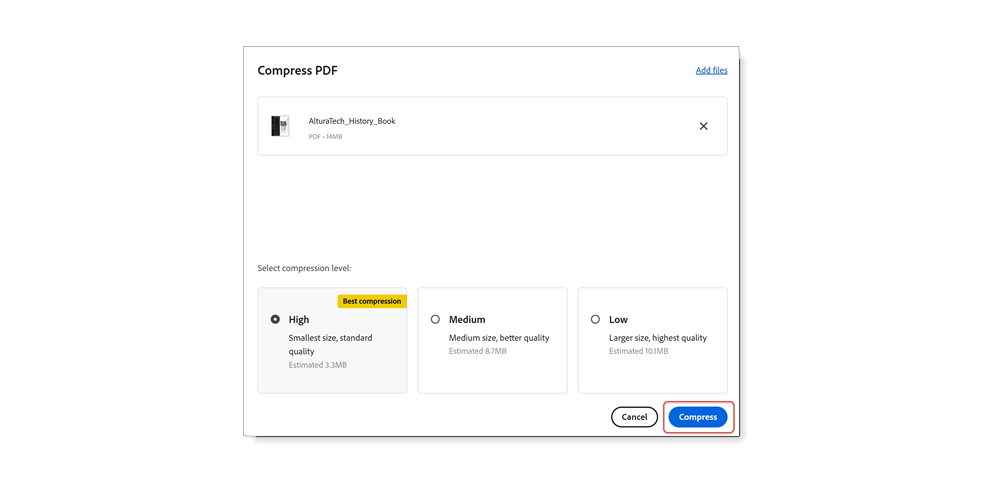

# ファイルサイズの縮小と最適化

共有、投稿、アーカイブの品質を損なうことなく、大きなファイルを削減し、PDFを最適化できます。

>[!NOTE]
>
>Acrobat Proでのみ使用できます。

1. 選択 **[!UICONTROL Optimize PDF]** 」を [!UICONTROL ツール] 中央または右側のパネル

   

1. 選択 **[!UICONTROL ファイルサイズを縮小]** を選択し、1 つのファイルを縮小するか、複数のファイルを縮小するかを選択します。

   ファイルは、ドキュメントの品質を維持しながら、できるだけ小さなサイズに縮小されます。

   

1. 選択 **[!UICONTROL 高度な最適化]**&#x200B;を選択し、最適化オプションのオプションからPDFします。

   

1. 選択 **[!UICONTROL 標準]** 」を **[!UICONTROL 設定]** メニューを使用して初期設定を使用します。

   **[!UICONTROL PDF の最適化]**&#x200B;ダイアログボックスで設定を変更すると、**プリセット**&#x200B;メニューは自動的に「**カスタム**」に切り替わります。

1. 選択 **[!UICONTROL 既存を保持]** 」を **[!UICONTROL 互換性を持たせる]** メニューを使用して、現在のPDFバージョンを維持するか、特定のAcrobatバージョンを選択します。

1. パネル（画像、フォント、透明度など）の横にあるチェックボックスをオンにして、そのパネルでオプションを選択します。

   

   最適化中にパネル内のすべてのオプションが実行されないようにするには、そのパネルのチェックボックスの選択を解除します。

1. **（オプション）** 選択 **[!UICONTROL 保存]** を選択し、現在の設定に名前を付けてカスタム選択を作成します。 保存した設定を削除するには、 **設定** メニューから **削除**&#x200B;を選択します。

   

>[!TIP]
>
>複数のPDFファイルを最適化するには、 [Action Wizard](../advanced-tasks/action.md)を選択します。

PDFアイコンを選択して、 *ファイルサイズの縮小と最適化* チュートリアル

を選択します。
