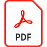

# ファイルサイズの縮小と最適化

共有、投稿、アーカイブの品質を損なうことなく、大きなファイルを削減し、PDFを最適化できます。

>[!NOTE]
>
>Acrobat Pro DCでのみ使用できます。

1. Acrobat Pro DCで、 **[!UICONTROL Optimize PDF]** 」を [!UICONTROL ツール] 中央またはペイン

   

1. 選択 **[!UICONTROL ファイルサイズを縮小]** を選択し、1 つのファイルを縮小するか、複数のファイルを縮小するかを選択します。

   ファイルは、文書の品質を維持しながら、できるだけ小さなサイズに縮小されます。

   

1. ファイルを最適化するには、 **[!UICONTROL 高度な最適化]**&#x200B;を選択します。 次に、オプションオプティマイザーのオプションからPDFします。

   

1. 初期設定を使用するには、 **[!UICONTROL 標準]** 」を **[!UICONTROL 設定]** を選択します。

設定は **[!UICONTROL PDFの最適化]** ダイアログボックスで、 **設定** メニューが **カスタム**&#x200B;を選択します。

1. **互換性を確保**&#x200B;メニューから「**既存を保持**」を選択して現在の PDF バージョンを維持するか、または Acrobat のバージョンを選択しますパネル（画像、フォント、透明など）の隣にあるチェックボックスを選択して、そのパネルのオプションを選択します。最適化中にパネル内のすべてのオプションが実行されないようにするには、そのパネルのチェックボックスの選択を解除します。

   

1. **（オプション）** カスタマイズした設定を保存するには、「 **保存** を選択し、設定に名前を付けます。 保存した設定を削除するには、 **設定** 」メニューをクリックし、「 **削除**&#x200B;を選択します。

   

>[!TIP]
>
>複数のPDFファイルを最適化するには、 [Action Wizard](../advanced-tasks/action.md)を選択します。

をクリックして、 *ファイルサイズの縮小と最適化* チュートリアル

を選択します。
