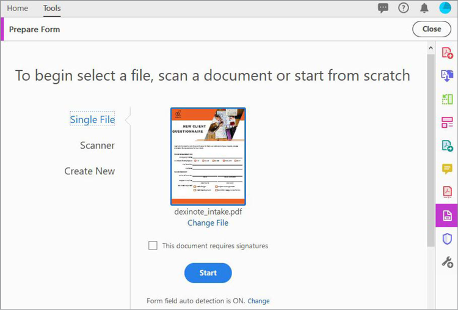

# 入力可能なフォームの作成

InDesign、Microsoft Word、Excel、またはその他のアプリケーションで作成されたスキャン済みの用紙フォームまたはドキュメントを、Acrobat DCで入力可能なPDFフォームに変換します。

1. [!UICONTROL ツール]の中から&#x200B;**[!UICONTROL フォームの準備]**&#x200B;を選択します。

   

1. フォームとして使用する既存のドキュメント（Word、Excel、InDesign、PDFファイルなど）を選択します。

   [!UICONTROL フォームフィールドの自動検出]がオンの場合、AcrobatはPDF内のフォームフィールドを自動的に検出します。

1. [**[!UICONTROL 開始]**]をクリックして、フォームを作成します。

   

   次のオプションを使用して、フォームを編集します。 トップ・メニュー・バーからフィールドをドラッグ・アンド・ドロップし、右ペインでフォーム・フィールドの詳細を編集します。

1. [**[!UICONTROL プレビュー]**]をクリックして、フィールドを追加した後にフォームを表示します。

   

   **[!UICONTROL 編集]**&#x200B;に簡単に戻り、作業を続けます。

   

1. **[!UICONTROL ファイル>名前を付けて保存]**&#x200B;をクリックして、PDFフォームを保存します。

クリックすると、「*入力可能なフォームの作成*」チュートリアルのPDFがダウンロードされます。

[! [入力可能なフォームの作成のチュートリアルをダウンロード](../assets/acrobat_PDF_96.png)](../assets/AcrobatDCForms.pdf)
