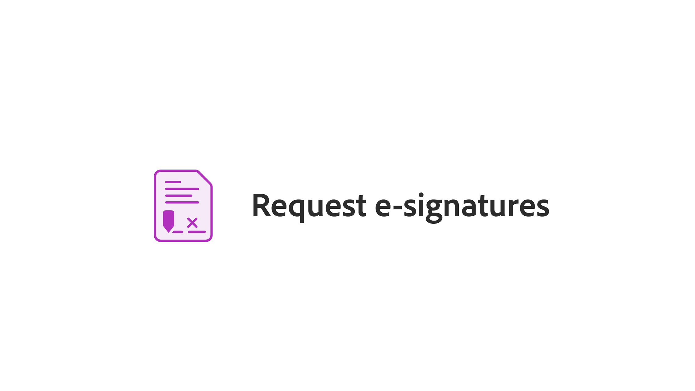

# はじめに/概要

Adobe Acrobatの使い方を説明する簡単なチュートリアルを利用してください。 文書の作成からPDFファイルの保護または[編集](https://www.adobe.com/jp/acrobat/online/pdf-editor.html){target="_blank"}まで、このコンテンツはPDFのワークフローを容易にするためのものです。 Acrobatの使用を開始するには、厳選されたこの[再生リスト](https://experienceleague.adobe.com/en/playlists/acrobat-get-started-business-users)を参照してください。

## 新機能

>[!BEGINTABS]

>[!TAB リアルタイムの共同作業]

効率性を向上させるだけでなく、コンテンツの品質も向上させるドキュメント[レビュープロセス](collaborate.md)を作成する方法を説明します。

>[!TAB 新しいページをデザインする]

Adobe Expressを使用して、PDFーで[新しいページをデザイン](add-custom-page.md)する方法を説明します。

>[!TAB PDFのグラフィックを編集する]

PDFで[グラフィックを作成、編集、拡張](edit-graphics.md)する方法を説明します。

>[!TAB 新しいワークスペースエクスペリエンス]

Acrobatの[新しいワークスペース](new-workspace.md)について説明します。このワークスペースを使用すると、ツールをすばやく見つけて、PDF作業を効率的に行うことができます。

>[!ENDTABS]

## 入門チュートリアル

## チュートリアルの作成、結合、整理

<!-- START CARDS HTML - DO NOT MODIFY BY HAND -->

    

        

            

                <figure class="image x-is-16by9">
                    
                </figure>
            

            

                

                    

                        <a href="https://experienceleague.adobe.com/en/docs/document-cloud-learn/acrobat-learning/getting-started/create-pdf" target="_blank" rel="referrer" title="PDFファイルの作成">PDF ファイルの作成</a>
                    

                    
あらゆる種類の文書からPDFを作成する

                

                <a href="https://experienceleague.adobe.com/en/docs/document-cloud-learn/acrobat-learning/getting-started/create-pdf" target="_blank" rel="referrer" class="spectrum-Button spectrum-Button--outline spectrum-Button--primary spectrum-Button--sizeM" style="align-self: flex-start; margin-top: 1rem;">
                    視聴
                </a>
            

        

    

    

        

            

                <figure class="image x-is-16by9">
                    
                </figure>
            

            

                

                    

                        <a href="https://experienceleague.adobe.com/en/docs/document-cloud-learn/acrobat-learning/getting-started/combine-to-pdf" target="_blank" rel="referrer" title="ファイルを1つのPDFーに結合">ファイルを1つのPDFに結合</a>
                    

                    
多種多様なファイルを1つのPDFにシームレスに結合

                

                <a href="https://experienceleague.adobe.com/en/docs/document-cloud-learn/acrobat-learning/getting-started/combine-to-pdf" target="_blank" rel="referrer" class="spectrum-Button spectrum-Button--outline spectrum-Button--primary spectrum-Button--sizeM" style="align-self: flex-start; margin-top: 1rem;">
                    視聴
                </a>
            

        

    

    

        

            

                <figure class="image x-is-16by9">
                    
                </figure>
            

            

                

                    

                        <a href="https://experienceleague.adobe.com/en/docs/document-cloud-learn/acrobat-learning/getting-started/organize" target="_blank" rel="referrer" title="ページを整理">ページを整理</a>
                    

                    
好きなようにページを並べ替える方法を説明します

                

                <a href="https://experienceleague.adobe.com/en/docs/document-cloud-learn/acrobat-learning/getting-started/organize" target="_blank" rel="referrer" class="spectrum-Button spectrum-Button--outline spectrum-Button--primary spectrum-Button--sizeM" style="align-self: flex-start; margin-top: 1rem;">
                    視聴
                </a>
            

        

    

    

        

            

                <figure class="image x-is-16by9">
                    
                </figure>
            

            

                

                    

                        <a href="https://experienceleague.adobe.com/en/docs/document-cloud-learn/acrobat-learning/getting-started/add-custom-page" target="_blank" rel="referrer" title="新しいページをデザインする">新しいページをデザインする</a>
                    

                    
PDFにプロフェッショナルな見映えの新しいページを作成する方法を説明します

                

                <a href="https://experienceleague.adobe.com/en/docs/document-cloud-learn/acrobat-learning/getting-started/add-custom-page" target="_blank" rel="referrer" class="spectrum-Button spectrum-Button--outline spectrum-Button--primary spectrum-Button--sizeM" style="align-self: flex-start; margin-top: 1rem;">
                    視聴
                </a>
            

        

    

<!-- END CARDS HTML - DO NOT MODIFY BY HAND -->

## チュートリアルの編集とエクスポート

<table style="table-layout:fixed">
  <tr>
    <td>
      
      

      <a href="edit-pdf.md"><strong>PDFのテキストを編集する</strong></a>
      

      PDF内の単語、語句、またはページ全体を編集
       
    </td>
    <td>
      
      

      <a href="edit-graphics.md"><strong>PDFのグラフィックを編集する</strong></a>
      

      PDFでグラフィックを作成、編集、拡張する方法を説明します。
       
    </td>
    <td>
      
      

      <a href="stylize-this-pdf.md"><strong>このPDFのスタイルを設定する</strong></a>
      

      プロのようなPDFを作成する方法を学ぶ
       
    </td>
   <td>
      
      

      <a href="auto-adjust-layout.md"><strong>自動調整レイアウト</strong></a>
      

      コンテンツをリフローする新しい編集モードについて説明します
       
    </td>
  </tr>
    <td>
      
      

      <a href="export-pdf.md"><strong>PDFを別のファイル形式に変換</strong></a>
      

      PDFファイルを別のファイル形式に変換する
       
    </td>
    <td>
   
    

     
  </td>
  <td>
   
    

     
  </td>
   <td>
   
    

     
  </td>
</tr>
</table>

## 共同作業チュートリアル

<table style="table-layout:fixed">
  <tr>
    <td>
      
      

      <a href="collaborate.md"><strong>リアルタイムの共同作業</strong></a>
      

      リアルタイムの共同作業でプロジェクトを進める
    </td>
    <td>
      
      

      <a href="comment-on-pdf-files.md"><strong>PDFに対するコメント</strong></a>
      

      注釈を追加して、他のユーザーとPDFを共有
       
    </td>
    <td>
    
      

       
    </td>
    <td>
    
      

       
    </td>
</tr>
</table>

## その他のチュートリアル

<table style="table-layout:fixed">
<tr>
  <td>
    
    

      <a href="create-fillable-forms.md"><strong>入力可能なフォームの作成</strong></a>
      

      スキャンした紙を入力可能な形に変換する
       
  </td>
  <td>
    
    

    <a href="fill-and-sign.md"><strong>PDFフォームをFill &amp; Signする</strong></a>
    

    PDFフォームにすばやく簡単に入力および署名する方法について説明します。
     
  </td>
  <td>
    
    

    <a href="scan-and-ocr.md"><strong>スキャンとOCR</strong></a>
    

    スキャンまたは画像を検索可能で編集可能なPDFファイルに変換
     
  </td>
  <td>
    
    

    <a href="password-protect.md"><strong>PDFファイルをパスワードでProtectする</strong></a>
    

    PDFにパスワードを追加する方法を説明します
     
  </td>
</tr>
<tr>
  <td>
    
    

    <a href="signatures.md"><strong>署名を取得</strong></a>
    

    法的拘束力がある電子サインを収集する方法を学ぶ
     
  </td>
  <td>
    
    

    <a href="track.md"><strong>ドキュメントのトラック</strong></a>
    

    電子サイン文書のトラックと管理
     
  </td>
  <td>
      
      

      <a href="where-do-pdfs-come-from.md"><strong>PDFの提供元</strong></a>
      

      PDFの提供元と使用方法について説明します
       
  </td>
  <td>
   
    

     
  </td>
</tr>
</table>
