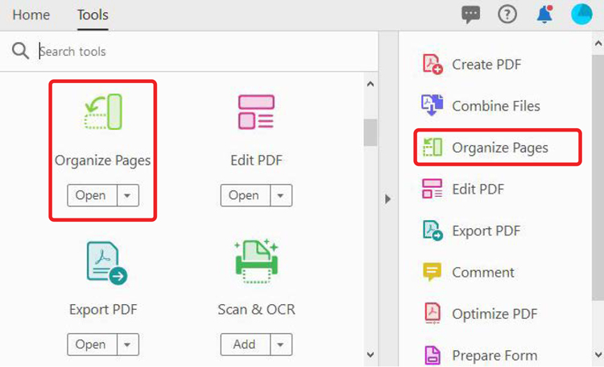

# ページを整理

用途 **[!UICONTROL ページを整理]** を使用して、PDF内のページを追加、置換、抽出、回転、削除、移動することができます。

1. 選択 **[!UICONTROL ページを整理]** 」を [!UICONTROL ツール] 中央または右側のパネル

   

1. ページの上にマウスポインターを置いて、ページを時計回りまたは反時計回りに回転するか、ページを削除します。

   ページを移動するには、ページを選択して新しい場所にドラッグします。

   

1. 選択 **[!UICONTROL Extract]** を使用して、1 つまたは複数のページからPDFを作成することができます。

1. ページを選択し、 **[!UICONTROL Extract]**&#x200B;を選択します。

   また、 **[!UICONTROL 挿入]** または **[!UICONTROL 置換]** ページを表示し、 **[!UICONTROL 詳細]**&#x200B;を選択します。

   

1. 選択 **[!UICONTROL 分割]** 1 つまたは複数のPDFを複数の小さなPDFに

   PDFを分割する場合、ページ数、ファイルサイズ、または上位レベルのしおりによって分割できます。

   

をクリックして、 *ページを整理* チュートリアル

[! [ ページの整理チュートリアルのダウンロード ](../assets/acrobat_PDF_96.png)](../assets/AcrobatDCOrganize.pdf)
