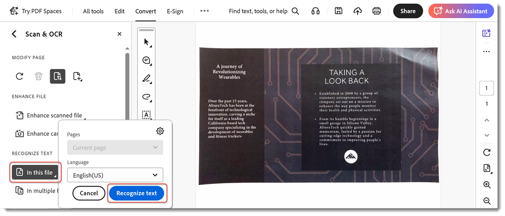

# 紙からPDF

紙の文書をスキャン（または写真を撮影）して、検索可能で[編集可能なPDFファイル](https://www.adobe.com/jp/acrobat/online/pdf-editor.html){target="_blank"}に変換する方法について説明します。 紙をPDFに変換すると、障害のある人でも情報をすばやく見つけて利用できるようになります。 このチュートリアルは、[新しいAcrobatエクスペリエンス](new-workspace.md)を示しています。

## デスクトップのAcrobatで紙をPDFに変換する方法

1. ドキュメントの写真またはスキャンした画像を開きます。 または、接続されたスキャナーを使用して新しいファイルを作成するか、無料の[Adobe Scanモバイルアプリ](https://adobescan.app.link/GpBqG8Bkoeb)を使用してください。

1. ツールバーから&#x200B;**[!UICONTROL すべてのツール]**&#x200B;を選択し、左側のパネルで「**[!UICONTROL スキャンとOCR]**」を選択します。

   

1. ファイルの種類に応じて、**[!UICONTROL スキャン画像を強化]**&#x200B;または&#x200B;**[!UICONTROL カメラ画像を強化]**&#x200B;を選択します。

   

1. ハンドルをドラッグしてページ境界線を調整し、**[!UICONTROL 強化]**&#x200B;を選択します。

   

   Acrobatによって、画像のクリーンアップと角度補正が自動的に行われます。

1. **[!UICONTROL このファイル内]**&#x200B;を選択し、**[!UICONTROL テキスト認識]**&#x200B;を選択して、テキストの検索と編集を可能にします。

   

これで、ファイルが検索可能で編集可能なPDFファイルになりました。

## Acrobat webで紙をPDFに変換する方法

1. ブラウザーで[acrobat.adobe.com](https://acrobat.adobe.com/)にログインします。

1. 上部のメニューから&#x200B;**[!UICONTROL 変換/OCRでテキストを認識]**&#x200B;を選択します。

   

1. **[!UICONTROL ファイルを選択]**&#x200B;し、ファイルを選択して、**[!UICONTROL 開く]**&#x200B;を選択します。

   

1. **[!UICONTROL テキスト認識]**&#x200B;を選択します。

   

   ファイル内のテキストが検索可能になり、編集可能になりました。

1. 背景を削除するには、画像を選択し、**[!UICONTROL 画像を編集]**&#x200B;を選択します。

   

1. Adobe Expressエディタから&#x200B;**[!UICONTROL 背景を削除]**&#x200B;を選択します。

   

1. ハンドルをドラッグしてページ境界線を調整し、**[!UICONTROL 適用]**&#x200B;を選択します。

   

>[!TIP]
>
>複数のPDFファイルにOCRを実行するには、デスクトップのAcrobat Pro、Premium、またはStudioで[Action Wizard](../advanced-tasks/action.md)を使用してみてください。