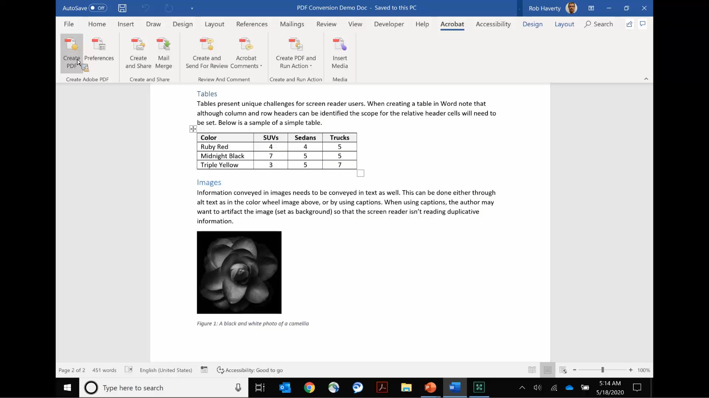

# Acrobat官公庁

連邦、州、地方自治体に特化したAcrobatチュートリアルをご覧ください。

## Acrobatでどこでも作業するための5つのヒント

<table style="table-layout:fixed">
<tr>
  <td>
    
    

    Acrobatでどこでも作業するための<a href="5-tips-for-working-anywhere-with-acrobat-dc-for-government.md"><strong>5のヒント（完了15:12）</strong></a>
    

    <em>Acrobatとその関連モバイルアプリのツールを入手して使用し、どこからでも作業する方法を説明します</em>
     
  </td>
  <td>
    
    

    <a href="get-your-tools.md"><strong>ヒント1:ツールを入手する</strong></a>
    

    <em>どこからでも作業を開始するための最初のステップは、Acrobatツールおよび関連するモバイルアプリを入手することです</em>
     
  </td>  
  <td>
    
    

    <a href="collaborate-on-documents.md"><strong>ヒント2:ドキュメントでの共同作業</strong></a>
    

    <em>文書で共同作業するためのシンプルで簡単なワークフローを作成する</em>
     
  </td>
  <td>
    
    

    <a href="protect-digital-documents.md"><strong>ヒント3: Protectデジタルドキュメント</strong></a>
    

    <em>コピー、編集、または印刷できないように、PDFにパスワードを設定してください</em>
     
  </td>
</tr>
  <td>
    
    

    <a href="work-with-forms-and-signatures.md"><strong>ヒント4:フォームと署名の操作</strong></a>
    

    <em>フォームの入力時にデジタル情報を維持する方法</em>
     
  </td>
  <td>
    
    

    <a href="scan-and-edit-on-mobile.md"><strong>ヒント5:モバイルでスキャンして編集</strong></a>
    

    <em>Adobe ScanおよびAcrobat Readerのモバイルアプリを使用して、どこからでも作業を行う方法を説明します</em>
     
  </td>
  <td>
   
    

     
  </td>
  <td>
   
    

     
  </td>
</tr>
</table>

## アクセシビリティ

<table>
<tr>
  <td>
    
    

    <a href="making-pdfs-accessible.md"><strong>PDFをアクセス可能にする（完了14:11）</strong></a>
    

    <em>アクセシブルなPDFファイルを作成するための最適なワークフローについて説明します</em>
     
  </td>
  <td>
    
    

    <a href="understanding-accessibility.md"><strong>PDFを利用可能にする：アクセシビリティについて</strong></a>
    

    <em>障害のある方がPDFにアクセスできるようにする方法を学ぶ</em>
     
  </td>  
  <td>
    
    

    <a href="collaborate-on-documents.md"><strong>PDFをアクセス可能にする： Wordでの作成</strong></a>
    

    <em>[!DNL Microsoft Word]</em>で作成されたPDFファイルを作成するためのベストプラクティスを確認します
     
  </td>
   <td>
    
    

    <a href="finishing-in-acrobat.md"><strong>PDFをアクセス可能にする： Acrobatで終了しています</strong></a>
    

    <em>Acrobat Proのツールを使ってPDFファイルにアクセスできるようにする最終方法を説明します</em>
     
  </td>
</tr>
<tr>
  <td>
    
    

    <a href="making-pdf-ballots-accessible.md"><strong>PDF投票のアクセシビリティの向上</strong></a>
    

    <em>このウェビナーでは、スクリーンリーダーなどの支援テクノロジーを使用するユーザーが投票用紙を読んで記入できるようにするために必要な、PDFのアクセシビリティの主な領域について説明します</em>
     
  </td>  
  <td>
   
    

     
  </td>
  <td>
   
    

     
  </td>
  <td>
   
    

     
  </td>
</tr>
</table>
