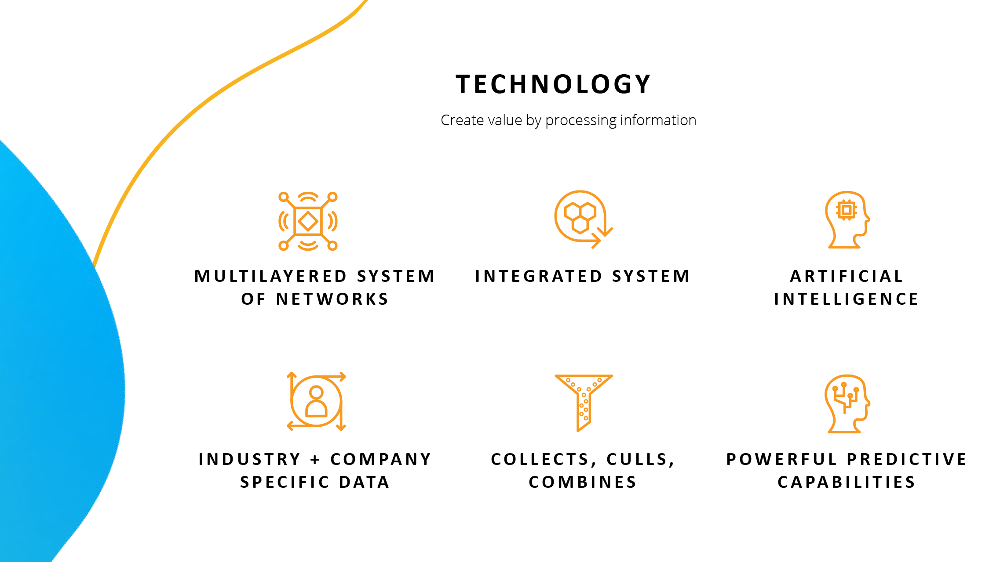

# 統合の概要

Acrobatを[!DNL Box]、[!DNL Dropbox]、[!DNL Google Drive]、[!DNL OneDrive]および[!DNL Microsoft]のアプリと連携します。

## Microsoft

[Microsoft 365](https://www.adobe.com/documentcloud/integrations/microsoft-office-365.html)内で、グループの全員がPDFファイルをシームレスに操作する方法について説明します。

<table style="table-layout:fixed">
<tr>
  <td>
    
  </td>
  <td>
    
  </td> 
  <td>
    
  </td>
  <td>
    
  </td>
</tr>
<tr>
  <td>
    
  </td>
  <td>
    
  </td>
  <td>
    
  </td>
  <td>
   
    

     
  </td>
</tr>
</table>

## Google ドライブ

[!DNL Google Drive]内の重要なPDFツールと電子サインツールを使用して、短時間でより多くの作業を行う方法を説明します。

<table style="table-layout:fixed">
<tr>
  <td>
    
  </td>
  <td>
   
    

     
  </td>
  <td>
   
    

     
  </td>
  <td>
   
    

     
  </td>
</tr>
</table>

## Dropbox

[!DNL Dropbox]に保存されているファイルへのアクセスと操作がいかに簡単かを説明します。

<table style="table-layout:fixed">
<tr>
  <td>
    
  </td>
  <td>
   
    

     
  </td>
  <td>
   
    

     
  </td>
  <td>
   
    

     
  </td>
</tr>
</table>

## Box

Acrobatと[Box](https://www.adobe.com/documentcloud/integrations/box.html){target="_blank"}を使用して、組織内の誰もが業務を継続しやすくする方法を説明します。
