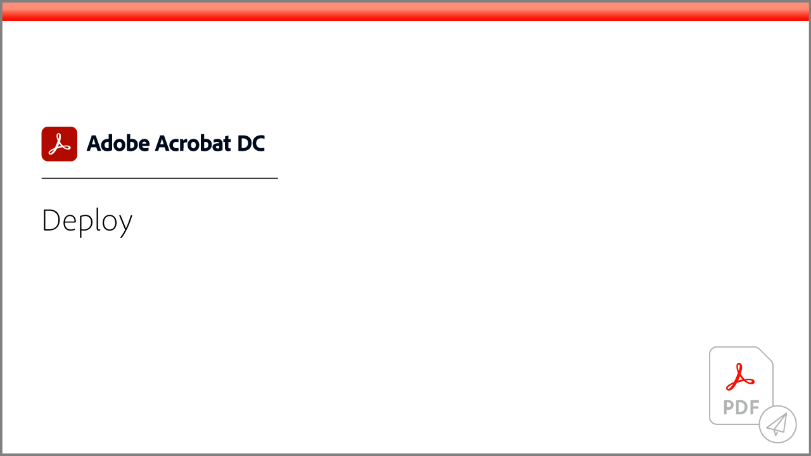

# Acrobatチュートリアル

Adobe Document CloudソリューションであるAdobe Acrobatは、PDFの変換、編集、共有、署名により、ビジネスを継続して進めることができます。 ここでは、Adobe Acrobatで初心者と上級者の両方に最新の状態にすばやく移行できるように設計された、幅広い学習体験を見つけることができます。

## 学習パス

<table style="table-layout:fixed">
<tr>
  <td>
    
  </td>
  <td>
    
  </td>
  <td>
    
  </td>
  <td>
    
  </td>
</tr>
<tr>
  <td>
    
  </td>  
  <td>
    
  </td>
  <td>
  
  </td>
  <td>
    
  </td>
</tr>
</table>
