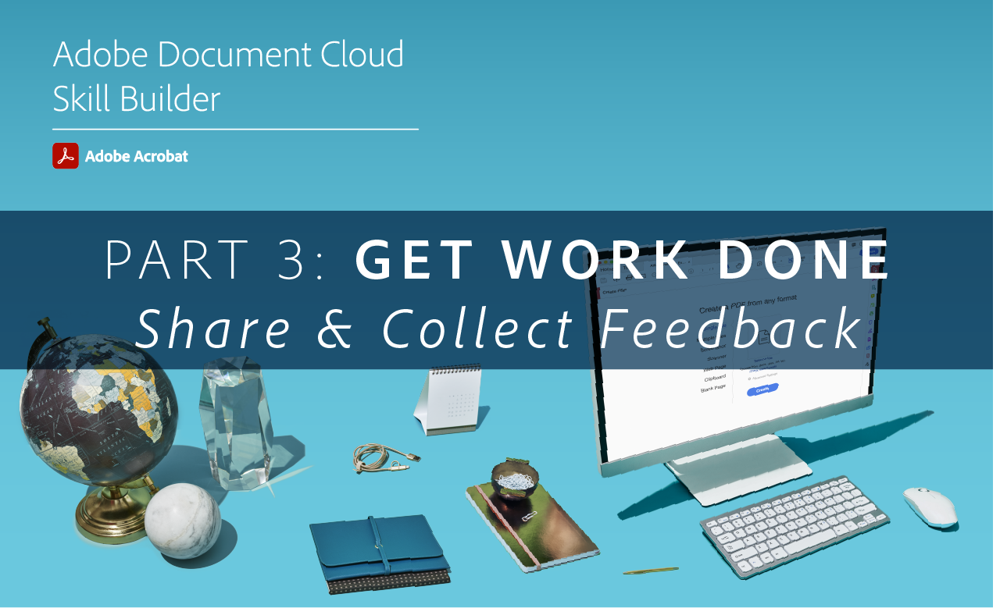

# Acrobat Skill Builders

インタラクティブなスキルビルダーの紹介でAcrobatの最新情報を入手しましょう。 または、 [月間ライブセッション](skill-builder-webinars.md)を選択します。

## デジタル化

<table style="table-layout:fixed">
<tr>
  <td>
    
    

    <a href="https://doccloud.adobeconnect.com/paperpdf/" target="_blank"><strong>紙からPDF</strong></a>
    

    <em>紙の文書をデジタルなPDF</em>
     
  </td>
  <td>
    
    

    <a href="https://doccloud.adobeconnect.com/skillbuilder-sigforms/" target="_blank"><strong>署名の準備</strong></a>
    

    <em>電子PDFフィールドを使用した署名の作成</em>
     
  </td>
  <td>
    
    

     
  </td>
  <td>
    
    

     
  </td>
</tr>
</table>

## デジタル化を維持

<table style="table-layout:fixed">
<tr>
 <td>
    
    

    <a href="https://doccloud.adobeconnect.com/createpdfs/" target="_blank"><strong>作成と整理PDF</strong></a>
    

    <em>あらゆる種類のPDFファイルの作成と整理</em>
     
  </td>
  <td>
    
    

    <a href="https://doccloud.adobeconnect.com/micro/" target="_blank"><strong>AcrobatとMicrosoft 101</strong></a>
    

    <em>SharePointで直接PDFを作成および管理する</em>
     
  </td>
  <td>
    
    

    <a href="https://doccloud.adobeconnect.com/editpdf/" target="_blank"><strong>編集PDF</strong></a>
    

    <em>PDFへのテキスト、画像、リンク、透かしの追加</em>
     
  </td>
  <td>
    
    

    <a href="https://doccloud.adobeconnect.com/sign/" target="_blank"><strong>作品への署名</strong></a>
    

    <em>Microsoft Outlook で文書に直接署名</em>
     
  </td>
</tr>
<tr>
  <td>
    
    

    <a href="https://doccloud.adobeconnect.com/convertpdfs/" target="_blank"><strong>変換PDF</strong></a>
    

    <em>PDFを Word、Excel、PowerPoint に変換</em>
     
  </td>
  <td>
    
    

    <a href="https://doccloud.adobeconnect.com/fillsign/" target="_blank"><strong>どこからでも入力、署名</strong></a>
    

    <em>あらゆるデバイスでフォームに電子的に入力、署名、送信</em>
     
  </td>
   <td>
    
    

    <a href="https://doccloud.adobeconnect.com/optimizepdfs/" target="_blank"><strong>最適化されたPDF</strong></a>
    

    <em>配布PDFの準備</em>
     
  </td>
  <td>
   
    

     
  </td>
</tr>
</table>

## 作業の完了

<table style="table-layout:fixed">
<tr>
  <td>
    
    

    <a href="https://doccloud.adobeconnect.com/skillbuilder-share/" target="_blank"><strong>フィードバックの共有と収集</strong></a>
    

    <em>フィードバックの収集とPDF</em>
     
  </td>
  <td>
    
    

    <a href="https://doccloud.adobeconnect.com/securepdfs/" target="_blank"><strong>安全なPDF</strong></a>
    

    <em>PDF内の機密情報の墨消しと保護</em>
     
  </td>
  <td>
   
    

     
  </td>
  <td>
   
    

     
  </td>
</tr>
</table>
