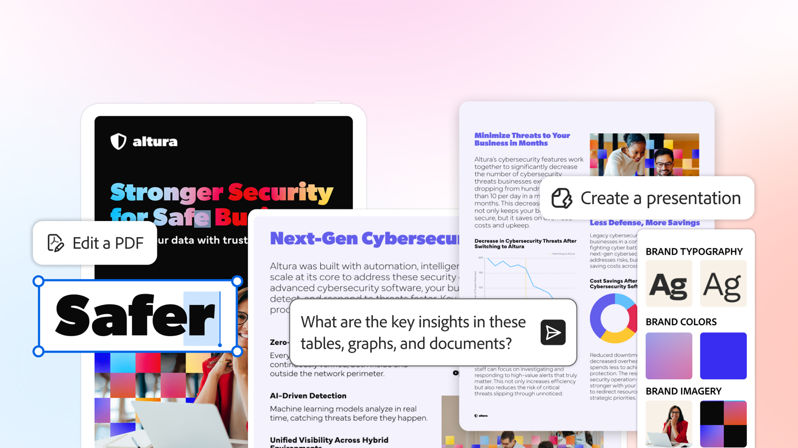

# ユースケースの概要

Acrobatを使用して生産性を向上させ、情報をチームや業界向けの実用的なインサイトに変換する方法を説明します。

## 基幹業務

異なる基幹業務全体を担当するチームがAcrobatを使用して、日常的な文書業務の課題の解決、ワークフローの合理化、およびビジネスクリティカルな作業のサポートを行う方法について説明します。

<table style="table-layout:fixed">
<tr>
  <td>
    
    

    <a href="lob/finance/finance-overview.md"><strong>財務の使用例</strong></a>
    

    <em>財務チームがAcrobatを使用して、財務ドキュメントを作成、管理、分析、およびセキュリティ保護する方法について説明します</em>
     
  </td>
  <td>
    
    

    <a href="lob/hr/hr-overview.md"><strong>HRの使用例</strong></a>
    

    <em>人事チームがAcrobatを使用して、従業員ライフサイクル全体の文書とワークフローを管理する方法を確認する</em>
     
  </td>
  <td>
    
    

    <a href="lob/legal/legal-overview.md"><strong>法律上の使用例</strong></a>
    

    <em>法務チームが複雑なドキュメントを迅速に理解し、重大なリスクと変更を表面化する方法を学ぶ</em>
     
  </td>
  <td>
    
    

    <a href="lob/marketing/marketing-overview.md"><strong>マーケティングの使用例</strong></a>
    

    <em>マーケティングチームが共同作業を効率化し、承認を促進し、新しいアイデアを迅速に市場に投入する方法を説明します</em>
     
  </td>
</tr>
<tr>
  <td>
    
    

    <a href="lob/sales/sales-overview.md"><strong>セールスの使用例</strong></a>
    

    <em>営業チームが洞察を得て、よりスマートな共同作業と迅速なコンテンツ作成に影響を与える方法を説明します</em>
     
  </td>
  <td>
        
        

         
  </td>
  <td>
        
        

         
  </td>
  <td>
        
        

         
  </td>
</tr>
</table>

## 中央省庁

<!-- START CARDS HTML - DO NOT MODIFY BY HAND -->

    

        

            

                <figure class="image x-is-16by9">
                    
                </figure>
            

            

                

                    

                        <a href="https://experienceleague.adobe.com/ja/docs/document-cloud-learn/acrobat-learning/use-cases/gov/gov-overview" target="_self" rel="referrer" title="Acrobat官公庁">官公庁向けAcrobat</a>
                    

                    
連邦、州、地方自治体に特化したAcrobatチュートリアルをご覧ください

                

                <a href="https://experienceleague.adobe.com/ja/docs/document-cloud-learn/acrobat-learning/use-cases/gov/gov-overview" target="_self" rel="referrer" class="spectrum-Button spectrum-Button--outline spectrum-Button--primary spectrum-Button--sizeM" style="align-self: flex-start; margin-top: 1rem;">
                    チュートリアルを見る
                </a>
            

        

    

<!-- END CARDS HTML - DO NOT MODIFY BY HAND -->