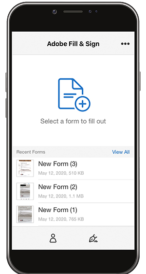

# デスクトップまたはモバイルでフォームに入力して署名

デスクトップ、ブラウザー、モバイルアプリからすばやくフォームに入力、署名、送信できます。 Adobe Senseiは、PDFフォームで使用する一般的なデータを認識して保存します。 描画、スキャンの読み込み、名前の入力を行って署名を作成し、安全に文書に適用できます。

この練習では、モバイルデバイスを使用してからのファイルの読み込み、入力、署名、送信を行います。

次のとおりです [デモファイル](assets/03_FillSignScan.zip) この演習のために

**手順1:** ダウンロード [!DNL Adobe Fill & Sign] アプリから [!DNL Apple App] ストアまたは [!DNL Google Play].

**手順2:** アプリを開いて、次をタップします。 **[!UICONTROL 入力するフォームを選択]**.

**手順3:** 読み込みオプションのいずれかを選択します。 この練習では、「写真を撮る」を行います。

**手順4:** 白いボタンを使用して写真を撮影し、をタップします。 **[!UICONTROL 写真を使用]**. タップ **[!UICONTROL 完了]** をクリックします。

**手順5:** アプリの下部で、 **[!UICONTROL 切り抜き]** ツールとガイドを使用して、次の操作を行います [画像を切り抜く](https://www.adobe.com/acrobat/online/crop-pdf.html). タップ **[!UICONTROL 完了]** 完了します。

**手順6:** 必要に応じて、自動選択ツールを使用して画像をクリーンアップします。 タップ **[!UICONTROL 完了]** 完了します。

**手順7:** ページの任意の場所をタップしてフィールドを作成し、必要な情報を文書に追加します。 楕円を選択してその他のオプションを表示します。

**手順8:** をタップ **[!UICONTROL 署名]** アプリの下部にあるボタンをクリックして、署名を追加します。

**手順9:** スタイラスペンまたは指を使用して、署名フィールドに署名します。 署名フィールドを移動して配置します。

**手順10:** をタップ **[!UICONTROL プロフィール]** アプリの下部にあるボタンをクリックして、名前や日付などの事前入力値を取得します。 この情報を1回入力するだけで、Fill &amp; Signアプリを使用して記入する今後のすべてのフォームで使用できます。

**手順11:** フォームの入力が完了したら、右下隅の「共有」ボタンをタップして電子メールを送信します。

## 確認：

* 電子メールからファイルを開いたり、紙のフォームの写真をデバイスのカメラでスナップしたりできます。

* をタップして、フォームフィールドにテキストまたはチェックマークを入力します。 さらに、速度を上げるために、カスタムの自動入力エントリを使用します。

* 指またはスタイラスを使用して署名を作成します。 次に、フォームに適用するか、必要に応じてイニシャルを追加します。
