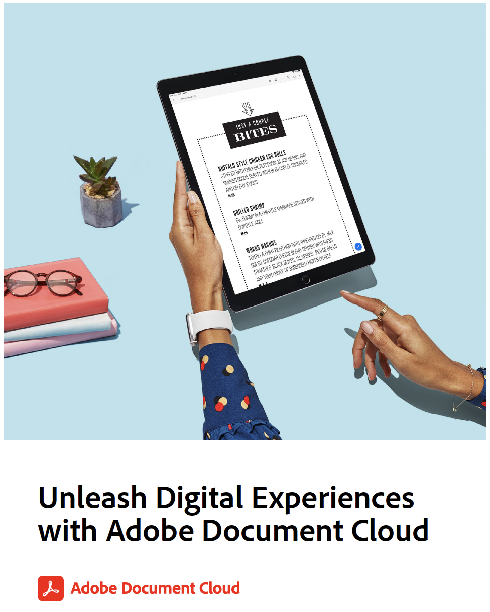

# Adobe Document Cloudでデジタルエクスペリエンスを解き放つ練習

この配布資料には、さらに多くの演習と取り上げられているワークフローのレビューが含まれています。 次の実習で使用するデモファイルを以下に示します。 各練習では、次の内容も確認します。

* 例1：あらゆるフォームをスキャン – 自分の名刺、領収書、またはその他の書類を使用
* [例2：任意のフォームへの入力と署名](assets/03_FillSignScan.zip)
* [例3:PDFファイルの共有とオンラインでのレビュー](assets/01_Review.zip)
