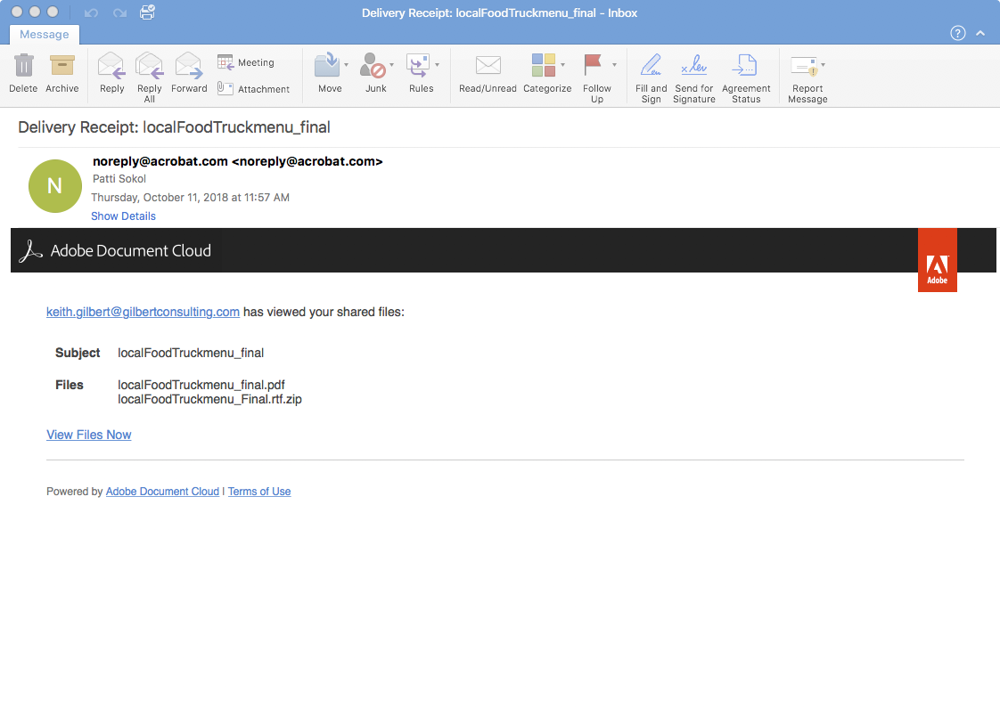

# PDFファイルの共有とオンラインでのレビュー

Adobe Document Cloudレビューサービスを使用すると、Acrobatデスクトップアプリケーション、Document Cloud webまたはAcrobat Readerモバイルアプリケーションから、レビュー用のPDFファイルを簡単に共有できます。 レビュー担当者は、コンピューターから電子メールの招待状にあるURLをクリックすることで、ログインしたり追加のソフトウェアをインストールしたりしなくても、ブラウザーで簡単にフィードバックを提供できます。

この練習では、次の方法を確認します。

* コメント用にパーソナライズされた招待状を送信
* 電子メールで匿名またはパブリックリンクを送信する

次のとおりです [デモファイル](assets/01_Review.zip) この演習のために

## コメント用にパーソナライズされた招待状を送信

**手順1:** を開きます `localFoodTruckmenu_start.pdf` ファイルをAdobe Acrobatで開きます。

**手順2:** をクリック **[!UICONTROL Send for Comments]** 右側のパネルまたは **[!UICONTROL このファイルを他のユーザーと共有]**   アイコンをクリックします。

**手順3:** 受信者の電子メールアドレスを入力します。 受信者へのメッセージを入力したり、レビューの期限を追加したりできます。

受信者がファイルを表示すると、メールで通知が届きます。

## レビュアーの経験

レビュー担当者はレビュー用 PDF へのリンクを含む電子メールの招待を受信します。ユーザーがリンクまたは **[!UICONTROL レビュー]** ボタン：招待状のPDFがwebブラウザーで開きます。 注釈ツールを使用して、注釈を PDF に追加できます。また、Acrobat Reader または Acrobat デスクトップアプリケーションを使用して、注釈を追加することもできます。

## 電子メールで匿名またはパブリックリンクを送信する

**手順1:** を開きます `localFoodTruckmenu_start.pdf` ファイルをAdobe Acrobatで開きます。

**手順2:** クリック **[!UICONTROL リンクを共有]** . 共有リンクは即座に生成され、ファイルがクラウドにアップロードされるのを待つ必要はありません。 デフォルトでは、 [!UICONTROL コメントを許可] スイッチはオンです。

**手順3:** クリック **[!UICONTROL リンクをコピー]** 受信者とリンクを共有します。

## コメントの作成

**手順1:** 「 **[!UICONTROL コメント]** 右側のパネルに表示されます。

**手順2:** 上のリボンツールを使用して、文書に注釈を追加したり、コメントを入力したりします。

注釈は自動的に保存され、他のユーザーに表示されます。

## InDesignへのPDFコメントの読み込み

InDesign CC 2019では、PDFファイルから直接コメントを読み込むことができます。 ワンクリックで変更を読み込み、適用、適用できます。 新しいPDFコメントパネルでコメントを選択すると、InDesignファイルでそのコメントが見つかり、ハイライト表示されます。

**手順1:** コメントを含むPDFファイルをダウンロードします。

**手順2:** InDesignファイルを開きます。

**手順3:** クリック **[!UICONTROL ファイル]** をクリックします。

**手順4:** クリック **[!UICONTROL PDFコメントの読み込み]** ドロップダウンから

**手順5:** コメントを含むPDFを開きます。

コメントはUIに表示されます。

## 確認：

Acrobatでデザインバージョンを確認して共有します。 Acrobatでは次のことが可能です。

* 他のユーザーがレビューできるようにPDFへのリンクを送信します。
* デスクトップ、ブラウザー、モバイルなど、どこにいてもレビューできます。
* 単一の文書に集めます。
* フィードバックを1か所にまとめて管理できます。
* 必要なのはブラウザーだけです。

コメントをすべて1か所で簡単に送信およびトラックできます。 受信者は、Acrobatがなくても閲覧できます。 ブラウザーを介して他のユーザーをコメントに招待できます。 時間と労力の節約
