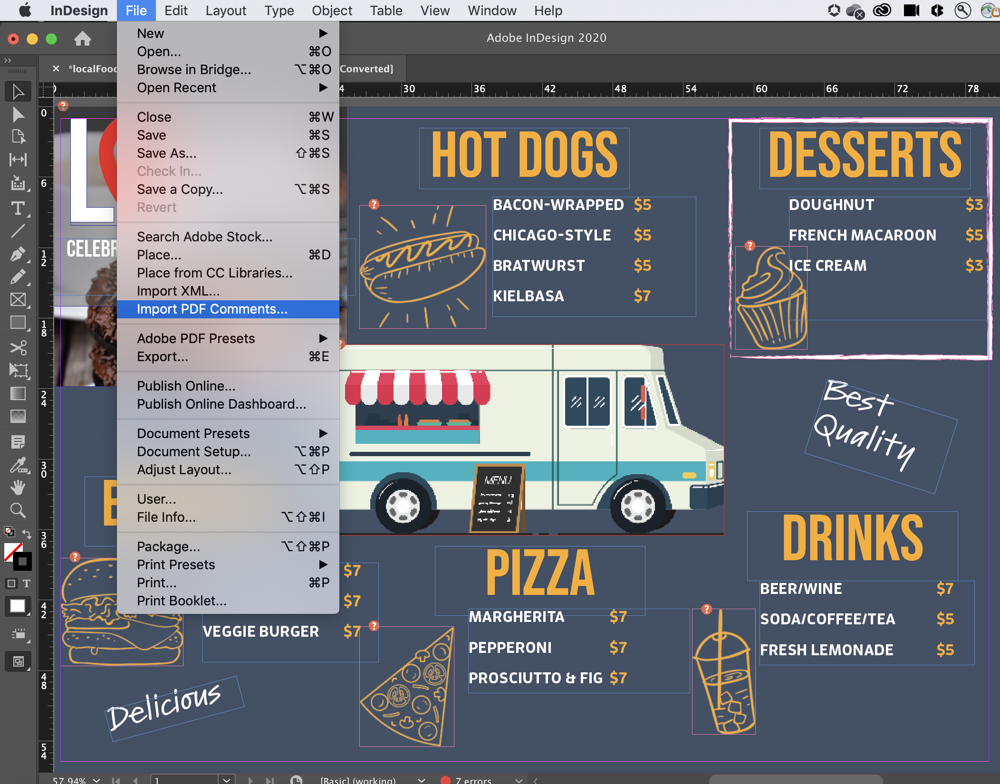

# オンラインでPDFファイルを共有してレビュー

Adobe Document Cloudレビューサービスを使用すると、Acrobat DCデスクトップアプリケーション、Document CloudWeb またはAcrobat Readerモバイルアプリケーションから、レビュー用にPDFファイルを簡単に共有できます。 レビュー担当者が依頼メールに含まれる URL を自身のコンピューター上でクリックすると、ログインしたり、追加のソフトウェアをインストールしたりしなくても、簡単にブラウザー上でフィードバックを入力することができます。

この練習では、次の操作を行う方法について説明します。

* 注釈用のパーソナライズされた依頼メールを送信
* 匿名またはパブリックリンクを電子メールで送信する

以下に、 [デモファイル](assets/01_Review.zip) この練習のために。

## 注釈用のパーソナライズされた依頼メールを送信

**手順 1:** パネルの「 `localFoodTruckmenu_start.pdf` ファイルをAdobe Acrobatで開きます。

**手順 2:** クリック **[!UICONTROL Send for Comments]** を選択するか、 **[!UICONTROL このファイルを他のユーザーと共有]**   アイコンをクリックします。

**手順 3:** 受信者の電子メールアドレスを入力します。 受信者へのメッセージを入力したり、レビューの期限を追加したりできます。

受信者がファイルを表示すると、通知メールが届きます。

## レビュー担当者の経験

レビュー担当者は、レビュー用 PDF へのリンクが記載された依頼メールを受信します。依頼メールに含まれているリンクをクリックするか、「**[!UICONTROL レビュー]**」ボタンをクリックすると、PDF が Web ブラウザー内で開きます。レビュー担当者は、注釈ツールを使用して PDF に注釈を追加できます。Acrobat Reader DC または Acrobat DC デスクトップアプリケーションを使用して、注釈を追加することもできます。

## 匿名またはパブリックリンクを電子メールで送信する

**手順 1:** パネルの「 `localFoodTruckmenu_start.pdf` ファイルをAdobe Acrobatで開きます。

**手順 2:** クリック **[!UICONTROL リンクを共有]** を選択します。 共有リンクはすぐに生成されるため、ファイルがクラウドにアップロードされるのを待つ必要はありません。デフォルトでは、 [!UICONTROL 注釈を許可] スイッチはオンです。

**手順 3:** クリック **[!UICONTROL リンクをコピー]** 受信者とリンクを共有します。

## 注釈の作成

**手順 1:** 次の **[!UICONTROL コメント]** をクリックします。

**手順 2:** 上部のリボンツールを使用して、文書をマークアップしたり、コメントを入力します。

注釈は自動保存され、他のユーザーが表示できます。

## PDF注釈のInDesign

InDesignCC 2019 では、コメントファイルから直接コメントをインポートPDFできます。 ワンクリックで変更を読み込み、適用できます。 新しい注釈パネルで注釈をPDFすると、選択ファイル内の注釈が検索され、ハイライトInDesignされます。

**手順 1:** コメントを含むPDFファイルをダウンロードします。

**手順 2:** InDesignを開きます。

**手順 3:** クリック **[!UICONTROL ファイル]** を選択します。

**手順 4:** クリック **[!UICONTROL コメントのPDFの取り込み]** を選択します。

**手順 5:** 注釈を含むPDFを開きます。

UI にコメントが表示されます。

## 要約：

Acrobatでデザインバージョンをレビューし、共有します。 Acrobatを使用すると、次のことができます。

* 他のユーザーがレビューできるように、PDFへのリンクを送信します。
* デスクトップ、ブラウザー、モバイルなど、どこからでもレビュー
* ひとつの文書にまとめる
* フィードバックを一元管理
* 必要なのはブラウザーだけです。

注釈の送信とトラックがすべて 1 か所で簡単にできます。 受信者は、Acrobatを持っていなくても表示できます。 他のユーザーをブラウザー経由でコメントに招待できます。 時間と労力を節約
