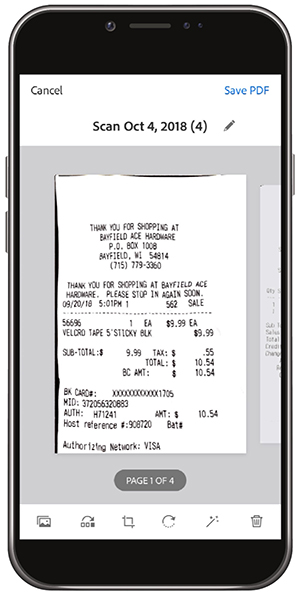

# Adobe Scanでデジタル化

整理、共有 机の上に大量の紙を置いたり、レシートを財布に入れる必要はありません。 Adobe Scanモバイルアプリは、紙の文書をPDFに直接スキャンし、自動的にテキストを認識します。

この練習では、名刺から連絡先に直接コンテンツをアップロードします。 領収書をスキャンして保存します。

作業対象の名刺、レシート、またはその他の紙製品を集めます。

## 名刺をスキャン

**手順1:** Apple App StoreまたはGoogle PlayからAdobe Scanアプリをダウンロードします。

**手順2:** Adobe Scanアプリを開きます。

**手順3:** アプリから、携帯電話に保存する連絡先情報が含まれている名刺の写真を撮影します。

**手順4:** スキャンが完了したら、カードがバウンディングボックス内に収まるように調整します。

**手順5:** タップ **[!UICONTROL PDFを保存]** をクリックします。 その後、次をタップします。 **[!UICONTROL 連絡先を保存]**.

**手順6:** 携帯電話に保存する前に、連絡先情報に必要な編集や追加を行います。 「保存」をもう一度タップして、連絡先への保存を完了します。

## 領収書のスキャンと保存

Adobe Scanアプリは、後で必要になる領収書（経費報告書やその他の償還など）をスキャンして保存する場合にも便利です。

**手順1:** Adobe Scanアプリケーションを開いた状態で、保存する領収書の写真を撮影します。

**手順2:** アプリが自動的に領収書を検出し、その内容をキャプチャすることを確認します。

**手順3:** タップ **[!UICONTROL PDFを保存]** 右上隅に、レシートを携帯電話に保存します。

## 確認：

* 紙の文書やフォームをスキャンしてPDFできます。
* JPG画像をPDFに変換します。
* デバイスで直接編集できます。
* 連絡先に直接、名刺情報を追加します。

捨てろ！
