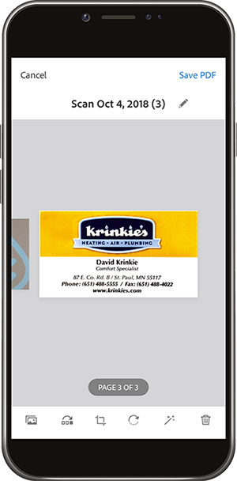
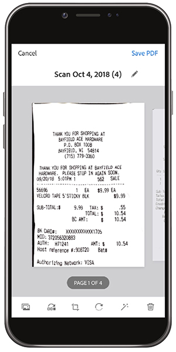

# Adobe Scanでデジタル化

整理、共有 机の上に大量の紙を置いたり、レシートを財布に入れる必要はありません。 Adobe Scanモバイルアプリは、紙の文書をPDFに直接スキャンし、自動的にテキストを認識します。

この練習では、名刺から連絡先に直接コンテンツをアップロードします。 領収書をスキャンして保存します。

作業対象の名刺、レシート、またはその他の紙製品を集めます。

## 名刺をスキャン

**手順1:** Apple App StoreまたはGoogle PlayからAdobe Scanアプリをダウンロードします。

**手順2:** Adobe Scanアプリを開きます。

**手順3:**&#x200B;アプリから、電話に保存する連絡先情報が記載された名刺の写真を撮影します。

**ステップ4:**&#x200B;スキャンが完了したら、カードがバウンディングボックス内に収まるように調整します。

**手順5:**&#x200B;右上隅の&#x200B;**[!UICONTROL PDFを保存]**&#x200B;をタップします。 次に、**[!UICONTROL 連絡先を保存]**&#x200B;をタップします。

**手順6:**&#x200B;電話に保存する前に、連絡先情報に必要な編集や追加を行ってください。 「保存」をもう一度タップして、連絡先への保存を完了します。

## 領収書のスキャンと保存

Adobe Scanアプリは、後で必要になる領収書（経費報告書やその他の償還など）をスキャンして保存する場合にも便利です。

**手順1:** Adobe Scanアプリを開いた状態で、保存する領収書の写真を撮影します。

**手順2:**&#x200B;アプリが自動的に領収書を検出し、その内容をキャプチャすることを確認してください。

**手順3:** **[!UICONTROL PDFの保存]**&#x200B;を右上からタップして、領収書を携帯電話に保存します。

## 確認：

* 紙の文書やフォームをスキャンしてPDFできます。
* JPG画像をPDFに変換します。
* デバイスで直接編集できます。
* 連絡先に直接、名刺情報を追加します。

捨てろ！
