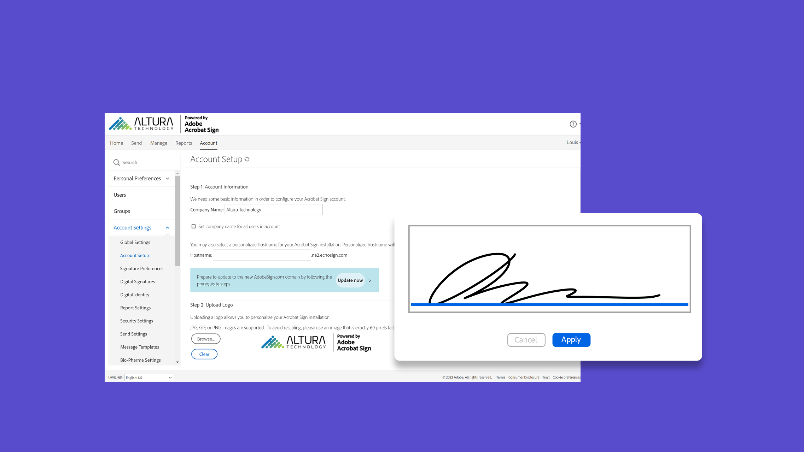
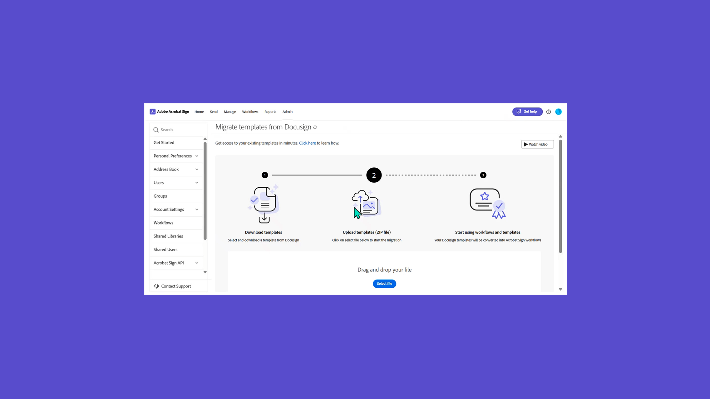
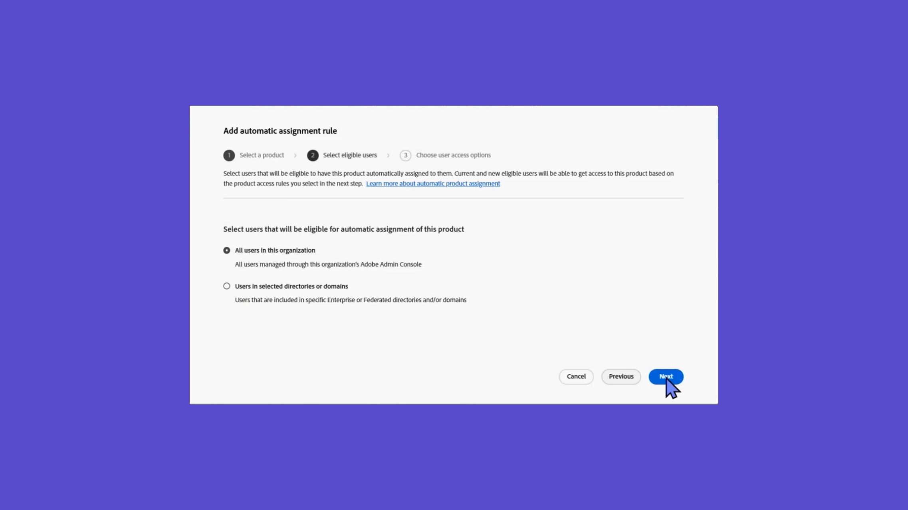
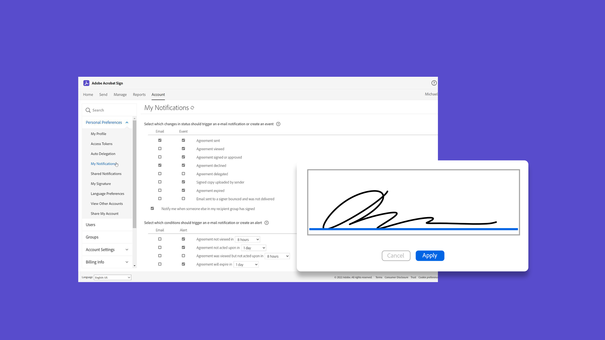
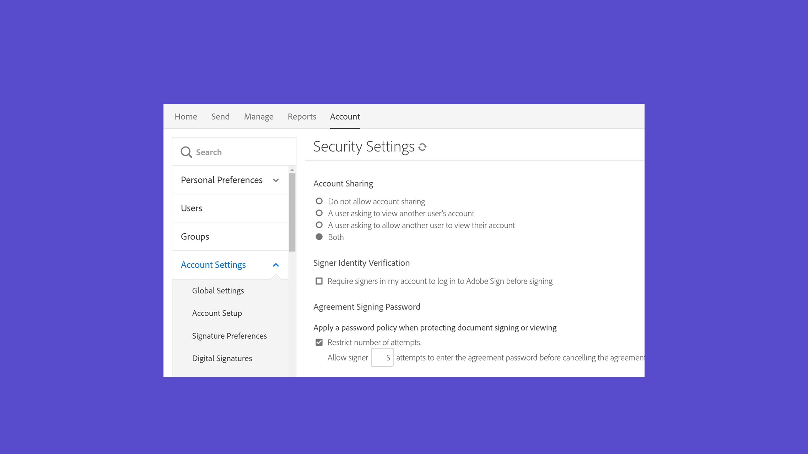
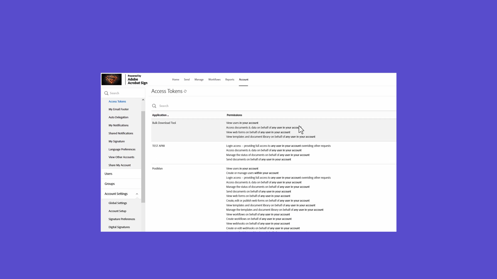
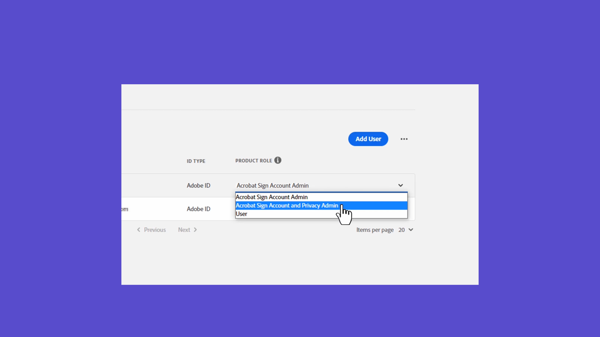

# 管理者概要

アカウントへのユーザーの追加、グループの設定、アクセスの共有、ワークフロー、外部アーカイブ、共有イベントと警告の設定について説明します。 これらのチュートリアルは、インストール段階を過ぎ、Acrobat Signを使い始める準備が整った管理者向けです。 詳細タスクでは、管理者設定を超えて、グローバル設定、アカウントアクセスと共有、テキストタグの定義に進むトピックについて説明します。

## 新機能

>[!BEGINTABS]

>[!TAB カスタムワークフローの作成]

[カスタムワークフロー](building-a-custom-workflow.md)を作成および使用して、契約書の作成と送信のプロセスを高速化する方法について説明します。

>[!TAB 再利用可能なテンプレートを作成]

[再利用可能な文書テンプレート](../sign-advanced-users/create-a-template.md)を作成する方法について説明します。

>[!TAB ユーザーの自動割り当てルールを有効にする]

Admin Console内のAcrobat Signへのアクセスをユーザーに許可する[自動割り当てルール](automatic-assignment-rules.md)を設定する方法について説明します。

>[!TAB Docusignテンプレートの移行]

3つの簡単な手順で、[Docusignテンプレート](docusign-templates.md)とワークフローをシームレスに移行する方法について説明します。

>[!ENDTABS]

## はじめに

<table style="table-layout:fixed">
<tr>
  <td>
    
    

    <a href="get-started-admin.md"><strong>新しい管理者の基本を学ぶ</strong></a>
    

    <em>この包括的なビデオガイドでは、Acrobat Signを使用して組織を稼働させるために必要なすべてのツールについて説明します</em>
     
  </td>
  <td>
    
    

    <a href="up-and-running-admin.md"><strong>管理者の管理を開始しています</strong></a>
    

    <em>Acrobat Signで管理者が迅速に導入および導入するための7つの主要分野の概要</em>
     
  </td>
  <td>
    
    

    <a href="docusign-templates.md"><strong>Docusignテンプレートの移行</strong></a>
    

    <em>Docusignテンプレートとワークフローをシームレスに移行する方法を説明します</em>
     
  </td>
  <td>
    
    

    <a href="add-users-to-your-account.md"><strong>新しいユーザーを追加する</strong></a>
    

    <em>Acrobat Signに新しいユーザーを追加する方法の詳細</em>
     
  </td>
</tr>
<tr>
  <td>
    
    

    <a href="automatic-assignment-rules.md"><strong>ユーザーの自動割り当てルールを有効にする</strong></a>
    

    <em>Admin Console内のAcrobat Signへのアクセス権をユーザーに付与する自動割り当てルールを設定する方法を説明します</em>
     
  </td>
  <td>
    
    

    <a href="add-admin.md"><strong>新しいアカウント管理者の追加</strong></a>
    

    <em>新しいユーザーを作成する方法、または既存のユーザーをAcrobat Sign管理者ロールに昇格させる方法を説明します</em>
     
  </td>
    <td>
      
      

      <a href="promote-admin.md"><strong>製品とサポートの管理者の役割の割り当て</strong></a>
      

      <em>Acrobat Signユーザーの製品管理者およびサポート管理者の役割をAdmin Consoleに割り当てる方法を説明します</em>
       
    </td>
    <td>
      
      

      <a href="create-and-manage-groups.md"><strong>グループの作成と管理</strong></a>
      

      <em>グループの作成、グループへのユーザーの追加、およびグループ設定の編集</em>
       
    </td>
</tr>
<tr>
 <td>
      
      

      <a href="set-up-your-external-archive.md"><strong>外部アーカイブを設定しています</strong></a>
      

      <em>署名済みの契約書のバックアップコピーの外部アーカイブを作成する</em>
       
    </td>
  <td>
    
    

    <a href="../sign-advanced-users/create-a-template.md"><strong>再利用可能なテンプレートを作成</strong></a>
    

    <em>スピードと一貫性を保つために再利用可能な文書テンプレートを作成</em>
     
  </td>
  <td>
    
    

    <a href="../sign-advanced-users/creating-a-report.md"><strong>レポートとトランザクションの使用状況</strong></a>
    

    <em>レポートを生成し、トランザクションの使用状況を追跡する方法を学ぶ</em>
     
  </td>
  <td>
    
    

    <a href="report-options.md"><strong>ユーザーのレポートオプション</strong></a>
    

    <em>ユーザーのレポートオプションを設定する方法を説明します</em>
     
  </td>
</tr>  
<tr>
   <td>
    
    

    <a href="../sign-advanced-users/webform.md"><strong>Webフォームを作成しています</strong></a>
    

    <em>Webサイトで直接電子サインできる文書を作成</em>
     
  </td>
  <td>
    
    

    <a href="../sign-advanced-users/modify-webform.md"><strong>既存のWebフォームを変更する</strong></a>
    

    <em>既存のWebフォームを無効にし、編集し、再度有効にする方法を説明します</em>
     
  </td>
  <td>
    
    

    <a href="../sign-advanced-users/megasign.md"><strong>一括送信</strong></a>
    

    <em>あらゆる文書に対して一度に数千もの署名を収集</em>
     
  </td>
  <td>
    
    

    <a href="building-a-custom-workflow.md"><strong>カスタムワークフローの作成</strong></a>
    

    <em>カスタムワークフローを作成および使用して、契約書の作成と送信のプロセスを高速化する方法について説明します</em>
     
  </td>
</tr>
<tr>
     <td>
    
    

    <a href="audit-reports.md"><strong>監査レポート</strong></a>
    

    <em>監査レポートにアクセスし、利用し、構成する方法の詳細</em>
     
    </td>
    <td>
      
      

      <a href="set-up-shared-events-and-alert.md"><strong>イベントとアラートの通知を構成する</strong></a>
      

      <em>アカウントのイベントとアラートの通知を構成する</em>
       
    </td>
    <td>
      
      

       
    </td>
    <td>
      
      

       
    </td>
</tr>    
</table>

## 高度なタスク

<table style="table-layout:fixed">
<tr>
  <td>
    
    

    <a href="learn-about-global-settings.md"><strong>グローバル設定</strong></a>
    

    <em>組織全体または特定のグループの製品設定をグローバルに編集する</em>
     
  </td>
  <td>
      
    

    <a href="share-account-access.md"><strong>アカウントアクセスの共有</strong></a>
    

    <em>別のユーザーのアカウントのトランザクションへの表示専用アクセスを設定します</em>
     
  </td>
  <td>
    
    

    <a href="advanced-account-sharing.md"><strong>高度なアカウント共有</strong></a>
    

    <em>管理者とユーザーが送信、変更、および表示のアクセス許可を委任できるようにアカウント共有を設定する</em>
     
  </td>
  <td>
    
    

    <a href="bulk-download-tool.md"><strong>一括ダウンロードツール</strong></a>
    

    <em>一括ダウンロードツールを使用して、署名済みのすべての契約書をすばやくダウンロードする方法を説明します</em>
     
  </td> 
</tr>
<tr>
   <td>
     
    

    <a href="../sign-advanced-users/adobe-sign-text-tagging.md"><strong>Acrobat Signのテキストタグ付け</strong></a>
    

    <em>Adobe Acrobatを使用してテキストタグ付けによりAcrobat Signフォームフィールドを作成する</em>
     
  </td>
  <td>
    
    

    <a href="use-bio-pharma-settings.md"><strong>バイオ医薬業界標準対応の使い方</strong></a>
    

    <em>FDA 21 CFR Part 11の要件を満たすことができるバイオ医薬業界標準対応の設定を行います</em>
     
  </td>
  <td>
    
    

    <a href="privacy.md"><strong>プライバシー管理者を設定する方法</strong></a>
    

    <em>プライバシー管理者を設定して使用する方法を説明します</em>
     
  </td>
  <td>
    
    

     
  </td>
</tr>
</table>
