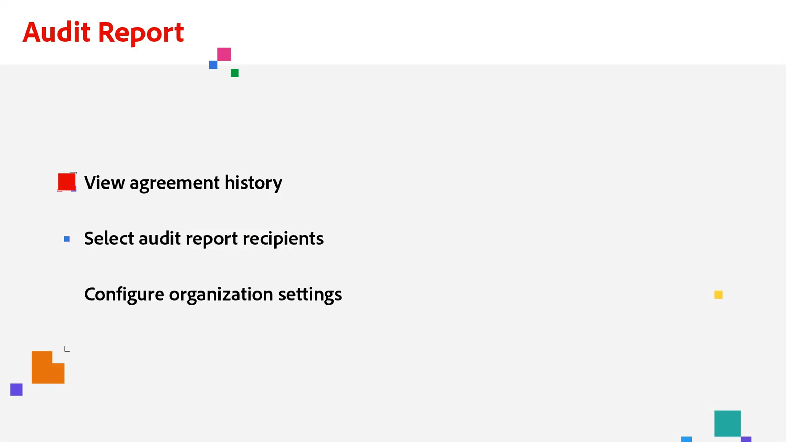

# 管理者概要

アカウントへのユーザーの追加、グループの設定、アクセスの共有、ワークフロー、外部アーカイブ、共有イベントと警告の設定について説明します。 これらのチュートリアルは、インストール段階を過ぎ、Acrobat Signを使い始める準備が整った管理者向けです。 詳細タスクでは、管理者設定を超えて、グローバル設定、アカウントアクセスと共有、テキストタグの定義に進むトピックについて説明します。

## 新機能

* [監査レポート](audit-reports.md)
組織のニーズに合わせて監査レポートにアクセスし、利用し、設定する方法について説明します
* [一括送信](../sign-advanced-users/megasign.md)
簡単な手順で、あらゆる文書の何千もの署名を一度に収集する方法を説明します
* [レポートオプション](report-options.md)
ユーザーのレポートオプションを設定する方法について説明します

## はじめに

<table style="table-layout:fixed">
<tr>
  <td>
    
    

    <a href="get-started-admin.md"><strong>新しい管理者の基本を学ぶ</strong></a>
    

    <em>この包括的なビデオガイドでは、Acrobat Signを使用して組織を稼働させるために必要なすべてのツールについて説明します</em>
     
  </td>
  <td>
    
    

    <a href="up-and-running-admin.md"><strong>管理者の管理を開始しています</strong></a>
    

    <em>Acrobat Signで管理者が迅速に導入および導入するための7つの主要分野の概要</em>
     
  </td>
  <td>
    
    

    <a href="set-up-shared-events-and-alert.md"><strong>イベントとアラートの通知を構成する</strong></a>
    

    <em>アカウントのイベントとアラートの通知を構成する</em>
     
  </td>
  <td>
    
    

    <a href="add-users-to-your-account.md"><strong>ユーザーの追加</strong></a>
    

    <em>Acrobat Signのユーザーの追加と管理</em>
     
  </td>
</tr>
<tr>
 <td>
    
    

    <a href="create-and-manage-groups.md"><strong>グループの作成と管理</strong></a>
    

    <em>グループの作成、グループへのユーザーの追加、およびグループ設定の編集</em>
     
  </td>
  <td>
    
    

    <a href="set-up-your-external-archive.md"><strong>外部アーカイブを設定しています</strong></a>
    

    <em>署名済みの契約書のバックアップコピーの外部アーカイブを作成する</em>
     
  </td>
  <td>
    
    

    <a href="../sign-advanced-users/create-a-template.md"><strong>ドキュメントテンプレートを作成しています</strong></a>
    

    <em>スピードと一貫性を保つために再利用可能な文書テンプレートを作成</em>
     
  </td>
  <td>
    
    

    <a href="create-a-report.md"><strong>レポートグラフを作成しています</strong></a>
    

    <em>独自のカスタムレポートおよびデータエクスポートを作成、保存、および管理する方法を説明します</em>
     
  </td>
</tr>
<tr>
  <td>
    
    

    <a href="report-options.md"><strong>ユーザーのレポートオプション</strong></a>
    

    <em>ユーザーのレポートオプションを設定する方法を説明します</em>
     
  </td>
  <td>
    
    

    <a href="../sign-advanced-users/webform.md"><strong>Webフォームを作成しています</strong></a>
    

    <em>Webサイトで直接電子サインできる文書を作成</em>
     
  </td>
  <td>
    
    

    <a href="../sign-advanced-users/modify-webform.md"><strong>既存のWebフォームを変更する</strong></a>
    

    <em>既存のWebフォームを無効にし、編集し、再度有効にする方法を説明します</em>
     
  </td>
  <td>
    
    

    <a href="../sign-advanced-users/megasign.md"><strong>一括送信</strong></a>
    

    <em>あらゆる文書に対して一度に数千もの署名を収集</em>
     
  </td>
</tr>
<tr>
  <td>
    
    

    <a href="building-a-custom-workflow.md"><strong>ワークフローを設定しています</strong></a>
    

    <em>文書ワークフローを自動化して、電子サインとデータをすばやく取得</em>
     
  </td>
  <td>
    
    

    <a href="audit-reports.md"><strong>監査レポート</strong></a>
    

    <em>監査レポートにアクセスし、利用し、構成する方法の詳細</em>
     
  </td>
  <td>
    
    

     
  </td>
  <td>
    
    

     
  </td>
</table>

## 高度なタスク

<table style="table-layout:fixed">
<tr>
  <td>
    
    

    <a href="learn-about-global-settings.md"><strong>グローバル設定</strong></a>
    

    <em>組織全体または特定のグループの製品設定をグローバルに編集する</em>
     
  </td>
  <td>
      
    

    <a href="share-account-access.md"><strong>アカウントアクセスの共有</strong></a>
    

    <em>別のユーザーのアカウントのトランザクションへの表示専用アクセスを設定します</em>
     
  </td>
  <td>
    
    

    <a href="advanced-account-sharing.md"><strong>高度なアカウント共有</strong></a>
    

    <em>管理者とユーザーが送信、変更、および表示のアクセス許可を委任できるようにアカウント共有を設定する</em>
     
  </td>
  <td>
    
    

    <a href="use-bio-pharma-settings.md"><strong>バイオ医薬業界標準対応の使い方</strong></a>
    

    <em>FDA 21 CFR Part 11の要件を満たすことができるバイオ医薬業界標準対応の設定を行います</em>
     
  </td> 
</tr>
<tr>
   <td>
     
    

    <a href="../sign-advanced-users/adobe-sign-text-tagging.md"><strong>Acrobat Signのテキストタグ付け</strong></a>
    

    <em>Adobe Acrobatを使用してテキストタグ付けによりAcrobat Signフォームフィールドを作成する</em>
     
  </td>
  <td>
    
    

     
  </td>
  <td>
    
    

     
  </td>
  <td>
    
    

     
  </td>
</tr>
</table>
