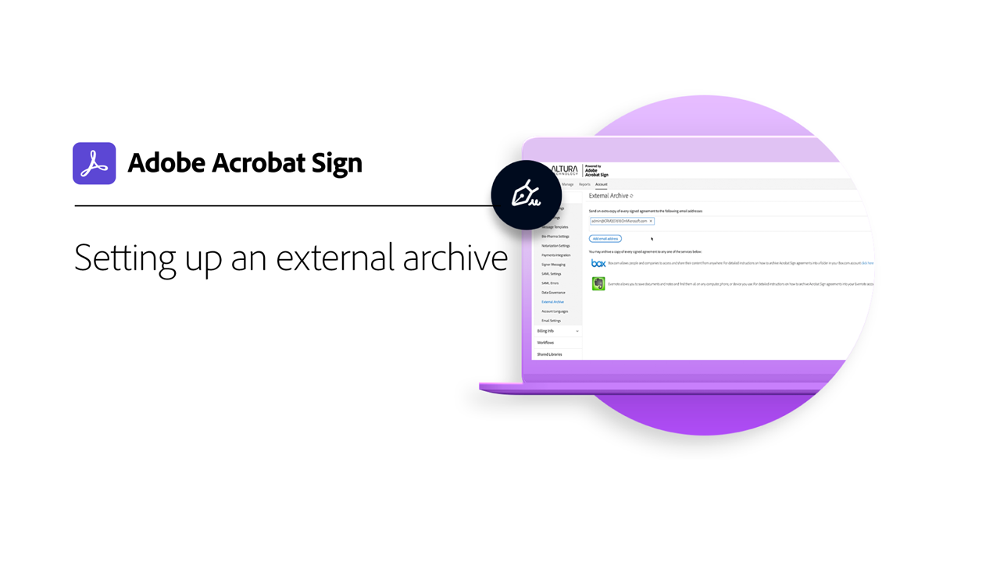
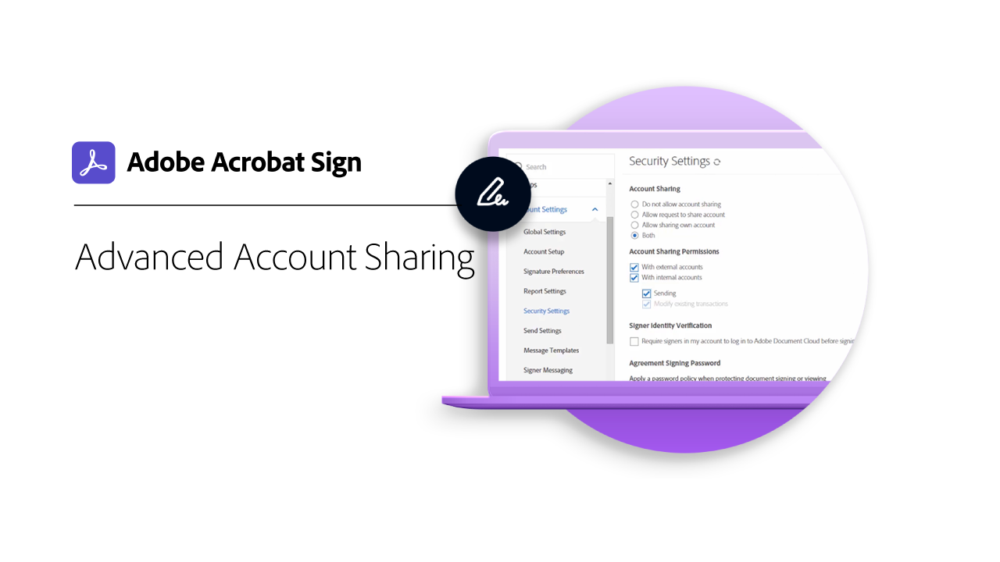
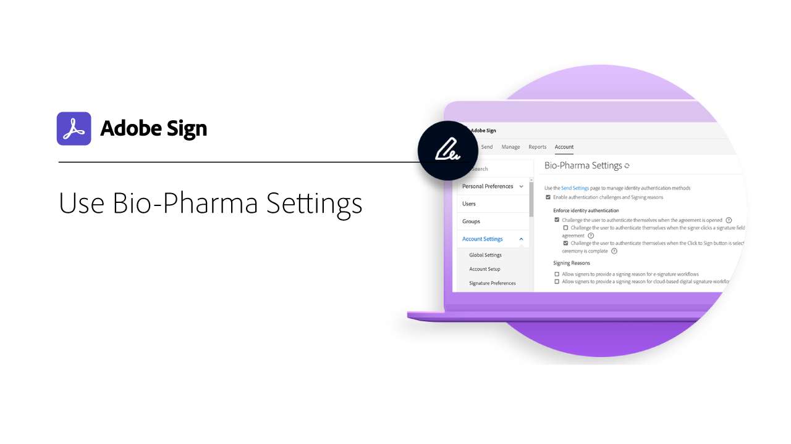

# 管理者の概要

アカウントへのユーザーの追加、グループの設定、アクセスの共有、ワークフロー、外部アーカイブ、共有イベントと通知の設定について説明します。 これらのチュートリアルは、インストールフェーズを過ぎ、Adobe Signの管理を開始する準備が整った管理者向けに設計されています。 詳細タスクでは、管理者の設定部分を超えて展開し、グローバル設定、アカウントのアクセスと共有、テキストのタグ付けの定義に移行するトピックについて説明します。

## はじめに

<table style="table-layout:fixed">
<tr>
  <td>
    
    

    <a href="up-and-running-admin.md"><strong>管理者向けに稼働</strong></a>
    

    <em>管理者がAdobe Signを使用して迅速に起動および実行できる7つの主要な領域の概要</em>
     
  </td>
  <td>
    
    

    <a href="set-up-shared-events-and-alert.md"><strong>共有イベントとアラートの設定</strong></a>
    

    <em>組織のイベントと警告の設定を構成します</em>
     
  </td>
  <td>
    
    

    <a href="add-users-to-your-account.md"><strong>ユーザーの追加</strong></a>
    

    <em>Adobe Signアカウントに個別に、または一括でユーザーを追加する</em>
     
  </td>
</tr>
<tr>
  <td>
    
    

    <a href="create-and-manage-groups.md"><strong>グループの作成と管理</strong></a>
    

    <em>グループの作成、グループへのユーザーの追加、グループ設定の編集</em>
     
  </td>
  <td>
    
    

    <a href="set-up-your-external-archive.md"><strong>外部アーカイブの設定</strong></a>
    

    <em>送信済みの契約のバックアップ・コピー用の外部アーカイブを作成</em>
     
  </td>
  <td>
    
    

    <a href="../sign-advanced-users/create-a-template.md"><strong>ドキュメントテンプレートの作成</strong></a>
    

    <em>再利用可能なドキュメントテンプレートを作成し、迅速かつ一貫性を保つ</em>
     
  </td>
</tr>
<tr>
  <td>
    
    

    <a href="create-a-report.md"><strong>レポートの作成</strong></a>
    

    <em>組織でAdobe Signを使用している場合に、レポートを作成し、スケジュールを設定して、目に見えるようにします。</em>
     
  </td>
  <td>
    
    

    <a href="../sign-advanced-users/webform.md"><strong>Webフォームの設定</strong></a>
    

    <em>Webサイト上で直接電子署名できるドキュメントを作成する</em>
     
  </td>
  <td>
    
    

    <a href="../sign-advanced-users/megasign.md"><strong>一括署名の収集</strong></a>
    

    <em>任意のドキュメントに対して、数百の署名を一度に収集</em>
     
  </td>
</tr>
<tr>
  <td>
    
    

    <a href="building-a-custom-workflow.md"><strong>ワークフローの設定</strong></a>
    

    <em>ドキュメント・ワークフローを自動化し、電子署名とデータを迅速に取得</em>
     
  </td>
  <td>
    
    

     
  </td>
  <td>
    
    

     
  </td>
</tr>
</table>

## 高度なタスク

<table style="table-layout:fixed">
<tr>
  <td>
    
    

    <a href="learn-about-global-settings.md"><strong>グローバル設定</strong></a>
    

    <em>組織全体または特定のグループの製品設定をグローバルに編集します</em>
     
  </td>
  <td>
      
    

    <a href="share-account-access.md"><strong>共有アカウントアクセス</strong></a>
    

    <em>別のユーザーのアカウントのトランザクションに対する表示専用アクセスを設定します</em>
     
  </td>
  <td>
    
    

    <a href="advanced-account-sharing.md"><strong>アカウント共有の詳細設定</strong></a>
    

    <em>管理者とユーザーが自分の送信、変更、およびアクセス許可の表示を委任できるように、アカウント共有を設定します</em>
     
  </td>
</tr>
<tr>
  <td>
    
    

    <a href="use-bio-pharma-settings.md"><strong>バイオファーマの設定の使用</strong></a>
    

    <em>FDA 21 CFR Part 11の要件を満たすためのバイオファーマ設定を設定します</em>
     
  </td> 
  <td>
     
    

    <a href="../sign-advanced-users/adobe-sign-text-tagging.md"><strong>Adobe署名テキストのタグ付け</strong></a>
    

    <em>Adobe Acrobat DCを使用したテキストタグ付けによるAdobe Signフォームフィールドの作成</em>
     
  </td>
  <td>
    
    

     
  </td>
</tr>
</table>
