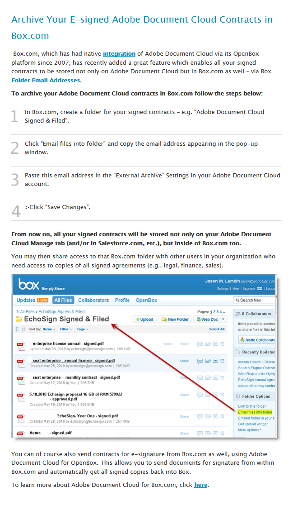
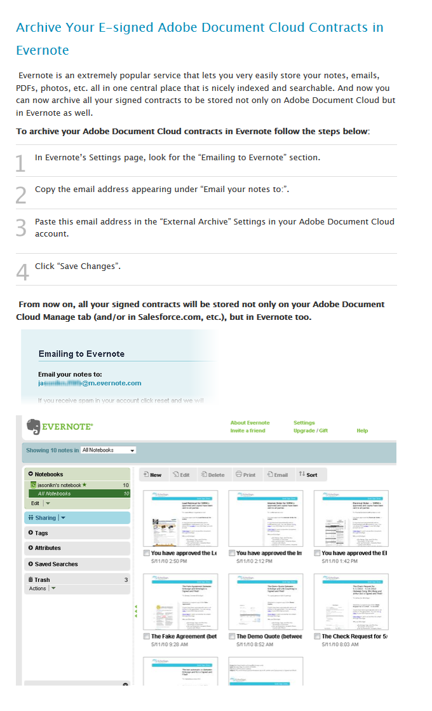

# 外部アーカイブの設定

送信された契約書のバックアップコピー用の外部アーカイブを作成する方法について説明します。 署名済み契約書のコピーは、任意の電子メールアドレス、または Box や Evernote にアーカイブできます。 署名済みおよび保存済みの電子メールのコピーが、設定した電子メールアドレスまたはサービスに送信されます。

## 外部アーカイブ：電子メールアドレス

1. アカウント管理者としてログインします。

1. クリック **[!UICONTROL アカウント設定]** > **[!UICONTROL 外部アーカイブ]** の下に [!UICONTROL アカウント] 」タブをクリックします。

   

1. アーカイブ電子メールアドレスを入力し、「 **[!UICONTROL 変更の保存]**&#x200B;を選択します。

   

## 外部アーカイブ：Box.com

1. アカウント管理者としてログインします。

1. クリック **[!UICONTROL アカウント設定]** > **[!UICONTROL 外部アーカイブ]** の下に [!UICONTROL アカウント] 」タブをクリックします。

1. 次の [!UICONTROL ここをクリック] box ロゴの右側にリンクします。

   

1. ポップアップウィンドウに表示される Box 向けの指示に従います。

   

## 外部アーカイブ：Evernote

1. アカウント管理者としてログインします。

1. クリック **[!UICONTROL アカウント設定]** > **[!UICONTROL 外部アーカイブ]** の下に [!UICONTROL アカウント] 」タブをクリックします。

1. 次の **[!UICONTROL ここをクリック]** Evernote ロゴの右側にリンクします。

   

1. ポップアップウィンドウに表示される Evernote 向けの指示に従います。

   
