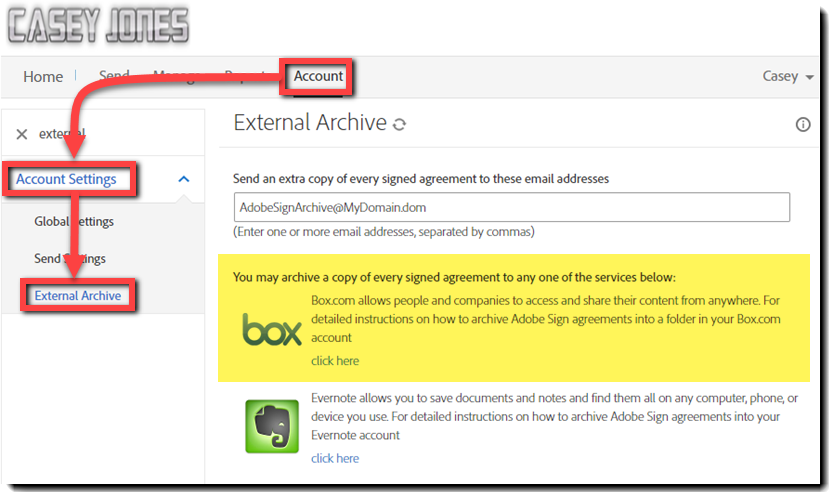

# 外部アーカイブの設定

送信された契約のバックアップコピー用に外部アーカイブを作成する方法を説明します。 署名済み契約のコピーは、任意の電子メールアドレス、またはBoxとEvernoteにアーカイブできます。 署名済みの電子メールのコピーが、設定した電子メールアドレスまたはサービスに送信されます。

## 外部アーカイブ：電子メールアドレス

1. アカウント管理者としてログインします。

1. [[!UICONTROL アカウント]]タブで、[**[!UICONTROL アカウント設定]**] > [**[!UICONTROL 外部アーカイブ]**]をクリックします。

   

1. アーカイブの電子メールアドレスを入力し、**[!UICONTROL [変更の保存]]**&#x200B;をクリックします。

   

## 外部アーカイブ：Box.com

1. アカウント管理者としてログインします。

1. [[!UICONTROL アカウント]]タブで、[**[!UICONTROL アカウント設定]**] > [**[!UICONTROL 外部アーカイブ]**]をクリックします。

1. ボックスのロゴの右側にある[!UICONTROL ここをクリック]します。

   

1. ポップアップウィンドウに表示される Box 向けの指示に従います。

   

## 外部アーカイブ：Evernote

1. アカウント管理者としてログインします。

1. [[!UICONTROL アカウント]]タブで、[**[!UICONTROL アカウント設定]**] > [**[!UICONTROL 外部アーカイブ]**]をクリックします。

1. Evernoteロゴの右側にある&#x200B;**[!UICONTROL ここをクリック]**&#x200B;します。

   

1. ポップアップウィンドウに表示される Evernote 向けの指示に従います。

   
