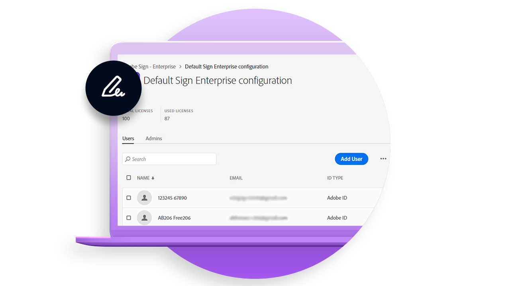

# デプロイの概要

組織内にAcrobat Signをデプロイする際に役立つ情報を掲載したベストプラクティスに関する記事。

<table style="table-layout:fixed">
<tr>
  <td>
    
    

    <a href="https://helpx.adobe.com/enterprise/using/adobe-sign-for-enterprise.html" target="_blank"><strong>Admin Console上のAcrobat Signの管理</strong></a>
    

    <em>AdobeのエンタープライズプラットフォームであるAdobe Admin ConsoleでAcrobat Signのユーザーとライセンスを管理する方法を説明します</em>
     
  </td>
  <td>
    
    

    <a href="https://www.adobe.com/trust/document-cloud-security.html" target="_blank"><strong>Adobeセキュリティセンター</strong></a>
    

    <em>Acrobat Signのセキュリティ、合法性、および標準に関するアドビの継続的な取り組みについて説明します</em>
     
  </td>
  <td>
    
    

    <a href="assets/SignStudyGuide.pdf"><strong>Acrobat Sign Essentialsスタディガイド</strong></a>
    

    <em>Acrobat Sign Essentials Assessment (AD3-D104)のAcrobat Signスタディガイド</em>
     
  </td>
  <td>
    
    

     
  </td>
</tr>
</table>
