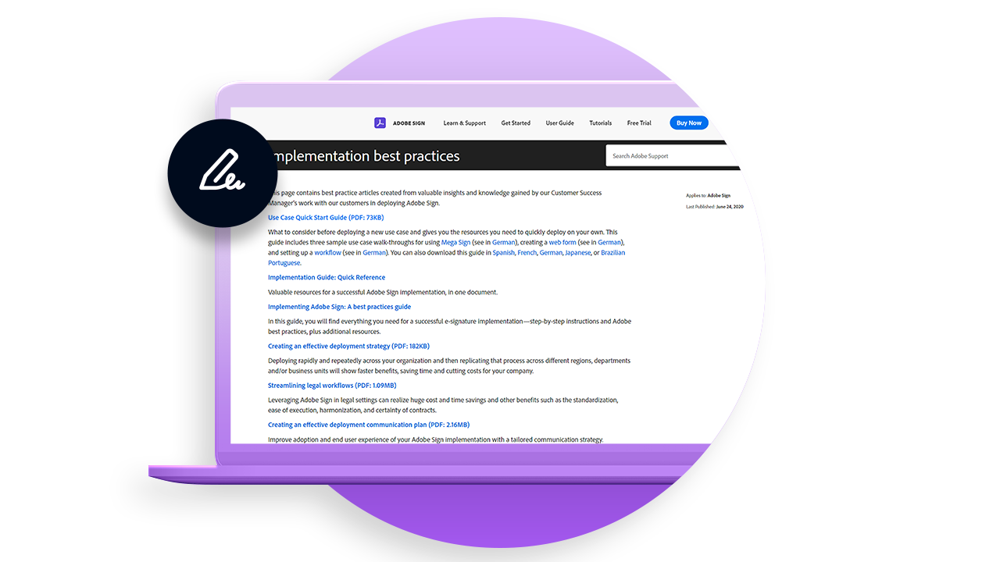

# デプロイの概要

Best practice articles with valuable insight on deploying Adobe Sign within your organization.

<table style="table-layout:fixed">
<tr>
  <td>
    
    

    <a href="https://helpx.adobe.com/enterprise/using/adobe-sign-for-enterprise.html" target="_blank"><strong>Admin ConsoleでのAdobe Signの管理</strong></a>
    

    <em>AdobeのエンタープライズプラットフォームであるAdobe Admin ConsoleでAdobe Signのユーザーとライセンスを管理する方法について説明します</em>
     
  </td>
  <td>
    
    

    <a href="https://helpx.adobe.com/sign/using/adobe-sign-training-best-practice.html" target="_blank"><strong>ベストプラクティス</strong></a>
    

    <em>Adobe Signのデプロイにおいて、カスタマーサクセスマネージャーがお客様と協力して獲得した貴重なインサイトと知識をご確認ください</em>
     
  </td>  
  <td>
    
    

    <a href="https://www.adobe.com/trust/document-cloud-security.html" target="_blank"><strong>Adobe Trust Center</strong></a>
    

    <em>Adobe Signのセキュリティ、適法性、標準に関するアドビの継続的な取り組みについてご覧ください</em>
     
  </td>
</tr>
<tr>
  <td>
    
    

    <a href="assets/SignStudyGuide.pdf"><strong>Adobe Sign Essentials Study Guide</strong></a>
    

    <em>Adobe Sign Essentials Assessment(AD3-D104) のAdobe Sign学習ガイド</em>
     
  </td>
  <td>
    
    

     
  </td>
  <td>
    
    

     
  </td>
</tr>
</table>
