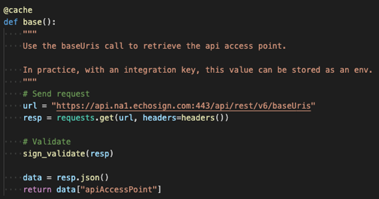
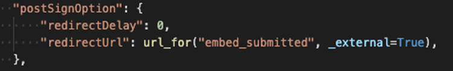

# 埋め込まれた電子サインおよび文書エクスペリエンスの作成

Acrobat Sign APIを使用して、電子サインおよび文書エクスペリエンスをwebプラットフォームとコンテンツおよび文書管理システムに埋め込む方法について説明します。 この実践チュートリアルは、4つの部分で構成されています。

## レッスン1：必要なもの

パート1では、パート2～4に必要なものをすべて使い始める方法を説明します。 まず、API資格情報の取得から始めましょう。

+++API資格情報の取得方法の詳細を表示

* [Acrobat Sign デベロッパーアカウント](https://acrobat.adobe.com/jp/ja/sign/developer-form.html)
* [スターターコード](https://github.com/benvanderberg/adobe-sign-api-tutorial)
* [VSコード（または任意のエディター）](https://code.visualstudio.com)
* Python 3.x
   * Mac — Homebrew
   * Linux – 組み込みインストーラー
   * Windows — Chocolatey
   * すべて – https://www.python.org/downloads/

+++

## パート2：低/コードなし – webフォームの機能

パート2では、webフォームを使用する低/コードなしのオプションについて説明します。 最初はコードを書かないようにするべきか、考えてみてください。

+++Webフォームの作成方法に関する詳細の表示

1. デベロッパーアカウントでAcrobat Signにアクセスします。

1. 選択 **Webフォームの公開** をクリックします。

   

1. 契約書を作成します。

   

1. フラットなHTMLページに契約書を埋め込むことができます。

1. クエリパラメーターを動的に追加してみましょう。

   

+++

## パート3：フォームを使用した契約書の送信とデータの結合

パート3では、契約書を動的に作成します。

+++契約書を動的に作成する方法の詳細を表示

まず、アクセス権を確立する必要があります。 Acrobat Signでは、APIを介して接続する方法が2つあります。 OAuthトークンと統合キー。 アプリケーションでOAuthを使用する特別な理由がない限り、まず統合キーを確認する必要があります。

1. 選択 **統合キー** を **API情報** メニュー（下） **アカウント** Acrobat Signの「 」タブ。

   

これで、APIにアクセスして操作できるようになったので、APIで何ができるかを確認してください。

1. 次に移動： [Acrobat Sign REST APIバージョン6メソッド](http://adobesign.com/public/docs/restapi/v6).

   

1. トークンを「bearer」値として使用します。

   

最初の契約書を送信するには、APIの使用方法を理解することが最善です。

1. 一時ドキュメントを作成し、送信します。

>[!NOTE]
>
>JSONベースのリクエスト呼び出しには、「Model」および「Minimal Model Schema」オプションがあります。 これにより、仕様と最小ペイロードセットが提供されます。

契約書を初めて送信した後は、ロジックを追加する準備が整いました。 繰り返しを最小限に抑えるためにヘルパーを設定することは常に良い考えです。 以下にその例を示します。

**バリデーター**

**ヘッダー/認証**

**ベースURI**

一時的なドキュメントがSignエコシステムの壮大なスキームのどこに入るかに注意してください。
一時的 – >契約書の一時的 – >テンプレート – >契約書の一時的 – >ウィジェット – >契約書

この例では、文書ソースとしてテンプレートを使用しています。 署名用にドキュメントを動的に生成する明確な理由（レガシーコードやドキュメント生成など）がない限り、通常これは最適な方法です。

コードは非常に単純です。文書ソースとしてライブラリドキュメント（テンプレート）を使用します。 1番目と2番目の署名者は動的に割り当てられます。 この `IN_PROCESS` 状態は、文書がすぐに送信されることを意味します。 また、 `mergeFieldInfo` フィールドに動的に入力するために使用されます。

+++

## パート4：署名エクスペリエンスやリダイレクトなどを埋め込む

多くのシナリオでは、トリガーされた参加者が契約書に即座に署名できるようにしたい場合があります。 これは、お客様向けのアプリケーションやキオスクで役立ちます。

+++署名エクスペリエンスを埋め込む方法の詳細を表示

最初の送信電子メールをトリガーしたくない場合は、API呼び出しを変更することで簡単にビヘイビアーを管理できます。

署名後のリダイレクトを制御する方法は次のとおりです。

契約書作成プロセスを更新したら、最後の手順として署名URLを生成します。 この呼び出しもかなり単純で、署名者が署名プロセスの役割にアクセスするために使用するURLを生成します。

>[!NOTE]
>
>契約書作成呼び出しは技術的に非同期であることに注意してください。 つまり、「POST」の契約書呼び出しは可能ですが、契約書の準備はまだ整っていません。 最善の方法は、再試行ループを確立することです。 お客様の環境に最適な方法で再試行してください。

すべてがまとまれば、その解決策は非常に簡単です。 契約書を作成してから、署名者がクリックして署名の儀式を開始するための署名URLを生成する場合

+++

## その他のトピック

* [JSイベント](https://www.adobe.io/apis/documentcloud/sign/docs.html#!adobedocs/adobe-sign/master/events.md)
* Webhookイベント
   * [REST API](https://sign-acs.na1.echosign.com/public/docs/restapi/v6#!/webhooks/createWebhook)
   * [Acrobat Sign v6のwebhook](https://www.adobe.io/apis/documentcloud/sign/docs.html#!adobedocs/adobe-sign/master/webhooks.md)
* [リクエストメールを再アクティベート（イベントを含む）](https://sign-acs.na1.echosign.com/public/docs/restapi/v6#!/agreements/updateAgreement)
* [タイムアウトを再試行に置き換える](https://stackoverflow.com/questions/23267409/how-to-implement-retry-mechanism-into-python-requests-library)
* カスタムリマインダー
   * 最初の作成時

     

   * または1つ追加 [機内で](https://sign-acs.na1.echosign.com/public/docs/restapi/v6#!/agreements/createReminderOnParticipant)
