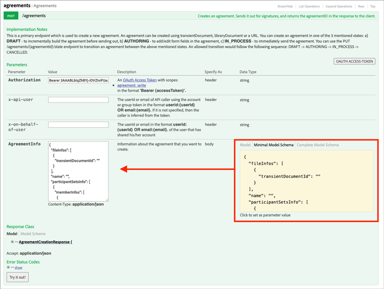

# 埋め込みの電子署名とドキュメントの経験を作成する

Adobe Sign APIを使用して、Webプラットフォームやコンテンツ、ドキュメント管理システムに電子署名とドキュメントの経験を埋め込む方法を説明します。 次のリンクで説明する、この実践的なチュートリアルの4つの部分があります。

<table style="table-layout:fixed">
<tr>
  <td>
    
    

    <a href="embeddedesignature.md#part1"><strong>パート1:必要なもの</strong></a>
    

  </td>
  <td>
    
    

    <a href="embeddedesignature.md#part2"><strong>パート2:低コード/コードなし – Webフォームの機能</strong></a>
    

  </td>
  <td>
   
    

    <a href="embeddedesignature.md#part3"><strong>レッスン3:フォームと契約を送信し、データを結合する</strong></a>
    

  </td>
  <td>
   
    

    <a href="embeddedesignature.md#part4"><strong>パート4:署名の経験、リダイレクトなどを埋め込む</strong></a>
    

  </td>
</tr>
</table>

## パート1:必要なもの {#part1}

レッスン1では、パーツ2～4に必要なものすべてを使用して作業を開始する方法を学びます。 まず、APIの資格情報を取得します。

* [Adobe Sign デベロッパーアカウント](https://acrobat.adobe.com/jp/ja/sign/developer-form.html)
* [スターターコード](https://github.com/benvanderberg/adobe-sign-api-tutorial)
* [VSコード（または任意のエディタ）](https://code.visualstudio.com)
* Python 3.x
   * Mac — Homebrew
   * Linux：組み込みのインストーラ
   * Windows – チョコレート
   * すべて – https://www.python.org/downloads/

## パート2:低コード/コードなし – Webフォームの機能 {#part2}

レッスン2では、Webフォームを使用する場合の低コード/非コードオプションについて説明します。 最初にコードを書くのを避けられるかどうかは、常に確かめるのが良い考えです。

1. 開発者アカウントでAdobe Signにアクセスします。
1. ホームページで[**Webフォームの発行**]をクリックします。

   

1. 契約を作成します。

   

1. 契約をフラットHTMLページに埋め込みます。
1. クエリパラメータを動的に追加してみてください。

   

## レッスン3:フォームと契約を送信し、データを結合する {#part3}

パート3では、免除承諾を動的に作成します。

最初に、アクセスを確立する必要があります。 Adobe Signでは、APIを介して接続する方法が2つあります。 OAuthトークンと統合キー。 OAuthをアプリケーションで使用する特別な理由がない限り、まず統合キーを調べる必要があります。

1. Adobe Signの[**アカウント**]タブの[**API情報**]メニューで[**統合キー**]を選択します。

   

これで、APIにアクセスでき、APIと対話できるようになりました。APIで何ができるかを確認します。

1. [Adobe Sign REST APIバージョン6メソッド](http://adobesign.com/public/docs/restapi/v6)に移動します。

   

1. トークンを「bearer」値として使用します。

   

最初の契約書を送信するには、APIの使い方を理解するのが一番です。

1. 一時的なドキュメントを作成し、送信します。

>[!NOTE]
>
>JSONベースの要求呼び出しには、&quot;Model&quot;および&quot;Minimal Model Schema&quot;オプションがあります。 これにより、仕様と最小ペイロードセットが提供されます。

初めて契約書を送った後、論理を追加する準備が整いました。 繰り返しを最小限に抑える助けを作るのは常に良い考えです いくつかの例を示します。

**検証**

**ヘッダー/認証**

**ベースURI**

Transientドキュメントが、Signエコシステムの大規模なスキーム内でどこに格納されるかを確認してください。
一時的 – >契約
一時的 – >テンプレート – >契約
一時的 – >ウィジェット – >契約

次の使用例は、文書ソースとしてテンプレートを使用します。 署名用のドキュメントを動的に生成する理由（例えば、レガシーコードやドキュメント生成）がない限り、通常はこのルートが最適です。

このコードはかなり単純です。ドキュメントソースにライブラリドキュメント（テンプレート）を使用します。 第1及び第2のシグナーは動的に割り当てられる。 `IN_PROCESS`状態は、ドキュメントが直ちに送信されることを意味します。 また、`mergeFieldInfo`は、動的にフィールドを埋めるのに活用されます。

## パート4:署名の経験、リダイレクトなどを埋め込む {#part4}

多くのシナリオでは、トリガー元の参加者が直ちに契約に署名できるようにします。 これは、お客様向けのアプリケーションやキオスクに便利です。

最初に送信する電子メールをトリガしたくない場合は、API呼び出しを変更して動作を管理するのが簡単です。

署名後のリダイレクトを制御する方法を次に示します。

免除承諾作成プロセスを更新した後、最後の手順で署名URLを生成します。 この呼び出しは非常に簡単で、署名者が署名プロセスの一部にアクセスする際に使用するURLを生成します。

>[!NOTE]
>
>免除承諾の作成呼び出しは技術的に非同期であることに注意してください。 これは、「POST」契約の呼び出しは可能だが、契約の準備が整っていないことを意味します。 再試行ループを確立するのがベストプラクティスです。 再試行を行うか、環境に最適な方法を選択してください。

すべてを組み合わせると、その解決は非常に簡単です。 契約を結び、署名者がクリックして署名の儀式を開始するための署名URLを生成する。

### その他のトピック

* [JSイベント](https://www.adobe.io/apis/documentcloud/sign/docs.html#!adobedocs/adobe-sign/master/events.md)
* Webhookイベント
   * [REST API](https://sign-acs.na1.echosign.com/public/docs/restapi/v6#!/webhooks/createWebhook)
   * [Adobe Sign v6のWebhooks](https://www.adobe.io/apis/documentcloud/sign/docs.html#!adobedocs/adobe-sign/master/webhooks.md)
* [要求電子メールの再アクティブ化（イベント付き）](https://sign-acs.na1.echosign.com/public/docs/restapi/v6#!/agreements/update契約)
* [タイムアウトを再試行で置き換える](https://stackoverflow.com/questions/23267409/how-to-implement-retry-mechanism-into-python-requests-library)

     
* ユーザー設定のアラーム
   * 初期作成時

      

   * または、[機内](https://sign-acs.na1.echosign.com/public/docs/restapi/v6#!/agreements/createReminderOnParticipant)を1つ追加します。

## 追加のリソース

http://bit.ly/Summit21-T126

内容：
* Adobe Sign デベロッパーアカウント
* Adobe Sign APIドキュメント
* サンプルコード
* Visual Studioコード
* Python
