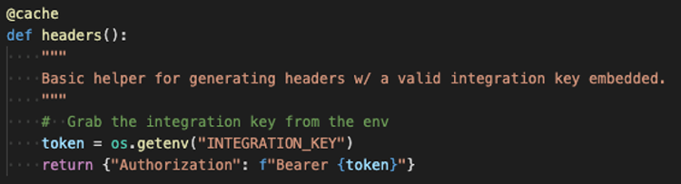

# 組み込みの電子サインと文書エクスペリエンスを作成

Adobe Sign API を使用して、web プラットフォームやコンテンツ管理システム、ドキュメント管理システムに電子サインやドキュメントのエクスペリエンスを組み込む方法を説明します。 この実践チュートリアルは、以下のリンク先から 4 つのパートで構成されています。

<table style="table-layout:fixed">
<tr>
  <td>
    
    

    <a href="embeddedesignature.md#part1"><strong>パート 1:必要なもの</strong></a>
    

  </td>
  <td>
    
    

    <a href="embeddedesignature.md#part2"><strong>パート 2:コードの削減/無効化 — Web フォームの機能</strong></a>
    

  </td>
  <td>
   
    

    <a href="embeddedesignature.md#part3"><strong>パート 3:フォームと結合データで契約書を送信</strong></a>
    

  </td>
  <td>
   
    

    <a href="embeddedesignature.md#part4"><strong>パート 4:署名エクスペリエンスやリダイレクトなどの埋め込み</strong></a>
    

  </td>
</tr>
</table>

## パート 1:必要なもの {#part1}

パート 1 では、パート 2～4 で必要なすべての作業の開始方法を学びます。 まず、API 資格情報を取得します。

* [Adobe Sign デベロッパーアカウント](https://acrobat.adobe.com/jp/ja/sign/developer-form.html)
* [スターターコード](https://github.com/benvanderberg/adobe-sign-api-tutorial)
* [VS コード（または選択したエディター）](https://code.visualstudio.com)
* Python 3.x
   * Mac — Homebrew
   * Linux — ビルトインインストーラー
   * Windows — Chocolatey
   * すべて — https://www.python.org/downloads/

## パート 2:コードの削減/無効化 — Web フォームの機能 {#part2}

パート 2 では、Web フォームを使用する際の低コード/コードなしオプションについて説明します。 最初にコードを書くのを避けることができるかどうかを確認することは、常に良い考えです。

1. 開発者アカウントでAdobe Signにアクセスします。
1. クリック **Web フォームの公開** 」をクリックします。

   

1. 契約書を作成します。

   

1. 契約書をフラットな埋め込みページにHTMLします。
1. クエリパラメーターを動的に追加してみましょう。

   

## パート 3:フォームと結合データで契約書を送信 {#part3}

パート 3 では、契約書を動的に作成します。

まず、アクセスを確立する必要があります。 Adobe Signでは、API 経由で接続する方法が 2 つあります。 OAuth トークンと統合キー。 アプリケーションで OAuth を使用する特別な理由がない限り、最初に統合キーを調べることをお勧めします。

1. 選択 **統合キー** 」を **API 情報** メニュー ( **アカウント** 」タブをクリックします。

   

API にアクセスして操作できるようになったので、API を使用してできることについて説明します。

1. 次の場所に移動します。 [Adobe Sign REST API バージョン 6 メソッド](http://adobesign.com/public/docs/restapi/v6)を選択します。

   

1. トークンを「ベアラー」値として使用します。

   

最初の契約書を送信するには、API の使用方法を理解するのが最善です。

1. 一時的なドキュメントを作成して送信します。

>[!NOTE]
>
>JSON ベースのリクエスト呼び出しには、「モデル」と「最小モデルスキーマ」オプションがあります。 これにより、スペックと最小ペイロードセットが提供されます。

契約書を初めて送信した後、ロジックを追加する準備が整います。 繰り返しを最小限に抑えるために、いくつかのヘルパーを確立することは常に良い考えです。 いくつかの例を示します。

**検証**

**ヘッダー/認証**

**ベース URI**

Transient ドキュメントが Sign エコシステムの壮大なスキーム内のどこに位置するかに注意してください。
一時的 —> 契約一時的 —> テンプレート —> 契約一時的 —> ウィジェット —> 契約書

この例では、テンプレートをドキュメントソースとして使用しています。 署名用にドキュメントを動的に生成する明確な理由（レガシーコードやドキュメント生成など）がない限り、通常はこれが最適な方法です。

このコードはかなり単純です。ドキュメントソースとしてライブラリ文書（テンプレート）を使用します。 最初と 2 番目の署名者は動的に割り当てられます。 この `IN_PROCESS` state は、文書がすぐに送信されることを意味します。 また、 `mergeFieldInfo` は、フィールドに動的に入力するために利用されます。

## パート 4:署名エクスペリエンスやリダイレクトなどの埋め込み {#part4}

多くの場合、トリガーした参加者がすぐに契約書に署名できるようにすることができます。 これは、顧客向けのアプリケーションやキオスクで便利です。

最初の送信メールがトリガーされないようにするには、API 呼び出しを変更して動作を管理する方法があります。

署名後リダイレクトを制御する方法は次のとおりです。

契約書作成プロセスを更新した後、最後の手順は署名 URL の生成です。 この呼び出しも非常に簡単で、署名者が署名プロセスの自分の部分にアクセスするために使用できる URL を生成します。

>[!NOTE]
>
>契約書作成の呼び出しは、技術的には非同期です。 これは、「POST」契約書の呼び出しは可能ですが、契約書はまだ準備ができていないことを意味します。 最適な方法は、再試行ループを確立することです。 お使いの環境に最適な方法で再試行などを行ってください。

すべてを組み合わせると、ソリューションはかなり簡単になります。 契約書を作成してから、署名者がクリックして署名の儀式を開始するための署名 URL を生成します。

### その他のトピック

* [JS イベント](https://www.adobe.io/apis/documentcloud/sign/docs.html#!adobedocs/adobe-sign/master/events.md)
* Webhook イベント
   * [REST API](https://sign-acs.na1.echosign.com/public/docs/restapi/v6#!/webhooks/createWebhook)
   * [Adobe Sign v6 の Webhooks](https://www.adobe.io/apis/documentcloud/sign/docs.html#!adobedocs/adobe-sign/master/webhooks.md)
* [リクエスト電子メールの再アクティベート（イベントあり）](https://sign-acs.na1.echosign.com/public/docs/restapi/v6#!/agreements/updateAgreement)
* [タイムアウトを再試行に置き換える](https://stackoverflow.com/questions/23267409/how-to-implement-retry-mechanism-into-python-requests-library)

     
* カスタムリマインダー
   * 最初の作成時

      

   * または 1 つ追加 [機内の](https://sign-acs.na1.echosign.com/public/docs/restapi/v6#!/agreements/createReminderOnParticipant)

## 追加のリソース

http://bit.ly/Summit21-T126

内容：
* Adobe Sign デベロッパーアカウント
* Adobe Sign API ドキュメント
* サンプルコード
* Visual Studio Code
* Python
