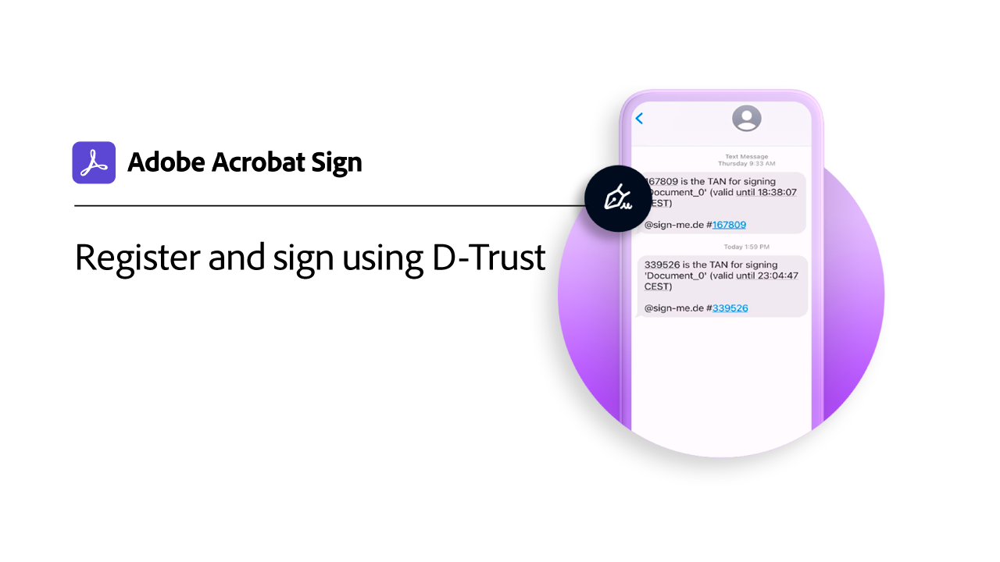

# デジタルIDの概要

電子形式のパスポートと同様に、デジタルIDを使用すると、自分の身元を確実に証明できます。 また、Acrobat SignでデジタルIDを使用して電子サインを行う場合、その文書で電子サインを承認したことをより確実に確認できます。 次のチュートリアルでは、Acrobat Signで世界中のデジタルIDを使用する方法を説明します。

>[!NOTE]
>
>クラウド署名でデジタルIDを使用する前に、組織の管理者に問い合わせて、プロバイダーのソリューションがAcrobat Signで有効になっていることを確認してください。

## 新機能

>[!BEGINTABS]

>[!TAB Digidentityを使用した登録と署名]

Acrobat Signで[[!DNL Digidentity]](digidentity-sign.md)デジタルIDを登録して使用する方法について説明します。

>[!TAB D-Trustを使用して登録および署名]

[[!DNL D-Trust]](d-trust.md)でIDを登録し、Acrobat Signで文書に[!DNL D-Trust]デジタル署名を使用する方法について説明します。

>[!ENDTABS]

## [!DNL Aadhaar]

<table style="table-layout:fixed">
<tr>
 <td>
    
    

    <a href="aadhaar-sign.md"><strong>[!DNL Aadhaar]</strong></a>を使用して署名しています
    

    <em>Acrobat Signで[!DNL Aadhaar]デジタルIDを使用する方法</em>を説明します
     
  </td>
  <td>
    
    

     
  </td>
  <td>
    
    

     
  </td>
  <td>
    
    

     
  </td>
</tr>
</table>

## [!DNL Digidentity]

<table style="table-layout:fixed">
<tr>
  <td>
    
    

    <a href="digidentity-sign.md"><strong>[!DNL Digidentity]</strong></a>を使用して登録および署名
    

    <em>Acrobat Signで[!DNL Digidentity]デジタルIDを登録して使用する方法</em>を説明します
     
  </td>
  <td>
    
    

     
  </td>
  <td>
    
    

     
  </td>
  <td>
    
    

     
  </td>
</tr>
</table>

## [!DNL D-Trust]

<table style="table-layout:fixed">
<tr>
  <td>
    
    

    <a href="d-trust.md"><strong>D-Trustを使用して登録および署名</strong></a>
    

    <em>[!DNL D-Trust]でIDを登録し、[!DNL D-Trust]のデジタル署名をAcrobat Signの文書で使用する方法を説明します</em>
     
  </td>
  <td>
    
    

     
  </td>
  <td>
    
    

     
  </td>
  <td>
    
    

     
  </td>
  </tr>
  </table>

## [!DNL Intesi Group]

<table style="table-layout:fixed">
<tr>
  <td>
    
    

    <a href="intesi-advanced.md"><strong>[!DNL Intesi Group]からデジタルIDを取得（上級）</strong></a>
    

    <em>[!DNL Intesi Group]</em>から高度なデジタル署名証明書を取得する方法を説明します
     
  </td>
  <td>
    
    

    <a href="intesi-qualified.md"><strong>[!DNL Intesi Group] （適格）からデジタルIDを取得</strong></a>
    

    <em>[!DNL Intesi Group]</em>から適格なデジタル署名証明書を取得する方法について説明します
     
  </td>
  <td>
    
    

    <a href="intesi-sign.md"><strong>[!DNL Intesi Group]</strong></a>を使用して署名しています
    

    <em>Acrobat Signで[!DNL Intesi Group]デジタルIDを使用する方法</em>を説明します
     
  </td>
  <td>
    
    

     
  </td>
</tr>
</table>
