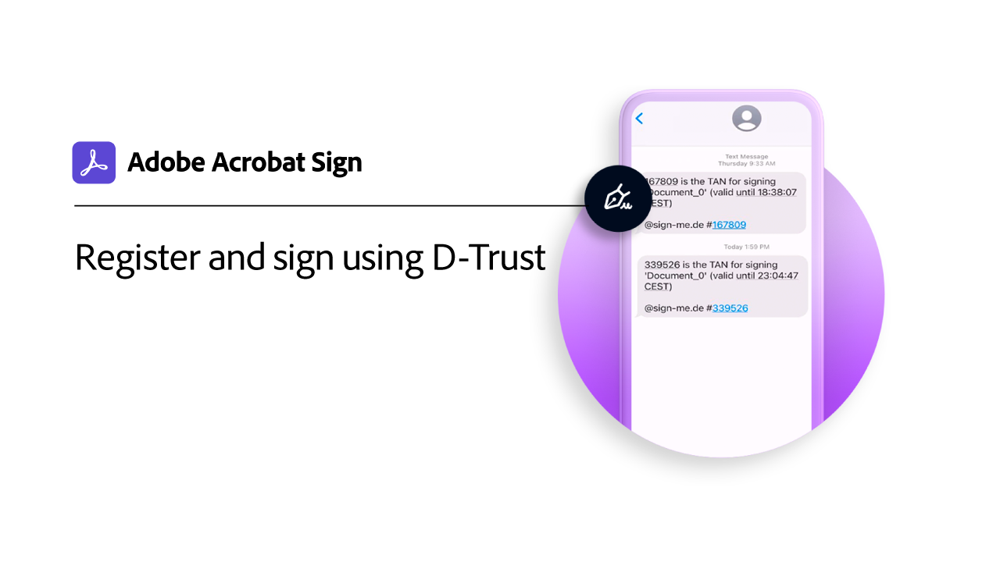

# デジタルIDの概要

電子形式のパスポートと同様に、デジタルIDを使用すると、自分の身元を確実に証明できます。 また、Acrobat SignでデジタルIDを使用して電子サインを行う場合、その文書で電子サインを承認したことをより確実に確認できます。 次のチュートリアルでは、Acrobat Signで世界中のデジタルIDを使用する方法を説明します。

>[!NOTE]
>
>クラウド署名でデジタルIDを使用する前に、組織の管理者に問い合わせて、プロバイダーのソリューションがAcrobat Signで有効になっていることを確認してください。

## 新機能

* [Digidentityを使用した登録と署名](digidentity-sign.md)
の登録と使用方法を学ぶ [!DNL Digidentity] Acrobat SignでのデジタルID
* [D-Trustを使用した登録と署名](d-trust.md)
IDの登録方法を説明します [!DNL D-Trust]を選択し、 [!DNL D-Trust] Acrobat Signでの文書のデジタル署名

## [!DNL Aadhaar]

<table style="table-layout:fixed">
<tr>
 <td>
    
    

    <a href="aadhaar-sign.md"><strong>を使用した署名 [!DNL Aadhaar]</strong></a>
    

    <em>の使用方法を学ぶ [!DNL Aadhaar] Acrobat SignでのデジタルID</em>
     
  </td>
  <td>
    
    

     
  </td>
  <td>
    
    

     
  </td>
  <td>
    
    

     
  </td>
</tr>
</table>

## [!DNL Digidentity]

<table style="table-layout:fixed">
<tr>
  <td>
    
    

    <a href="digidentity-sign.md"><strong>を使用して登録して署名 [!DNL Digidentity]</strong></a>
    

    <em>の登録と使用方法を学ぶ [!DNL Digidentity] Acrobat SignでのデジタルID</em>
     
  </td>
  <td>
    
    

     
  </td>
  <td>
    
    

     
  </td>
  <td>
    
    

     
  </td>
</tr>
</table>

## [!DNL D-Trust]

<table style="table-layout:fixed">
<tr>
  <td>
    
    

    <a href="d-trust.md"><strong>D-Trustを使用した登録と署名</strong></a>
    

    <em>IDの登録方法を説明します [!DNL D-Trust]を選択し、 [!DNL D-Trust] Acrobat Signでの文書のデジタル署名</em>
     
  </td>
  <td>
    
    

     
  </td>
  <td>
    
    

     
  </td>
  <td>
    
    

     
  </td>
  </tr>
  </table>

## [!DNL Intesi Group]

<table style="table-layout:fixed">
<tr>
  <td>
    
    

    <a href="intesi-advanced.md"><strong>デジタルIDを取得 [!DNL Intesi Group] （上級）</strong></a>
    

    <em>様から高度なデジタル署名証明書を取得する方法について説明します。 [!DNL Intesi Group]</em>
     
  </td>
  <td>
    
    

    <a href="intesi-qualified.md"><strong>デジタルIDを取得 [!DNL Intesi Group] （適格）</strong></a>
    

    <em>適格なデジタル署名証明書を取得する方法を説明します。 [!DNL Intesi Group]</em>
     
  </td>
  <td>
    
    

    <a href="intesi-sign.md"><strong>を使用した署名 [!DNL Intesi Group]</strong></a>
    

    <em>の使用方法を学ぶ [!DNL Intesi Group] Acrobat SignでのデジタルID</em>
     
  </td>
  <td>
    
    

     
  </td>
</tr>
</table>
