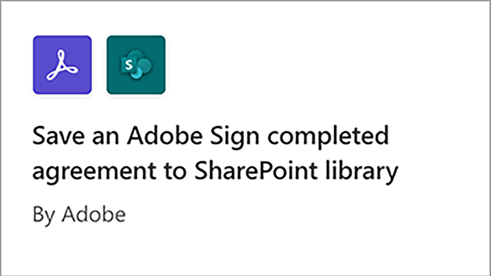
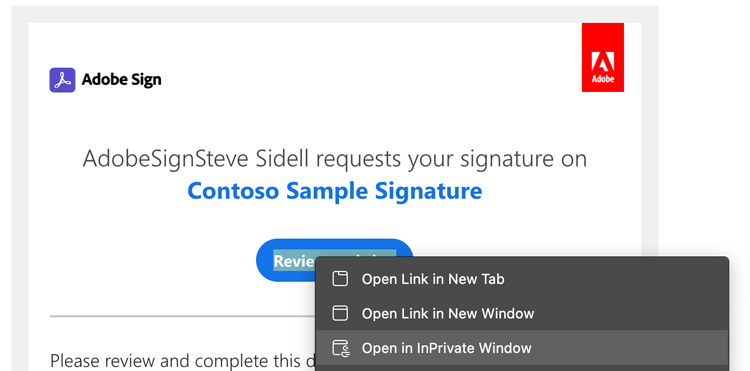

# Microsoft Power Platform向けAcrobat Signを使用した文書の自動処理

Microsoft Powerアプリケーション用のAcrobat SignおよびAdobe PDFツールコネクタをアクティベートして使用する方法について説明します。 コードを使用せずに、ビジネス承認および署名プロセスを迅速かつ安全に自動化するワークフローを構築できます。 以下のリンクで概説されているこの実践チュートリアルには、4つの部分があります。

<table style="table-layout:fixed">
<tr>
  <td>
    
    

    <a href="documentautomation.md#part1"><strong>パート1:Acrobat Signを使用して署名済み契約書をSharePointに保存する</strong></a>
    

  </td>
  <td>
    
    

    <a href="documentautomation.md#part2"><strong>パート2:Acrobat Signを使用して電子サインを取得するための自動承認プロセス</strong></a>
    

  </td>
  <td>
   
    

    <a href="documentautomation.md#part3"><strong>パート3: Adobe PDF Toolsによる文書の自動OCR</strong></a>
    

  </td>
  <td>
   
    

    <a href="documentautomation.md#part4"><strong>パート4:Adobe PDF Toolsを使用した自動ドキュメントアセンブリ</strong></a>
    

  </td>
</tr>
</table>

## 前提条件

* Microsoft 365およびPower Automateの使いやすさ
* Acrobat Signの知識
* SharePointおよびPower Automateへのアクセス権を持つMicrosoft 365アカウント(Acrobat Signの場合はBasic、Adobe PDF Toolsの場合はPremium)
* Acrobat Signエンタープライズ版またはAcrobat Signデベロッパーアカウント

**演習1と2**

* APIにアクセスできるAcrobat Signアカウント 開発者アカウントまたはエンタープライズアカウント。
* 編集権限を持つPower AutomateからアクセスできるSharePointサイト フル管理者アクセスをお勧めします。
* 署名承認リクエストと署名用のサンプル文書。

**演習3および4**

マテリアルのダウンロード [こちら](https://github.com/benvanderberg/adobe-sign-pdftools-powerautomate-tutorial)

## パート1:Acrobat Signを使用して署名済み契約書をSharePointに保存する {#part1}

パート1では、Power Automate Flowテンプレートを使用して自動化されたワークフローを設定し、署名済みの契約書をすべてSharePointサイトに保存します。

1. Power Automateに移動します。
1. Acrobat Signを検索します。

   

1. を選択 **Acrobat Signが完了した契約書をSharePointライブラリに保存**.

   

1. 画面を確認して、必要な接続を構成します。 Acrobat Sign接続を有効にします。
1. 青をクリックします `+` 記号で囲みます。

   

1. Acrobat Signアカウントの電子メールを入力し、新しいウィンドウのパスワードフィールドをクリックします。

   

   Adobeがアカウントを確認するまでお待ちください。

   >[!NOTE]
   >
   >Adobe IDまたはアドビの企業SSOを使用している場合、このチェックにより適切なログイン画面に誘導されます。

1. 完全なログイン
1. クリック **続行** をクリックして、フロー編集画面に移動します。
1. トリガーに名前を付けます。

   

1. SharePointを設定します。

   

   **サイトアドレス：** お客様のSharePointサイト
   **フォルダーパス：** 使用する共有ドキュメントへのパス
   **ファイル名：** デフォルトを使用
   **ファイルの内容：** デフォルトを使用

1. フローを保存します.

   

1. 青い戻り矢印があるフロー概要画面に移動します。 パート2でこのフローをテストします。

   

次のパートでこのフローをテストします。

## パート2:Acrobat Signを使用して電子サインを取得するための自動承認プロセス {#part2}

パート2では、最初のパートを構築してより堅牢なフローを作成し、両方のフローをテストして動作を確認します。

1. 選択 **テンプレート** Power Automateインターフェイスの左側に表示されます。

   

1. 「manager approval」を検索します。
1. 選択 **選択したファイルのマネージャーの承認を要求**.

   

   接続を確認し、不足している場合は追加します。

   >[!NOTE]
   >
   >これが承認を使用する最初のフローである場合は、フローの実行時に完全に設定されます。

1. クリック **続行** をクリックして、フロー編集画面に移動します。

   このフローには、エラーチェックやネストされた条件付き手順など、事前に設定された手順が多数あります。

1. 設定 **選択したファイル用** 次の手順に従います。
   **サイトアドレス：** お客様のSharePointサイト
   **ライブラリ名：** 文書リポジトリ
1. 次のように入力を追加します。
   **種類**：電子メール
   **名前**：署名者の電子メール

   

1. 設定 **ファイルのプロパティを取得：** 次の手順に従います。
   **サイトアドレス：** お客様のSharePointサイト
   **ライブラリ名：** 文書リポジトリ

1. 下にスクロールして **ある場合**.

   

1. クリック **アクションを追加** を **ある場合** 署名用に送信する手順を追加するボックス（一番下のボックスではありません）。

   

1. 検索 **SharePointでファイルコンテンツを取得** を選択 **ファイルコンテンツを取得**.

   

1. 設定する **ファイルコンテンツを取得** 次の手順に従います。

   

   **サイトアドレス：** お客様のSharePointサイト
   **ファイル識別子：** 「ID」を検索し、次からIDを選択します。 **ファイルのプロパティを取得** 手順
1. 「Adobe」を検索し、 **Acrobat Sign** をクリックして、別のアクションを追加します。

   

1. Acrobat Signの検索ボックスに「upload」と入力し、 **文書をアップロードして文書IDを取得**.
1. ダイナミック変数を検索する **名前** トリガーで選択したアイテム/ドキュメントの名前を取得するには、次の操作を実行します **ファイル名**.
1. クリック **式** の下の変数補助内 **ファイルコンテンツ**.

   

1. アポストロフィを1つ追加して、クリックして戻る **動的コンテンツ**、アポストロフィを削除して **ファイルコンテンツ** 次に **OK**.

   追加のアポストロフィがなく、以下のサンプルのように見えることを確認します。

   

1. Acrobat Signの検索領域で「create」を検索して、別のAcrobat Signアクションを追加します。
1. 選択 **アップロードされた文書から契約書を作成して署名用に送信**.

   

1. 必要な情報を設定します。以下を選択します。 **名前** のダイナミック変数アシスタントから **契約書名**.
を選択 **文書ID** のダイナミック変数アシスタントから **文書ID**.
を選択 **署名者の電子メール** のダイナミック変数アシスタントから **参加者のメールアドレス**.
に「1」を入力 **参加者の順序**.
を選択 **署名者** のドロップダウンから **参加者の役割**.

   

1. **保存** フロー：

### フローのテスト

SharePointサイトの文書リポジトリに移動して、テストします。

1. ドキュメントを選択して **自動化** および **流量** 作成しました。

   

1. フローを開始して、接続を検証します（最初のフロー実行のみ）。
1. 承認者への適切なメッセージを入力 **メッセージ**.
1. 内の文書署名者の電子メールを入力 **署名者の電子メール**.
1. クリック **フローを実行**.

フローを開始するユーザーに設定された承認者は、承認リクエストを受け取ります。 承認は、電子メールまたはPower Automateのアクション項目メニューから行うことができます。
承認されたら、文書に署名します。 ユーザーとSignにログインしているユーザーによっては、プライベートブラウザーウィンドウで署名ウィンドウを開く必要がある場合があります。

署名を完了し、SharePointフォルダーを確認します。

## パート3: Adobe PDF Toolsによる文書の自動OCR {#part3}

パート3では、Microsoft SharePointに読み込まれたPDFのOCRを自動化する方法について説明します。 これにより、SharePointで検索できないスキャン済みPDF文書に関する問題が解決されます。

### SharePointでのフォルダーの設定

文書を保存するMicrosoft SharePointに移動します。

1. クリック **+新規** をクリックして、「Processed Contracts」という新しいフォルダーを作成します。
1. クリック **+新規** 「Old Contracts」という名前の新しいフォルダーを作成します。

   

これらのフォルダーは、Power Automateフローの一部として参照されるようになりました。

### テンプレートからのフローの作成

1. https://flow.microsoft.comにログインします。
1. クリック **テンプレート** をクリックします。

   

1. 選択 **SharePointで、新しく追加したファイルをテキスト検索可能なPDFに変換する**.
1. 「 **+** Adobe PDF Toolsの横にある記号。

   

1. 新規タブでhttps://www.adobe.com/go/powerautomate_getstartedに移動します。
1. 「**今すぐ始める**」をクリックします。

   

1. Adobe ID でログインします。

   

1. 資格情報の名前と資格情報の説明を入力して、 **資格情報の作成**.

   

   資格情報を開いた状態でウィンドウを開いたままにします。 Microsoft Power Automateに入力する必要があります。

   

1. 資格情報を入力して「 **Microsoft Power Automateで作成**.

   

1. 「**続行**」をクリックします。

   

   これでワークフローのビューが表示され、環境に合わせてワークフローを設定する必要があります。

1. 「サイトアドレス」フィールドを選択し、「 」トリガーで使用するSharePointサイトを選択します。 **フォルダー内にファイルが作成されたとき**.

   

1. フォルダーアイコンをクリックして、フォルダーIDの下にあるOld Contractsフォルダーに移動します。

   

1. 編集 **ファイルを作成** フローの下部のアクション：

   変更 **サイトアドレス** をサイトのアドレスに追加します。
処理された契約フォルダの場所をフォルダ・パスで指定します。

1. クリック **保存** をクリックします。
1. クリック **テスト**.
1. 選択 **手動**.
1. クリック **テスト**.

   

### 新しいフローを試す

1. SharePointでOld Contractsフォルダーに移動します。
1. ダウンロードした演習ファイルのE03/Old Contractsに移動します。
1. ReleaseFormXX.pdfファイルをSharePointのOld Contractsフォルダーにコピーします。

   

「Processed Contracts」フォルダーに移動すると、フローの実行が少し遅れた後にPDFが表示されます。 PDFを開くと、テキストが選択可能であることがわかります。
さらに、SharePointでは、文書のインデックスを作成し、SharePointの検索バーから文書のコンテンツを検索することもできます。

## パート4:Adobe PDF Toolsを使用した自動ドキュメントアセンブリ {#part4}

第4部では、MicrosoftSharePointでフローを選択して開始したときに表示される情報に基づいて、多くの文書を結合する方法について説明します。 このシナリオのフローは次のようになります。

* お客様のパッケージに含める内容を選択するための情報を求めます。
* 提供された情報に基づいて、多くの文書が結合されます。 これらの文書には、表紙とオプションのホワイトペーパーが含まれます。
* 結合文書がSharePointに保存されます。

### SharePointへのエクササイズファイルの読み込み

1. 演習ファイル内のE04フォルダを開きます。
1. Proposalフォルダー、Templatesフォルダー、およびGenerated DocsフォルダーをSharePointに読み込みます。

   

これらのフォルダーは参照に使用されます。 特に、プロポーザルにはProposal.docxファイルを使用します。

Templatesフォルダには、Coversフォルダがあり、さまざまな都市の表紙のデザインが含まれています。 オプションの追加のホワイトペーパーを含むWhitepapersフォルダもあります。このフォルダを選択すると、末尾に添付されます。

### Microsoft Power Automateへのフローの読み込み

1. Microsoft Power Automate(https://flow.microsoft.com)にログインします。
1. クリック **自分のフロー**.

   

1. 「**読み込み**」をクリックします。

   

1. クリック **アップロード** E04/Flows/でGenerateProposal_20210311231623.zipフォルダーを選択します。

   

1. 「**読み込み**」をクリックします。

1. の横にある「アクション」の下の「レンチ」アイコンをクリックします。 **お客様に提案書を送信**.

   

1. 選択 **新規として作成** [設定]の下。
1. 「リソース名」でフローの名前を設定します。
1. 「**保存**」をクリックします。

   その他の関連リソースについてこの手順を繰り返し、接続を選択します。

   

1. クリック **読み込み** 君が全てのコネを作った後

### 選択したファイルに設定

フローを作成したので、次の操作を行います。

1. 「**編集**」をクリックします。

   

1. トリガーを選択します **選択したファイル用**.

   「サイトアドレス」にSharePointサイトを追加します。
ライブラリにライブラリを追加します。

   

### Set templateFolderPath

1. templateFolderPath変数をクリックします。
1. 読み込んだSharePointサイト内のTemplatesフォルダーがある場所へのパスを設定します。

### ファイルの内容を取得するカバーを設定

1. クリック **カバー** アクションを実行します。これにより、スコープが展開されます。
1. 展開 **カバー：ファイルの内容を取得**.

   サイトアドレスをSharePointサイトに設定します。

   

### 選択ファイルを設定

1. 展開する **選択したファイル** スコープのアクション。

   「サイトアドレス」をSharePointサイトに、「ライブラリ名」をライブラリにそれぞれ変更します。 **ファイルのプロパティを取得**.
以下で、サイトアドレスをSharePointサイトに変更します **ファイルコンテンツを取得**.

   

### ホワイトペーパーの設定

1. クリック **ホワイトペーパー** アクション：
1. 展開 **条件：ホワイトペーパーを追加する**.

   

1. 展開 **ホワイトペーパー1：パスを使用してファイルの内容を取得する**.
指定したSharePointサイトのサイトアドレスを編集します。

同じ手順を繰り返す： **条件：ホワイトペーパー2を追加する**.

### ファイルの作成を設定

1. 展開 **ファイルを作成**.

   Edit Site Address and Folder Path to the SharePoint site and path where the Generated Docs folderに移動します。

1. 「**保存**」をクリックします。

### フローのテスト

1. SharePointのProposalフォルダーに移動します。
1. Proposal.docxフォルダーを選択します。

   

1. 下のフローを選択 **自動化** メニュー。

   

1. クリック **続行** をクリックしてフローを開始します。

   

1. 表紙と、追加するホワイトペーパーを選択します。
1. クリック **フローを実行**.

   

Generate Docsフォルダに移動します。 これで、生成されたPDFファイルが表示されます。

### Protectやその他のアクションのフローへの追加

これでフローを正常に作成できました。次に、フローを編集してPDF文書をパスワードで暗号化します。 また、他のアクションを利用する方法についても説明します。

1. フローの最後に戻ります。
1. 「 **+** 間のシンボル **PDFを結合** および **ファイルを作成**.

   

1. 選択 **アクションを追加**.
1. 「Adobe PDF Tools」を検索します。

   

1. 選択 **ProtectPDFの表示**.
1. ダイナミックコンテンツを使用したファイル名フィールドの設定 **結合PDFからのPDFファイル名**.

   

   トリガーには、開始フォームの一部であるパスワードフィールドがあります。 私たちはそれをここで使えます。

1. 検索 **パスワードフィールド** ダイナミックコンテンツを使用して、「パスワード」フィールドに配置します。

   

1. ダイナミックコンテンツを使用した設定 **結合PDFからファイルの内容をPDF** 「ファイルコンテンツ」フィールドに入力します。
1. 変更 **ファイルを作成** 結合PDFではなく、Protect PDFからファイルの内容を取得します。
1. 展開 **ファイルを作成**.
1. 「ファイルコンテンツ」フィールドをクリアします。
1. ダイナミックコンテンツを使用して配置 **PDFファイルコンテンツ** から **ProtectPDFの表示**.

### フローのテスト

1. SharePointのProposalフォルダーに移動します。
1. Proposal.docxを選択します。

   

1. 選択 **自動化** をクリックして、フローを選択します。

   

1. クリック **続行** をクリックしてフローを開始します。

   

1. 追加する表紙とホワイトペーパーを選択します。
1. 「パスワード」フィールドに、設定するパスワードを設定します。
1. クリック **フローを実行**.

   

1. Generate Docsフォルダに移動します。
生成されたPDFファイルが表示されます。 PDFファイルを開くと、PDFパスワードの入力を求めるプロンプトが表示されます。

   
