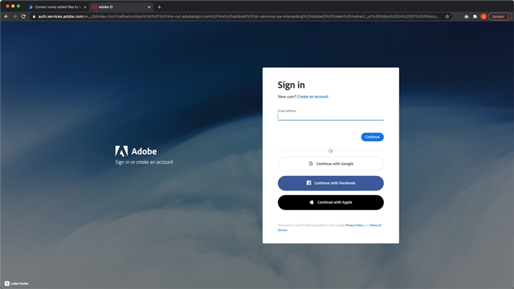

# Microsoft Power Platform向けAcrobat Signを使用した文書の自動処理

Microsoft Powerアプリケーション用のAcrobat SignおよびAdobe PDFツールコネクタをアクティベートして使用する方法について説明します。 コードを使用せずに、ビジネス承認および署名プロセスを迅速かつ安全に自動化するワークフローを構築できます。 以下のリンクで概説されているこの実践チュートリアルには、4つの部分があります。

<table style="table-layout:fixed">
<tr>
  <td>
    
    

    <a href="documentautomation.md#part1"><strong>パート1：署名した契約書をAcrobat SignとSharePointで保存する</strong></a>
    

  </td>
  <td>
    
    

    <a href="documentautomation.md#part2"><strong>パート2:Acrobat Signで電子サインを取得するための自動承認プロセス</strong></a>
    

  </td>
  <td>
   
    

    <a href="documentautomation.md#part3"><strong>パート3: Adobe PDF Toolsを使用した文書の自動OCR処理</strong></a>
    

  </td>
  <td>
   
    

    <a href="documentautomation.md#part4"><strong>パート4: Adobe PDF Toolsを使用した自動ドキュメント作成</strong></a>
    

  </td>
</tr>
</table>

## 前提条件

* Microsoft 365およびPower Automateの使いやすさ
* Acrobat Signの知識
* SharePointおよびPower Automateへのアクセス権を持つMicrosoft 365アカウント(Acrobat Signの場合はBasic、Adobe PDF Toolsの場合はPremium)
* Acrobat Signエンタープライズ版またはAcrobat Signデベロッパーアカウント

**演習1および2**

* APIにアクセスできるAcrobat Signアカウント 開発者アカウントまたはエンタープライズアカウント。
* 編集権限を持つPower AutomateからアクセスできるSharePointサイト フル管理者アクセスをお勧めします。
* 署名承認リクエストと署名用のサンプル文書。

**演習3および4**

マテリアル[こちら](https://github.com/benvanderberg/adobe-sign-pdftools-powerautomate-tutorial)をダウンロード

## パート1:Acrobat Signを使用して署名済み契約書をSharePointに保存する {#part1}

パート1では、Power Automate Flowテンプレートを使用して自動化されたワークフローを設定し、署名済みの契約書をすべてSharePointサイトに保存します。

1. Power Automateに移動します。
1. Acrobat Signを検索します。

   

1. 「**Acrobat Signが完了した契約書をSharePointライブラリに保存**」を選択します。

   

1. 画面を確認して、必要な接続を構成します。 Acrobat Sign接続を有効にします。
1. 青い`+`記号をクリックします。

   

1. Acrobat Signアカウントの電子メールを入力し、新しいウィンドウのパスワードフィールドをクリックします。

   

   Adobeがアカウントを確認するまでお待ちください。

   >[!NOTE]
   >
   >Adobe IDまたはアドビの企業SSOを使用している場合、このチェックにより適切なログイン画面に誘導されます。

1. 完全なログイン
1. 「**続行**」をクリックして、フロー編集画面に移動します。
1. トリガーに名前を付けます。

   

1. SharePointを設定します。

   

   SharePointサイトの&#x200B;**サイトアドレス：**
   **フォルダパス：**&#x200B;使用する共有ドキュメントへのパス
   **ファイル名：**&#x200B;既定のファイル名を使用する
   **ファイルコンテンツ：**&#x200B;既定の設定を適用する

1. フローを保存します。

   

1. 青い戻り矢印があるフロー概要画面に移動します。 パート2でこのフローをテストします。

   

次のパートでこのフローをテストします。

## パート2:Acrobat Signを使用して電子サインを取得するための自動承認プロセス {#part2}

パート2では、最初のパートを構築してより堅牢なフローを作成し、両方のフローをテストして動作を確認します。

1. Power Automateインターフェイスから左側の&#x200B;**テンプレート**&#x200B;を選択します。

   

1. 「manager approval」を検索します。
1. **選択したファイルのマネージャーの承認を要求**&#x200B;を選択します。

   

   接続を確認し、不足している場合は追加します。

   >[!NOTE]
   >
   >これが承認を使用する最初のフローである場合は、フローの実行時に完全に設定されます。

1. 「**続行**」をクリックして、フロー編集画面に移動します。

   このフローには、エラーチェックやネストされた条件付き手順など、事前に設定された手順が多数あります。

1. 選択したファイル&#x200B;**に対して**&#x200B;を次のように構成します：
   **サイトアドレス：**&#x200B;お客様のSharePointサイト
   **ライブラリ名：**&#x200B;文書リポジトリ
1. 次のように入力を追加します。
   **種類**：電子メール
   **名前** ：署名者の電子メール

   

1. **Get File Properties:**&#x200B;を次のように構成します：
   **サイトアドレス：**&#x200B;お客様のSharePointサイト
   **ライブラリ名：**&#x200B;文書リポジトリ

1. 下にスクロールして、**はい場合**&#x200B;を探します。

   

1. 署名用に送信する手順を追加するには、**はい**&#x200B;の場合&#x200B;**ボックスの[アクションの追加**]をクリックします（一番下のボックスではありません）。

   ![[はい]ボックスにアクションを追加したスクリーンショット](assets/documentautomation/automation_13.png)

1. **SharePoint 「ファイルの内容を取得」**&#x200B;を検索し、**「ファイルの内容を取得」**&#x200B;を選択します。

   

1. **ファイルコンテンツの取得**&#x200B;を次のように構成します：

   

   **サイトアドレス：**&#x200B;お客様のSharePointサイトです。
   **ファイル識別子：** 「識別子」を検索し、**ファイルのプロパティを取得**&#x200B;の手順から識別子を選択します。
1. 「Adobe」を検索し、**Acrobat Sign**&#x200B;を選択して別のアクションを追加します。

   

1. Acrobat Signの検索ボックスに「upload」と入力し、**文書をアップロードして文書IDを取得**&#x200B;を選択します。
1. 動的変数&#x200B;**Name**&#x200B;を検索して、**ファイル名**&#x200B;のトリガーで選択された項目/ドキュメントの名前を取得します。
1. **ファイルコンテンツ**&#x200B;の下にある変数アシスタントの&#x200B;**式**&#x200B;をクリックします。

   

1. 1つのアポストロフィを追加し、**動的コンテンツ**&#x200B;をクリックして戻り、アポストロフィを削除して、**ファイルコンテンツ**&#x200B;を選択し、[**OK**]をクリックします。

   追加のアポストロフィがなく、以下のサンプルのように見えることを確認します。

   

1. Acrobat Signの検索領域で「create」を検索して、別のAcrobat Signアクションを追加します。
1. **アップロードされた文書から作成して契約書を作成し、署名用に送信**&#x200B;を選択します。

   

1. 必要な情報を設定します。
**契約書名**&#x200B;の動的変数アシスタントから&#x200B;**名前**&#x200B;を選択します。
**文書ID**&#x200B;の動的変数アシスタントから&#x200B;**文書ID**&#x200B;を選択します。
**参加者の電子メール**&#x200B;の動的変数アシスタントから&#x200B;**署名者の電子メール**&#x200B;を選択します。
**参加者の順序**&#x200B;に「1」を入力します。
**参加者の役割**&#x200B;のドロップダウンから「**署名者**」を選択します。

   

1. フローを&#x200B;**保存**&#x200B;します。

### フローのテスト

SharePointサイトの文書リポジトリに移動して、テストします。

1. ドキュメントを選択して、**自動化**&#x200B;および作成したばかりの&#x200B;**フロー**&#x200B;を選択します。

   

1. フローを開始して、接続を検証します（最初のフロー実行のみ）。
1. **メッセージ**&#x200B;の承認者に適切なメッセージを入力してください。
1. **署名者の電子メール**&#x200B;に、文書の署名者の電子メールを入力します。
1. **フローの実行**&#x200B;をクリックします。

フローを開始するユーザーに設定された承認者は、承認リクエストを受け取ります。 承認は、電子メールまたはPower Automateのアクション項目メニューから行うことができます。
承認されたら、文書に署名します。 ユーザーとSignにログインしているユーザーによっては、プライベートブラウザーウィンドウで署名ウィンドウを開く必要がある場合があります。

署名を完了し、SharePointフォルダーを確認します。

## パート3: Adobe PDF Toolsによる文書の自動OCR {#part3}

パート3では、Microsoft SharePointに読み込まれたPDFのOCRを自動化する方法について説明します。 これにより、SharePointで検索できないスキャン済みPDF文書に関する問題が解決されます。

### SharePointでのフォルダーの設定

文書を保存するMicrosoft SharePointに移動します。

1. 「**+新規**」をクリックして、「処理済みの契約」という名前の新規フォルダーを作成します。
1. 「**+新規**」をクリックして、「古い契約」という名前の新しいフォルダーを作成します。

   

これらのフォルダーは、Power Automateフローの一部として参照されるようになりました。

### テンプレートからのフローの作成

1. https://flow.microsoft.comにログインします。
1. サイドバーの&#x200B;**テンプレート**&#x200B;をクリックします。

   

1. 「**SharePointで、新しく追加したファイルをテキスト検索可能なPDFに変換する**」を選択します。
1. Adobe PDFツールの横にある&#x200B;**+**&#x200B;記号をクリックします。

   

1. 新規タブでhttps://www.adobe.com/go/powerautomate_getstartedに移動します。
1. 「**今すぐ始める**」をクリックします。

   ![[開始]ボタンのスクリーンショット](assets/documentautomation/automation_28.png)

1. Adobe ID でログインします。

   

1. 資格情報の名前と資格情報の説明を入力して、[**資格情報の作成**]をクリックします。

   

   資格情報を開いた状態でウィンドウを開いたままにします。 Microsoft Power Automateに入力する必要があります。

   

1. 資格情報を入力して、**Microsoft Power Automateで作成**&#x200B;をクリックします。

   

1. 「**続行**」をクリックします。

   ![[続行]をクリックする場所のスクリーンショット](assets/documentautomation/automation_33.png)

   これでワークフローのビューが表示され、環境に合わせてワークフローを設定する必要があります。

1. 「サイトアドレス」フィールドを選択し、「**フォルダーにファイルが作成されたとき**」というトリガーで、使用するSharePointサイトを選択します。

   

1. フォルダーアイコンをクリックして、フォルダーIDの下にあるOld Contractsフォルダーに移動します。

   

1. フローの一番下にある&#x200B;**ファイルの作成**&#x200B;アクションを編集します。

   **サイトアドレス**&#x200B;を自分のサイトアドレスに変更します。
処理された契約フォルダの場所をフォルダ・パスで指定します。

1. 右上隅の「**保存**」をクリックします。
1. [**テスト**]をクリックします。
1. **手動**&#x200B;を選択してください。
1. [**テスト**]をクリックします。

   

### 新しいフローを試す

1. SharePointでOld Contractsフォルダーに移動します。
1. ダウンロードした演習ファイルのE03/Old Contractsに移動します。
1. ReleaseFormXX.pdfファイルをSharePointのOld Contractsフォルダーにコピーします。

   

「Processed Contracts」フォルダーに移動すると、フローの実行が少し遅れた後にPDFが表示されます。 PDFを開くと、テキストが選択可能であることがわかります。
さらに、SharePointでは、文書のインデックスを作成し、SharePointの検索バーから文書のコンテンツを検索することもできます。

## パート4:Adobe PDF Toolsを使用した自動ドキュメントアセンブリ {#part4}

第4部では、MicrosoftSharePointでフローを選択して開始したときに表示される情報に基づいて、多くの文書を結合する方法について説明します。 このシナリオのフローは次のようになります。

* お客様のパッケージに含める内容を選択するための情報を求めます。
* 提供された情報に基づいて、多くの文書が結合されます。 これらの文書には、表紙とオプションのホワイトペーパーが含まれます。
* 結合文書がSharePointに保存されます。

### SharePointへのエクササイズファイルの読み込み

1. 演習ファイル内のE04フォルダを開きます。
1. Proposalフォルダー、Templatesフォルダー、およびGenerated DocsフォルダーをSharePointに読み込みます。

   

これらのフォルダーは参照に使用されます。 特に、プロポーザルにはProposal.docxファイルを使用します。

Templatesフォルダには、Coversフォルダがあり、さまざまな都市の表紙のデザインが含まれています。 オプションの追加のホワイトペーパーを含むWhitepapersフォルダもあります。このフォルダを選択すると、末尾に添付されます。

### Microsoft Power Automateへのフローの読み込み

1. Microsoft Power Automate(https://flow.microsoft.com)にログインします。
1. [**マイフロー**]をクリックします。

   

1. 「**読み込み**」をクリックします。

   

1. 「**Upload**」をクリックし、E04/Flows/のGenerateProposal_20210311231623.zipフォルダーを選択します。

   

1. 「**読み込み**」をクリックします。

1. **お客様に提案を送信**&#x200B;の横にある「アクション」の下のレンチアイコンをクリックします。

   

1. セットアップで、**新規作成**&#x200B;を選択します。
1. 「リソース名」でフローの名前を設定します。
1. 「**保存**」をクリックします。

   その他の関連リソースについてこの手順を繰り返し、接続を選択します。

   

1. すべての接続を完了したら、**[インポート]**&#x200B;をクリックします。

### 選択したファイルに設定

フローを作成したので、次の操作を行います。

1. 「**編集**」をクリックします。

   

1. 選択したファイルの&#x200B;**のトリガー**&#x200B;を選択します。

   「サイトアドレス」にSharePointサイトを追加します。
ライブラリにライブラリを追加します。

   

### Set templateFolderPath

1. templateFolderPath変数をクリックします。
1. 読み込んだSharePointサイト内のTemplatesフォルダーがある場所へのパスを設定します。

### ファイルの内容を取得するカバーを設定

1. **カバー**&#x200B;アクションをクリックすると、スコープが展開されます。
1. **カバー：ファイルの内容を取得**&#x200B;を展開します。

   サイトアドレスをSharePointサイトに設定します。

   

### 選択ファイルを設定

1. **選択したファイル**&#x200B;の範囲アクションを展開します。

   **ファイルのプロパティを取得**&#x200B;で、サイトアドレスとライブラリ名をそれぞれSharePointサイトとライブラリに変更します。
**ファイルコンテンツを取得**&#x200B;で、サイトアドレスをSharePointサイトに変更します。

   

### ホワイトペーパーの設定

1. 「**ホワイトペーパー**」アクションをクリックします。
1. **Condition: Add Whitepaper**&#x200B;を展開します。

   

1. **ホワイトペーパー1:パス**&#x200B;を使用してファイルの内容を取得を展開します。
指定したSharePointサイトのサイトアドレスを編集します。

**条件： Add Whitepaper 2**&#x200B;に対して同じ手順を繰り返します。

### ファイルの作成を設定

1. **[ファイルの作成]**&#x200B;を展開します。

   Edit Site Address and Folder Path to the SharePoint site and path where the Generated Docs folderに移動します。

1. 「**保存**」をクリックします。

### フローのテスト

1. SharePointのProposalフォルダーに移動します。
1. Proposal.docxフォルダーを選択します。

   

1. **自動化**&#x200B;メニューでフローを選択します。

   

1. **[続行]**&#x200B;をクリックして、フローを開始します。

   ![[続行]ボタンを選択したスクリーンショット](assets/documentautomation/automation_51.png)

1. 表紙と、追加するホワイトペーパーを選択します。
1. **フローの実行**&#x200B;をクリックします。

   ![[フローの実行]ボタンのスクリーンショット](assets/documentautomation/automation_52.png)

Generate Docsフォルダに移動します。 これで、生成されたPDFファイルが表示されます。

### Protectやその他のアクションのフローへの追加

これでフローを正常に作成できました。次に、フローを編集してPDF文書をパスワードで暗号化します。 また、他のアクションを利用する方法についても説明します。

1. フローの最後に戻ります。
1. **PDFを結合**&#x200B;と&#x200B;**ファイルを作成**&#x200B;の間の&#x200B;**+**&#x200B;記号をクリックします。

   

1. 「**アクションを追加**」を選択します。
1. 「Adobe PDF Tools」を検索します。

   

1. **Protect PDFを表示から選択**。
1. 動的コンテンツを使用して、ファイル名フィールドを&#x200B;**結合PDFからのPDFファイル名**&#x200B;に設定します。

   

   トリガーには、開始フォームの一部であるパスワードフィールドがあります。 私たちはそれをここで使えます。

1. 動的コンテンツを使用して&#x200B;**パスワードフィールド**&#x200B;を検索し、パスワードフィールドに配置します。

   

1. 動的コンテンツを使用して、[ファイルコンテンツ]フィールドの&#x200B;**結合PDFのPDFファイルコンテンツ**&#x200B;に設定します。
1. **ファイルの作成**&#x200B;を変更して、PDFを結合するのではなく、Protect PDFからファイルの内容を取得します。
1. **[ファイルの作成]**&#x200B;を展開します。
1. 「ファイルコンテンツ」フィールドをクリアします。
1. 動的コンテンツを使用して、**Protect PDFの**&#x200B;から&#x200B;**PDFファイルコンテンツ**&#x200B;を配置します。

### フローのテスト

1. SharePointのProposalフォルダーに移動します。
1. Proposal.docxを選択します。

   

1. 「**自動化**」を選択してフローを選択します。

   ![メニューから[自動化]を選択したスクリーンショット](assets/documentautomation/automation_59.png)

1. **[続行]**&#x200B;をクリックして、フローを開始します。

   

1. 追加する表紙とホワイトペーパーを選択します。
1. 「パスワード」フィールドに、設定するパスワードを設定します。
1. **フローの実行**&#x200B;をクリックします。

   ![選択したファイルのスクリーンショットと[フローの実行]ボタン](assets/documentautomation/automation_61.png)

1. Generate Docsフォルダに移動します。
生成されたPDFファイルが表示されます。 PDFファイルを開くと、PDFパスワードの入力を求めるプロンプトが表示されます。

   
