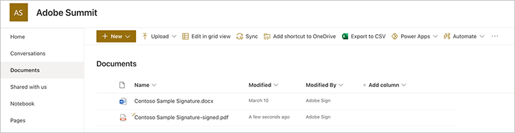
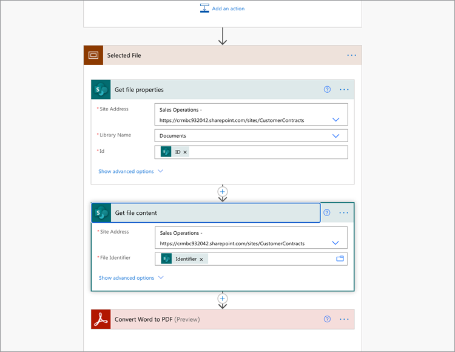

# Adobe Sign for Microsoft Power Platformを使用したドキュメントの自動化

Microsoft Power Apps用のAdobe SignおよびAdobe PDFツールコネクタをアクティブにして使用する方法を説明します。 業務の承認と署名のプロセスをコードなしで迅速かつ安全に自動化するワークフローを構築します。 次のリンクで説明する、この実践的なチュートリアルの4つの部分があります。

<table style="table-layout:fixed">
<tr>
  <td>
    
    

    <a href="documentautomation.md#part1"><strong>パート1:署名済みの契約をAdobe Signと共にSharePointに保存する</strong></a>
    

  </td>
  <td>
    
    

    <a href="documentautomation.md#part2"><strong>パート2:Adobe Signで電子署名を取得する自動承認プロセス</strong></a>
    

  </td>
  <td>
   
    

    <a href="documentautomation.md#part3"><strong>レッスン3:Adobe PDFツールを使用した自動ドキュメントOCR</strong></a>
    

  </td>
  <td>
   
    

    <a href="documentautomation.md#part4"><strong>パート4:Adobe PDFツールを使用した自動ドキュメントアセンブリ</strong></a>
    

  </td>
</tr>
</table>

## 前提条件

* Microsoft 365とPower Automateの使いやすさ
* Adobe Signの知識
* SharePointとPower AutomateにアクセスできるMicrosoft 365アカウント（Adobe Signの基本、Adobe PDFツールのプレミアム）
* Adobe Sign for enterpriseまたはAdobe Sign開発者アカウント

**練習1と2**

* APIにアクセスできるAdobe Signアカウント。 開発者アカウントまたはエンタープライズアカウント。
* Power Automateからアクセス可能なSharePointサイト。編集権限があることを示します。 完全な管理者アクセスをお勧めします。
* 署名の承認リクエストと署名のサンプルドキュメント。

**演習3と4**

資料をダウンロード[ここ](https://github.com/benvanderberg/adobe-sign-pdftools-powerautomate-tutorial)

## パート1:署名済みの契約をAdobe Signと共にSharePointに保存する {#part1}

パート1では、Power Automate Flowテンプレートを使用して、署名済みの契約をすべてSharePointサイトに保存する自動ワークフローを設定します。

1. Power Automateに移動します。
1. Search for Adobe Sign.

   

1. 「**Adobe署名完了契約をSharePointライブラリに保存**」を選択します。

   

1. 画面を確認し、必要な接続を構成します。 Adobe署名接続を有効にします。
1. 青い`+`記号をクリックします。

   

1. Adobe Signアカウントの電子メールを入力し、新しいウィンドウでパスワードフィールドをクリックします。

   

   Adobeがアカウントを確認するまでお待ちください。

   >[!NOTE]
   >
   >Adobe IDまたは弊社のSSOを使用している場合は、このチェックで適切なログインにルーティングされます。

1. ログインを完了します。
1. [**続行**]をクリックして、[フロー]編集画面に移動します。
1. トリガに名前を付けます。

   

1. SharePointの設定を構成します。

   

   **サイトアドレス：** SharePointサイト
   **フォルダパス：** 使用する共有ドキュメントへのパス
   **ファイル名：デフ** ォルトを受け入れる
   **ファイルの内容：既** 定を受け入れる

1. フローを保存します.

   

1. 青い戻り矢印を使用して、フローの概要画面に移動します。 この流れを第2部でテストします。

   

この流れは次の部分でテストします。

## パート2:Adobe Signで電子署名を取得する自動承認プロセス {#part2}

第2部では、より堅牢なフローを持つ第1部を構築し、両方のフローをテストして、動作を確認します。

1. Power Automateインタフェースの左側にある&#x200B;**Templates**&#x200B;を選択します。

   

1. 「管理者の承認」を検索します。
1. **選択したファイルに対して、[管理者の承認を要求する]**&#x200B;を選択します。

   

   接続を確認し、不足している接続を追加します。

   >[!NOTE]
   >
   >これが承認を使用して最初に行うフローの場合は、フローの実行時に完全に設定されます。

1. [**続行**]をクリックして、フロー編集画面に移動します。

   このフローには、エラーチェックや入れ子になった条件付きステップなど、事前に構成された多くのステップが含まれます。

1. **選択したファイル**に対して、次のように構成します。
   **サイトアドレス：** SharePointサイト
   **ライブラリ名：ドキュメ** ントリポジトリ
1. 次のように入力を追加します。
   **種類**:電子メール
   **名前**:署名者の電子メール

   

1. **ファイルプロパティの取得：**を次のように構成します。
   **サイトアドレス：** SharePointサイト
   **ライブラリ名：ドキュメ** ントリポジトリ

1. 下にスクロールし、**If yes**&#x200B;を探します。

   

1. [**はい**]ボックス（一番下の方ではない）の[**アクション**&#x200B;を追加]をクリックして、署名の送信手順を追加します。

   

1. **SharePointでファイルの内容を取得**&#x200B;を検索し、**ファイルの内容を取得**&#x200B;を選択します。

   

1. **Get file content**&#x200B;を次のように構成します。

   

   **サイトアドレス：**  SharePointサイトです。
   **ファイルID:「identifier」** を検索し、「ファイルのプロパティを取得」ステップから「Identifier」 **を選択** します。
1. 「Adobe」を検索し、「**Adobe署名**」を選択して別のアクションを追加します。

   

1. Adobe Signの検索ボックスに「upload」と入力し、「**ドキュメントをアップロードしてドキュメントIDを取得**」を選択します。
1. 動的変数&#x200B;**Name**&#x200B;を検索して、**File Name**&#x200B;の下でトリガで選択された項目/ドキュメントの名前を取得します。
1. **ファイルの内容**&#x200B;の下の変数アシスタントで、**式**&#x200B;をクリックします。

   

1. 1つのアポストロフィを追加し、[**動的コンテンツ**]に戻り、アポストロフィを削除し、[**ファイルの内容**]を選択して、[**OK**]をクリックします。

   追加のアポストロフィがないことを確認し、次の例のように表示します。

   

1. Adobe Signの検索領域で「作成」を検索して、別のAdobe Signアクションを追加します。
1. 「**アップロードしたドキュメントから作成して同意を得て、署名を送信する**」を選択します。

   

1. 必要な情報を構成します。
**契約名**&#x200B;の動的変数アシスタントから&#x200B;**名前**を選択します。
**ドキュメントID**&#x200B;の動的変数アシスタントから、**ドキュメントID**を選択します。
**参加者の電子メール**&#x200B;の動的変数アシスタントから、**署名者の電子メール**を選択します。
**参加者の順序**に「1」と入力します。
**参加者ロール**&#x200B;のドロップダウンから&#x200B;**署名者**&#x200B;を選択します。

   

1. **フロー** を保存します。

### フローのテスト

SharePointサイトのドキュメントリポジトリに移動して、テストアウトします。

1. ドキュメントを選択し、「**自動化**」と、作成した&#x200B;**フロー**&#x200B;を選択します。

   

1. フローを開始して接続を検証します（最初のフローの実行のみ）。
1. **「メッセージ**」に、承認者に適切なメッセージを入力します。
1. **署名者の電子メール**&#x200B;に署名者の電子メールを入力します。
1. [**フローを実行**]をクリックします。

フローを開始するユーザーに対して構成された承認者が承認要求を受け取ります。 承認は、電子メールまたはPower Automate Action Itemsメニューを使用して行うことができます。
承認が完了したら、ドキュメントに署名します。 ユーザーによっては、また、ユーザーが[署名]にログインしている場合は、プライベートブラウザウィンドウで署名ウィンドウを開く必要がある場合があります。

署名を完了し、SharePointフォルダーを再び参照します。

## レッスン3:Adobe PDFツールを使用した自動ドキュメントOCR {#part3}

レッスン3では、PDFをMicrosoft SharePointにインポートする際に、OCRを自動化する方法を学習します。 SharePointで検索できないスキャン済みのPDFドキュメントで発生する問題に対処します。

### SharePointでフォルダをセットアップする

ドキュメントを保存するMicrosoft SharePointに移動します。

1. [**+ New**]をクリックして、[Processed Contracts]という新しいフォルダを作成します。
1. [**+ New**]をクリックして、「Old Contracts」という新しいフォルダを作成します。

   

これらのフォルダは、Power Automateフローの一部として参照されます。

### テンプレートからフローを作成する

1. https://flow.microsoft.comにログインします。
1. サイドバーの&#x200B;**テンプレート**&#x200B;をクリックします。

   

1. [**新しく追加したファイルを、SharePointで検索可能なテキストPDFに変換**]を選択します。
1. Adobe PDFツールの横の&#x200B;**+**&#x200B;記号をクリックします。

   

1. 新しいタブでhttps://www.adobe.com/go/powerautomate_getstartedに移動します。
1. **[開始]**&#x200B;をクリックします。

   

1. Adobe IDでサインインします。

   

1. 「資格情報名」と「資格情報の説明」を入力し、「**資格情報の作成**」をクリックします。

   

   資格情報を開いたままウィンドウを開いておく。 Microsoft Power Automateに入力する必要があります。

   

1. 資格情報を入力し、[**Microsoft Power Automateで作成**]をクリックします。

   

1. 「**続行**」をクリックします。

   

   これで、ワークフローのビューが表示され、環境に合わせてワークフローを構成する必要があります。

1. [サイトアドレス]フィールドを選択し、**フォルダ**&#x200B;にファイルが作成されるときに呼び出されるトリガーの下で、使用するSharePointサイトを選択します。

   

1. 「フォルダ」アイコンをクリックして、「フォルダID」の下にある「旧契約」フォルダにナビゲートします。

   

1. フローの最下部にある&#x200B;**Create file**&#x200B;アクションを編集します。

   **サイトアドレス**をサイトアドレスに変更します。
「フォルダ・パス」で、「処理済契約」フォルダの場所を指定します。

1. 右上隅の&#x200B;**保存**&#x200B;をクリックします。
1. **テスト**&#x200B;をクリックします。
1. **手動**&#x200B;を選択します。
1. **テスト**&#x200B;をクリックします。

   

### 新しいフローを試す

1. SharePointのOld Contractsフォルダに移動します。
1. ダウンロードした練習ファイルでE03/Old Contractsに移動します。
1. ReleaseFormXX.pdfファイルをSharePointのOld Contractsフォルダにコピーします。

   

「処理済契約」フォルダにナビゲートすると、フローの実行に数分かかった後で使用可能なPDFが表示されます。 PDFを開くと、テキストが選択可能になることが分かります。
また、SharePointではドキュメントのインデックスが作成され、SharePointの検索バーからドキュメントのコンテンツを検索できます。

## パート4:Adobe PDFツールを使用した自動ドキュメントアセンブリ {#part4}

第4部では、Microsoft SharePointからのフローの選択と開始時に提供された情報に基づいて、多数のドキュメントを結合する方法を学習します。 このシナリオでは、フローは次のようになります。

* お客様のパッケージに含める内容を選択する情報を求めます。
* 提供された情報に基づいて、多くの文書を結合します。 これらのドキュメントには、表紙とオプションのホワイトペーパーが含まれます。
* 差し込み印刷後の文書がSharePointに保存されます。

### 演習ファイルをSharePointに読み込む

1. ExerciseファイルのE04フォルダを開きます。
1. 提案、テンプレート、および生成されたドキュメントフォルダをSharePointにインポートします。

   

これらのフォルダは参照用に使用されます。 特に、提案書にProposal.docxファイルを使用します。

Templatesフォルダには、各都市の送付状デザインを含むCoversフォルダがあります。 また、オプションの追加のホワイトペーパーが含まれるホワイトペーパーフォルダもあります。このフォルダを選択すると、末尾に添付されます。

### Microsoft Power Automateにフローをインポートする

1. Microsoft Power Automate (https://flow.microsoft.com)にログインします。
1. [**マイフロー**]をクリックします。

   

1. [**読み込み**]をクリックします。

   

1. 「**アップロード**」をクリックし、E04/Flows/のGenerateProposal_20210311231623.zipフォルダを選択します。

   

1. [**読み込み**]をクリックします。

1. **「Send Proposal to Customer**」の横にある「Action」の下の「Renti」アイコンをクリックします。

   

1. [設定]で[**新規作成**]を選択します。
1. 「リソース名」でフローの名前を設定します。
1. 「**保存**」をクリックします。

   他の関連リソースに対しても同じ操作を繰り返し、接続を選択します。

   

1. すべての接続を行った後、**[インポート]**&#x200B;をクリックします。

### 選択したファイルに設定

フローが作成されたら、次の操作を行います。

1. **編集**&#x200B;をクリックします。

   

1. トリガ&#x200B;**選択したファイル**&#x200B;に対してトリガを選択します。

   SharePointサイトをサイトアドレスに追加します。
ライブラリにライブラリを追加します。

   

### templateFolderPathの設定

1. 変数templateFolderPathをクリックします。
1. インポートしたSharePointサイト内のTemplatesフォルダの場所へのパスを設定します。

### カバー取得ファイルの内容を設定

1. [**カバー**]操作をクリックし、スコープを展開します。
1. **カバーを展開：ファイルの内容を取得**&#x200B;します。

   サイトアドレスをSharePointサイトに設定します。

   

### 選択したファイルを設定

1. **「選択したファイル**」スコープアクションを展開します。

   [サイトアドレス]と[ライブラリ名]を、それぞれ&#x200B;**[ファイルのプロパティを取得]**の下のSharePointサイトとライブラリに変更します。
**[ファイルの内容を取得]**&#x200B;で、サイトアドレスをSharePointサイトに変更します。

   

### ホワイトペーパーの設定

1. **ホワイトペーパー**&#x200B;操作をクリックします。
1. **条件の展開：ホワイトペーパー**&#x200B;を追加します。

   

1. **ホワイトペーパー1:パス**を使用してファイルの内容を取得します。
指定したSharePointサイトのサイトアドレスを編集します。

**条件に対して同じ手順を繰り返します。ホワイトペーパー2**&#x200B;を追加します。

### ファイルの作成の設定

1. **ファイルの作成**&#x200B;を展開します。

   SharePointサイトの[サイトアドレス]と[フォルダパス]を編集し、[生成されたドキュメント]フォルダが置かれているパスを編集します。

1. 「**保存**」をクリックします。

### フローをテストする

1. SharePointの提案フォルダに移動します。
1. Proposal.docxフォルダを選択します。

   

1. [**自動化**]メニューでフローを選択します。

   

1. **[続行]**&#x200B;をクリックして、流れを開始します。

   

1. 表紙と追加するホワイトペーパーを選択します。
1. [**フローを実行**]をクリックします。

   

Generate Docsフォルダに移動します。 生成したPDFファイルが表示されます。

### フローに保護とその他のアクションを追加しています

これで、フローが正常に作成されたので、フローを編集して、PDFドキュメントをパスワードで暗号化します。 また、他のアクションを使用する方法についても説明します。

1. フローの最後に戻ります。
1. **PDFの結合**&#x200B;と&#x200B;**ファイルの作成**&#x200B;の間の&#x200B;**+**&#x200B;記号をクリックします。

   

1. [**アクションを追加**]を選択します。
1. 「Adobe PDFツール」を検索します。

   

1. 「**PDFを表示から保護**」を選択します。
1. 「動的コンテンツ」を使用して、「ファイル名」フィールドを「PDFを結合&#x200B;**からの** PDFファイル名」に設定します。

   

   トリガーには、開始フォームの一部であるPasswordフィールドがあります。 私たちはそれをここで使うことができます。

1. 動的コンテンツを使用して&#x200B;**パスワードフィールド**&#x200B;を検索し、[パスワード]フィールドに配置します。

   

1. 「動的コンテンツ」を使用して、「ファイルコンテンツ」フィールドの「PDFの結合」**から「PDFファイルコンテンツ」に設定します。**
1. 「PDFの結合」ではなく「PDFの保護」からファイルの内容を取得するには、「**ファイルの作成**」を変更します。
1. **ファイルの作成**&#x200B;を展開します。
1. [ファイルの内容]フィールドをオフにします。
1. 動的コンテンツを使用して、**PDFの** PDFファイルコンテンツ&#x200B;**を表示から保護**&#x200B;に配置します。

### フローをテストする

1. SharePointの提案フォルダに移動します。
1. Proposal.docxを選択します。

   

1. 「**自動化**」を選択して、フローを選択します。

   

1. **[続行]**&#x200B;をクリックして、流れを開始します。

   

1. 表紙と追加するホワイトペーパーを選択します。
1. 「Password」フィールドに、設定するパスワードを設定します。
1. [**フローを実行**]をクリックします。

   

1. Generate Docsフォルダに移動します。
生成したPDFファイルが表示されます。 PDFファイルを開くと、PDFパスワードの入力を求めるプロンプトが表示されます。

   
