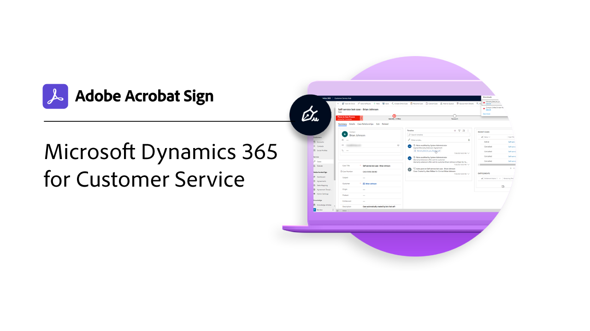

# 統合の概要

Acrobat Signは、Microsoft、Salesforce、Workday、Marketoなど、組織内で既に使用している他のアプリケーションの中で使用することができます。 これらの統合ガイドとチュートリアルで、電子サインワークフローを簡素化する方法について説明します。

>[!NOTE]
> これらの機能のいずれかにアクセスできない場合は、組織の管理者に連絡して、統合が有効になっていることを確認してください。

## 新機能

* [文書タブの統合 [!DNL Microsoft Teams]](acrobat-sign-teams-documents-tab.md)
[!DNL Microsoft Teams]の「文書」タブから署名用に文書を直接送信する方法について説明します
* [Adobe Acrobat Signでの [!DNL Microsoft Teams]](live-sign-microsoft-teams.md)のライブサイン
[!DNL Microsoft Teams]会議中に対面署名のようなオンライン署名エクスペリエンスを作成する方法を説明します
* [高度なワークフローを作成する [!DNL Power Automate]](advanced-workflow-power-automate.md)
[!DNL Power Automate]コネクタを使用して高度なワークフローを作成する方法について説明します

## Microsoft統合チュートリアル

<table style="table-layout:fixed">
<tr>
  <td>
    
    

    <a href="fill-and-sign-doc-microsoft-outlook.md"><strong>Microsoft Outlookでの入力と署名</strong></a>
    

    <em>Microsoft Outlook内から直接フォームに入力して署名</em>
     
  </td>
  <td>
    
    

    <a href="send-for-signature-with-outlook.md"><strong>Outlookで署名用に送信</strong></a>
    

    <em>Microsoft Outlook内で直接、署名用に文書を送信する</em>
     
  </td>
  <td>
    
    

    <a href="send-for-signature-with-sharepoint-online.md"><strong>SharePoint Onlineで署名用に送信</strong></a>
    

    <em>Sharepoint Online内で直接、署名用に文書を送信する</em>
     
  </td>
   <td>
    
    

    <a href="track-an-agreement-with-sharepoint-online.md"><strong>SharePoint Onlineでのトラッキング</strong></a>
    

    <em>Microsoft Sharepoint内で直接契約書の進捗状況をトラック</em>
     
  </td>
</tr>
<tr>
  <td>
    
    

    <a href="integrate-web-form-sharepoint-online.md"><strong>Webフォームを[!DNL SharePoint Online]</strong></a>と統合する
    

    <em>Webフォームから収集したデータを[!DNL SharePoint]リストにマップする方法を説明します</em>
     
  </td>
  <td>
    
    

    <a href="auto-archive-sharepoint-power-automate.md"><strong>[!DNL SharePoint]のファイルを[!DNL Power Automate]</strong></a>と自動アーカイブ
    

    <em>[!DNL Power Automate]</em>を使用して署名済み文書を自動的に[!DNL SharePoint]ライブラリにアーカイブする方法を説明します
     
  </td>
  <td>
    
    

    <a href="documentautomation.md"><strong>[!DNL Acrobat Sign for Microsoft Power Platform]</strong></a>を使用したドキュメントの自動処理
    

    <em>[!DNL Microsoft Power]アプリの[!DNL Acrobat Sign]コネクタと[!DNL Adobe PDF Tools]コネクタをアクティブにして使用する方法を説明します</em>
     
  </td>
   <td>
    
    

    <a href="adobe-sign-teams-mortgage.md"><strong>[!DNL Microsoft Teams]</strong></a>で署名用に送信
    

    <em>[!DNL Microsoft Teams]</em>内で署名用に文書を直接送信
     
  </td>
</tr>
<tr>
  <td>
    
    

    [!DNL Microsoft Teams]</strong></a>様のAdobe Acrobat Signでの<a href="live-sign-microsoft-teams.md"><strong>ライブサインイン
    

    <em>[!DNL Microsoft Teams]ミーティング中の対面署名のようなオンライン署名エクスペリエンスを作成する方法を説明します</em>
     
  </td>
   <td>
    
    

    <a href="acrobat-sign-teams-documents-tab.md"><strong>[!DNL Microsoft Teams]</strong></a>の[ドキュメント]タブの統合
    

    <em>[!DNL Microsoft Teams]</em>の「文書」タブから署名用に文書を直接送信する方法を説明します
     
  </td>
 <td>
    
    

    <a href="simple-workflow-power-automate.md"><strong>[!DNL Power Automate]</strong></a>で簡単なワークフローを作成する
    

    <em>[!DNL Power Automate]コネクタを使用して簡単なワークフローを作成する方法を説明します</em>
     
  </td>
  <td>
    
    

    <a href="advanced-workflow-power-automate.md"><strong>Power Automateを使用して高度なワークフローを作成する</strong></a>
    

    <em>[!DNL Power Automate]コネクタを使用して高度なワークフローを作成する方法</em>を説明します
     
  </td>
<tr>
  <td>
    
    

    <a href="dynamics-customer-service.md"><strong>Microsoft Dynamics 365 for Customer Service</strong></a>
    

    <em>Acrobat Signと[!DNL Microsoft Dynamics 365]カスタマーサービス版を使用して、セルフサービスのお客様のWebポータルでのお客様満足度を高める方法を説明します</em>
     
  </td>
  <td>
    
    

    <a href="dynamics-field-service.md"><strong>フィールドサービス用Microsoft Dynamics 365</strong></a>
    

    <em>Acrobat Sign、[!DNL Power Automate]、および[!DNL Microsoft Dynamics 365] for Field Serviceを使用して、お客様のオンサイト契約を効率化する方法を説明します</em>
     
  </td>
  <td>
    
    

    <a href="dynamics-sales.md"><strong>Microsoft Dynamics 365 for Sales</strong></a>
    

    <em>Acrobat Signと[!DNL Microsoft Dynamics 365] for Salesを使用して、販売見積の署名プロセスを自動化する方法を説明します</em>
     
  </td>
  <td>
    
    

     
  </td>
</tr>
</table>

## [!DNL Notarize]統合チュートリアル

<table style="table-layout:fixed">
<tr>
  <td>
    
    

    <a href="send-document-notarize.md"><strong>公証用に文書を送信</strong></a>
    

    <em>公証用に文書を送信する方法の詳細</em>
     
  </td>
  <td>
    
    

     
  </td>
  <td>
    
    

     
  </td>
  <td>
    
    

     
  </td>
</tr>
</table>

## Salesforce統合チュートリアル

<table style="table-layout:fixed">
<tr>
  <td>
    
    

    <a href="create-an-agreement-template.md"><strong>[!DNL Salesforce]</strong></a>のDocument Builder
    

    <em>[!DNL Salesforce]</em>のDocument Builderを使用して再利用可能な文書テンプレートを作成する方法を説明します
     
  </td>
  <td>
    
    

    <a href="set-up-data-mapping.md"><strong>データマッピングを設定しています</strong></a>
    

    <em>契約書の署名後にSalesforceにデータをプルする</em>
     
  </td>
  <td>
    
    

    <a href="set-up-merging-map.md"><strong>Salesforceで結合マッピングを設定しています</strong></a>
    

    <em>Salesforceのデータを直接Acrobat Sign文書に結合する方法</em>について
     
  </td>
  <td>
    
    

    <a href="create-a-custom-button.md"><strong>カスタムボタンを作成しています</strong></a>
    

    <em>送信プロセスを開始し、Salesforce内の契約書を自動的に入力するカスタムボタンを作成</em>
     
  </td>
</tr>
</table>

## Workday統合のチュートリアル

<table style="table-layout:fixed">
<tr>
 <td>
    
    

    <a href="acrobat-sign-workday-onboarding.md"><strong>Acrobat Sign + Workday新入社員オンボーディング</strong></a>
    

    <em>Acrobat Sign + Workdayを使用してオンボーディングワークフローを合理化する方法</em>
     
  </td>
 <td>
    
    

     
  </td>
  <td>
    
    

     
  </td>
  <td>
    
    

     
  </td>
</tr>
</table>

## Marketo統合のチュートリアルと設定ガイド

<table style="table-layout:fixed">
<tr>
  <td>
    
    

    <a href="marketo-salesforce-sms.md"><strong>SalesforceおよびMarketo用Acrobat Signを使用して通知を送信する</strong></a>
    

    <em>テキストメッセージ、電子メール、またはプッシュ通知を送信して、契約書が処理中であることを署名者に知らせる方法について説明します</em>
     
  </td>
  <td>
    
    

    <a href="marketo-salesforce-reminder.md"><strong>Salesforce用Adobe SignおよびMarketoビデオチュートリアルを使用したリマインダーの送信</strong></a>
    

    <em>一定期間後に契約書が署名されないままの場合に、Marketoから電子メールでリマインダーを送信する方法について説明します</em>
     
  </td>
  <td>
    
    

    <a href="marketo-salesforce-reminder.md"><strong>Salesforce用Acrobat SignおよびMarketoの設定ガイドを使用してリマインダーを送信</strong></a>
    

    <em>一定時間経過後に契約書が署名されないままの場合に、Marketoから電子メールでリマインダーを送信する方法を確認</em>
     
  </td>
   <td>
    
    

    <a href="marketo-dynamics-reminder.md"><strong>Microsoft DynamicsおよびMarketo用Acrobat Signを使用してリマインダーを送信する</strong></a>
    

    <em>一定期間後に契約書が署名されないままの場合に電子メールでリマインダーを送信する方法を説明します</em>
     
  </td>
</tr>
<tr>
  <td>
    
    

    <a href="marketo-dynamics-sms.md"><strong>Microsoft DynamicsおよびMarketo用のAcrobat Signを使用して通知を送信する</strong></a>
    

    <em>テキストメッセージ、電子メール、またはプッシュ通知を送信して、契約書が処理中であることを署名者に知らせる方法について説明します</em>
     
  </td>
  <td>
    
    

     
  </td>
  <td>
    
    

     
  </td>
  <td>
    
    

     
  </td>
</tr>
</table>
