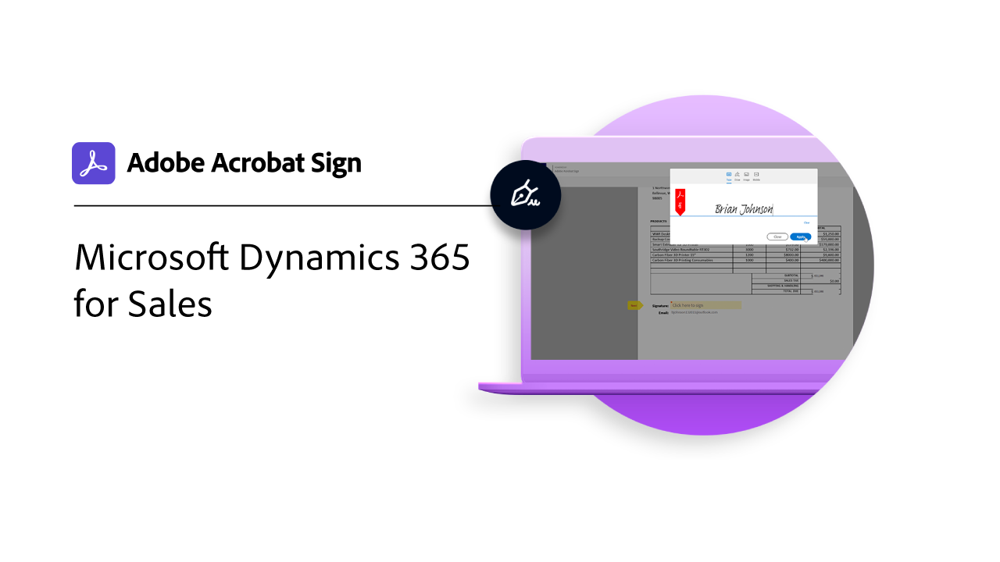

# 統合の概要

Acrobat Signは、Microsoft、Salesforce、Workday、Marketoなど、組織内で既に使用している他のアプリケーションの中で使用することができます。 これらの統合ガイドとチュートリアルで、電子サインワークフローを簡素化する方法について説明します。

>[!NOTE]
> これらの機能のいずれかにアクセスできない場合は、組織の管理者に連絡して、統合が有効になっていることを確認してください。

## 新機能

* [Microsoft Dynamics 365 for Sales](dynamics-sales.md)
Acrobat Signと [!DNL Microsoft Dynamics 365] for Salesは、販売見積の署名プロセスを自動化するために使用します。
* [フィールドサービス用Microsoft Dynamics 365](dynamics-field-service.md)
Acrobat Signの詳細 [!DNL Power Automate]、および [!DNL Microsoft Dynamics 365] フィールドサービスは、お客様のオンサイト作業を効率化するために使用されます。
* [Microsoft Dynamics 365カスタマーサービス](dynamics-customer-service.md)
Acrobat Signと [!DNL Microsoft Dynamics 365] カスタマーサービスは、セルフサービスの顧客webポータルで顧客満足度を向上させるために使用されます
* [Webフォームの統合 [!DNL SharePoint] オンライン](integrate-web-form-sharepoint-online.md)
Webフォームから収集したデータを [!DNL SharePoint] list

## Microsoft統合チュートリアル

<table style="table-layout:fixed">
<tr>
  <td>
    
    

    <a href="fill-and-sign-doc-microsoft-outlook.md"><strong>Microsoft Outlookでの入力と署名</strong></a>
    

    <em>Microsoft Outlook内でフォームに直接入力して署名</em>
     
  </td>
  <td>
    
    

    <a href="send-for-signature-with-outlook.md"><strong>Outlookで署名用に送信</strong></a>
    

    <em>Microsoft Outlook内で署名用に文書を直接送信</em>
     
  </td>
  <td>
    
    

    <a href="send-for-signature-with-sharepoint-online.md"><strong>SharePoint Onlineで署名用に送信</strong></a>
    

    <em>Sharepoint Online内で署名用に文書を直接送信</em>
     
  </td>
   <td>
    
    

    <a href="track-an-agreement-with-sharepoint-online.md"><strong>SharePoint Onlineでのトラッキング</strong></a>
    

    <em>Microsoft Sharepoint内で契約書の進行状況を直接追跡</em>
     
  </td>
</tr>
<tr>
  <td>
    
    

    <a href="integrate-web-form-sharepoint-online.md"><strong>Webフォームの統合 [!DNL SharePoint Online]</strong></a>
    

    <em>Webフォームから収集したデータを [!DNL SharePoint] list</em>
     
  </td>
  <td>
    
    

    <a href="auto-archive-sharepoint-power-automate.md"><strong>ファイルの自動アーカイブ [!DNL SharePoint] 使用する [!DNL Power Automate]</strong></a>
    

    <em>署名済み文書を次の場所に自動的にアーカイブする方法を説明します [!DNL SharePoint] ライブラリ使用 [!DNL Power Automate]</em>
     
  </td>
  <td>
    
    

    <a href="documentautomation.md"><strong>次を使用した文書の自動処理 [!DNL Acrobat Sign for Microsoft Power Platform]</strong></a>
    

    <em>ライセンス認証して [!DNL Acrobat Sign] および [!DNL Adobe PDF Tools] コネクタ [!DNL Microsoft Power] アプリ</em>
     
  </td>
   <td>
    
    

    <a href="adobe-sign-teams-mortgage.md"><strong>署名用に送信 [!DNL Microsoft Teams]</strong></a>
    

    <em>文書を署名用に直接送信 [!DNL Microsoft Teams]</em>
     
  </td>
</tr>
<tr>
  <td>
    
    

    <a href="dynamics-customer-service.md"><strong>Microsoft Dynamics 365カスタマーサービス</strong></a>
    

    <em>Acrobat Signと [!DNL Microsoft Dynamics 365] カスタマーサービスは、セルフサービスの顧客webポータルで顧客満足度を向上させるために使用されます</em>
     
  </td>
  <td>
    
    

    <a href="dynamics-field-service.md"><strong>フィールドサービス用Microsoft Dynamics 365</strong></a>
    

    <em>Acrobat Signの詳細 [!DNL Power Automate]、および [!DNL Microsoft Dynamics 365] フィールドサービスは、お客様のオンサイト作業を効率化するために使用されます。</em>
     
  </td>
  <td>
    
    

    <a href="dynamics-sales.md"><strong>Microsoft Dynamics 365 for Sales</strong></a>
    

    <em>Acrobat Signと [!DNL Microsoft Dynamics 365] for Salesは、販売見積の署名プロセスを自動化するために使用します。</em>
     
  </td>
  <td>
    
    

     
  </td>
</tr>
</table>

## [!DNL Notarize] 統合チュートリアル

<table style="table-layout:fixed">
<tr>
  <td>
    
    

    <a href="send-document-notarize.md"><strong>公証用に文書を送信</strong></a>
    

    <em>公証用に文書を送信する方法について</em>
     
  </td>
  <td>
    
    

     
  </td>
  <td>
    
    

     
  </td>
  <td>
    
    

     
  </td>
</tr>
</table>

## Salesforce統合チュートリアル

<table style="table-layout:fixed">
<tr>
  <td>
    
    

    <a href="create-an-agreement-template.md"><strong>Document Builderの [!DNL Salesforce]</strong></a>
    

    <em>Document Builderを使用して [!DNL Salesforce]</em>
     
  </td>
  <td>
    
    

    <a href="set-up-data-mapping.md"><strong>データマッピングの設定</strong></a>
    

    <em>契約書の署名後にSalesforceにデータをプル</em>
     
  </td>
  <td>
    
    

    <a href="set-up-merging-map.md"><strong>Salesforceでの結合マッピングの設定</strong></a>
    

    <em>Salesforceのデータを直接Acrobat Sign文書に結合する方法について説明します。</em>
     
  </td>
  <td>
    
    

    <a href="create-a-custom-button.md"><strong>カスタムボタンの作成</strong></a>
    

    <em>送信プロセスを開始し、Salesforce内に契約書を自動入力するカスタムボタンを作成</em>
     
  </td>
</tr>
</table>

## Workday統合のチュートリアル

<table style="table-layout:fixed">
<tr>
 <td>
    
    

    <a href="acrobat-sign-workday-onboarding.md"><strong>Acrobat Sign + Workday新規採用オンボーディング</strong></a>
    

    <em>Acrobat SignとWorkdayを使用して、オンボーディングワークフローを合理化する方法について説明します</em>
     
  </td>
 <td>
    
    

     
  </td>
  <td>
    
    

     
  </td>
  <td>
    
    

     
  </td>
</tr>
</table>

## Marketo統合のチュートリアルと設定ガイド

<table style="table-layout:fixed">
<tr>
  <td>
    
    

    <a href="marketo-salesforce-sms.md"><strong>SalesforceおよびMarketo向けAcrobat Signを使用した通知の送信</strong></a>
    

    <em>テキストメッセージ、電子メール、またはプッシュ通知を送信して、契約書が処理中であることを署名者に知らせる方法について説明します。</em>
     
  </td>
  <td>
    
    

    <a href="marketo-salesforce-reminder.md"><strong>Salesforce向けAdobe SignおよびMarketoを使用したリマインダーの送信のビデオチュートリアル</strong></a>
    

    <em>一定期間後に契約書が未署名のままになったときに、Marketoから電子メールでリマインダーを送信する方法について説明します</em>
     
  </td>
  <td>
    
    

    <a href="marketo-salesforce-reminder.md"><strong>Acrobat Sign（Salesforce向け）とMarketoの設定ガイドを使用してリマインダーを送信する</strong></a>
    

    <em>一定期間後に契約書が署名されないままの場合に、Marketoから電子メールによるリマインダーを送信する方法について説明します。</em>
     
  </td>
   <td>
    
    

    <a href="marketo-dynamics-reminder.md"><strong>Microsoft DynamicsおよびMarketo向けAcrobat Signを使用したリマインダーの送信</strong></a>
    

    <em>一定期間後に契約書が未署名のままになったときに電子メールでリマインダーを送信する方法について説明します</em>
     
  </td>
</tr>
<tr>
  <td>
    
    

    <a href="marketo-dynamics-sms.md"><strong>Microsoft DynamicsおよびMarketo向けAcrobat Signを使用した通知の送信</strong></a>
    

    <em>テキストメッセージ、電子メール、またはプッシュ通知を送信して、契約書が処理中であることを署名者に知らせる方法について説明します。</em>
     
  </td>
  <td>
    
    

     
  </td>
  <td>
    
    

     
  </td>
  <td>
    
    

     
  </td>
</tr>
</table>
