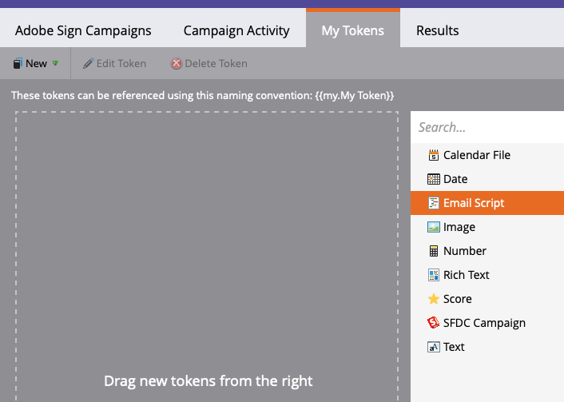

# Microsoft Dynamics 365およびMarketo向けAcrobat Signを使用したリマインダーの送信

一定期間後に契約書が未署名のままになったときに電子メールでリマインダーを送信する方法について説明します。 この統合には、Acrobat Sign、Microsoft Dynamics向けAcrobat Sign、Marketo、Marketo Microsoft Dynamics Syncが使用されます。

## 前提条件

1. Marketo Microsoft Dynamics Syncをインストールします。

   Microsoft Dynamics Syncの情報と最新のプラグインは、[こちら](https://experienceleague.adobe.com/docs/marketo/using/product-docs/crm-sync/microsoft-dynamics/marketo-plugin-releases-for-microsoft-dynamics.html)から入手できます。

1. [Microsoft Dynamics用Acrobat Sign](https://appsource.microsoft.com/ja-jp/product/dynamics-365/adobesign.f3b856fc-a427-4d47-ad4b-d5d1baba6f86)をインストールします。

   このプラグインに関する情報は、[こちら](https://helpx.adobe.com/ca/sign/using/microsoft-dynamics-integration-installation-guide.html)から入手できます。

## カスタムオブジェクトの検索

Microsoft Dynamics SyncとDynamics用Acrobat SignのMarketoの設定が完了すると、Marketo管理ターミナルに2つの新しいオプションが表示されます。


1. **[!UICONTROL Dynamicsエンティティ同期]**&#x200B;をクリックします。

   カスタムエンティティを同期する前に、同期を無効にする必要があります。 初めて使用する場合は、[**スキーマの同期**]をクリックします。 それ以外の場合は、[**スキーマの更新**]をクリックします。

   

## カスタムオブジェクトの同期

1. 右側で、[!UICONTROL リード]、[!UICONTROL 取引先担当者]、および[!UICONTROL 取引先企業]ベースのカスタムオブジェクトを見つけます。

   * [!UICONTROL リード]がDynamicsで契約書に署名していないときにリマインダーを送信する場合は、**[!UICONTROL リード]**&#x200B;の下にあるオブジェクトの&#x200B;**同期**&#x200B;を有効にします。

   * [!UICONTROL 取引先担当者]がDynamicsで契約書に署名していないときにリマインダーを送信する場合は、**[!UICONTROL 取引先担当者]**&#x200B;のオブジェクトに対して&#x200B;**同期**&#x200B;を有効にします。

   * [!UICONTROL アカウント]がDynamicsで契約書に署名していないときにリマインダーを送信する場合は、**[!UICONTROL アカウント]**&#x200B;のオブジェクトに対して&#x200B;**同期**&#x200B;を有効にしてください。

   * 目的の&#x200B;**[!UICONTROL 親]**&#x200B;の下にある契約オブジェクトに対して&#x200B;**同期**&#x200B;を有効にします（[!UICONTROL リード]、[!UICONTROL 連絡先]、または[!UICONTROL アカウント]）。

   

1. 新しいウィンドウで、[契約書]で必要なプロパティを選択し、[**制約**]と[**トリガー**]のボックスを有効にして、マーケティング活動に公開します。

   

   

1. カスタムオブジェクトで同期を有効にした後、同期を再アクティベートします。

   管理ターミナルに戻り、**Microsoft Dynamics**&#x200B;をクリックしてから、**同期を有効にする**&#x200B;をクリックしてください。

   

   

## プログラムとトークンの作成

1. Marketoの「マーケティング活動」セクションで、左側のバーの&#x200B;**「マーケティング活動」**&#x200B;を右クリックします。

   **新しいキャンペーンフォルダー**&#x200B;を選択し、名前を付けます。

   

1. 作成されたフォルダーを右クリックし、**新規プログラム**&#x200B;を選択して、名前を付けます。

   その他はすべて既定のままにして、[**作成**]をクリックします。

   

   

1. **マイトークン**&#x200B;をクリックし、**電子メールスクリプト**&#x200B;をキャンバスにドラッグします。

   

1. 名前を付けて、**クリックして編集**&#x200B;をクリックしてください。

   

1. 右側の&#x200B;**[!UICONTROL カスタムオブジェクト]**&#x200B;を展開し、**[!UICONTROL 契約書]**&#x200B;オブジェクトを展開します。

   [!UICONTROL 名前]、契約書のステータス、送信日、現在の署名者URLを見つけてキャンバスにドラッグします。

1. これらのトークンを使用してVelocityスクリプトを記述し、1週間署名されていない契約書の契約書URLを表示します。 現在の日付を送信日と比較する例を次に示します。

   ```
   #foreach($agreement in $adobe_agreementList)
       #if($agreement.adobe_esagreementstatus == "Out for Signature")
           #set($todayCalObj = $date.toCalendar($date.toDate("yyyy-MM-dd",$date.get('yyyy-MM-dd'))) )
           #set($dateSentCalObj = $date.toCalendar($date.toDate("yyyy-MM-dd",$agreement.adobe_datesent)) )
           #set($dateDiff = ($todayCalObj.getTimeInMillis() - $dateSentCalObj.getTimeInMillis()) / 86400000 )
   
           #if($dateDiff >= 7)
               #set($agreementName = $agreement.adobe_name)
               #set($agreementURL = $agreement.adobe_currentsignerurl.substring(8))
               #break
           #else
           #end
       #else
       #end
   #end
   
   #if(${agreementName})
       <a href="https://${agreementURL}">${agreementName}</a>
   #else
       Please contact us. 
   #end
   ```

1. 「**[!UICONTROL 保存]**」をクリックします。

## リマインダーを作成してパーソナライズする

パーソナライズの例としては、署名者の名前、契約書の名前、契約書へのリンクなどがあります。

1. 作成したプログラムを右クリックして、**[!UICONTROL 新しいローカルアセット]**&#x200B;をクリックし、**[!UICONTROL 電子メール]**&#x200B;を選択します。

   

1. 新しいタブで、電子メールの&#x200B;**[!UICONTROL 名前]**&#x200B;と&#x200B;**[!UICONTROL 説明]**&#x200B;を入力し、テンプレートピッカーからテンプレートを選択します。

   

1. 「**[!UICONTROL 作成]**」をクリックします。

1. **[!UICONTROL 差出人の名前]**&#x200B;と&#x200B;**[!UICONTROL 差出人のアドレス]**&#x200B;を設定します。

   

1. メッセージ本文をクリックして、エディターをアクティブにします。

   「**[!UICONTROL トークンを挿入]**」ボタンをクリックし、作成したカスタム契約書URLトークンを見つけて、「**[!UICONTROL 挿入]**」をクリックします。 電子メールのカスタマイズを完了し、[**[!UICONTROL 保存]**]をクリックします。

   

1. 契約書が割り当てられたプロファイルを使用してプレビューする。

   契約書名をラベルとして含んだURLへのリンクが表示されます。

   

## スマートキャンペーンフィルターの設定

1. 作成したプログラムを右クリックし、[**[!UICONTROL 新しいスマートキャンペーン]**]をクリックします。

   

1. 選択した名前を指定して、[**[!UICONTROL 作成]**]をクリックします。

   

1. 「**[!UICONTROL 契約書あり]**」を検索してクリック&amp;ドラッグし、スマートリストに追加します。

   

   トリガーに公開するフィールドは、**[!UICONTROL 制約の追加]**&#x200B;で使用できる必要があります。

1. **[!UICONTROL 契約書のステータス]**&#x200B;と、フィルター処理に使用するその他のフィールドを選択します。

   追加した各フィールドについて、フィルターに使用する値を定義します。 この場合、**[!UICONTROL 契約書のステータス]**&#x200B;が&#x200B;*署名用に送信*&#x200B;で、**[!UICONTROL 送信日]**&#x200B;が&#x200B;*過去1週間*&#x200B;の場合にのみトリガーされます。

   

   >[!NOTE]
   >
   > 特定の契約書に対してのみキャンペーンを実行する場合は、**名前**&#x200B;などの一意のIDを制約に追加します。

1. 「スケジュール」タブで、キャンペーン対象ユーザーを確認し、資格を付与するユーザーを確認します。

   

## スマートキャンペーンフローの設定

キャンペーンフィルター&#x200B;**有効期限までの日数**&#x200B;が使用されたため、スケジュールされた定期的なキャンペーンを使用できます。

1. [!UICONTROL スマートキャンペーン]で「**[!UICONTROL フロー]**」タブをクリックします。

   **電子メールを送信**&#x200B;フローを検索してキャンバスにドラッグし、前のセクションで作成したリマインダー電子メールを選択します。

   

1. スマートキャンペーンの「**[!UICONTROL スケジュール]**」タブをクリックします。 キャンペーンフローが、**スマートキャンペーン設定**&#x200B;で1人につき1回のみ実行されるように制限されていることを確認してください。 次に、「**定期的なアイテムのスケジュール**」タブをクリックします。

   

1. **スケジュール**&#x200B;を&#x200B;_毎日_&#x200B;に設定します。 必要に応じて、キャンペーンの開始日時および終了日を選択します。

   
