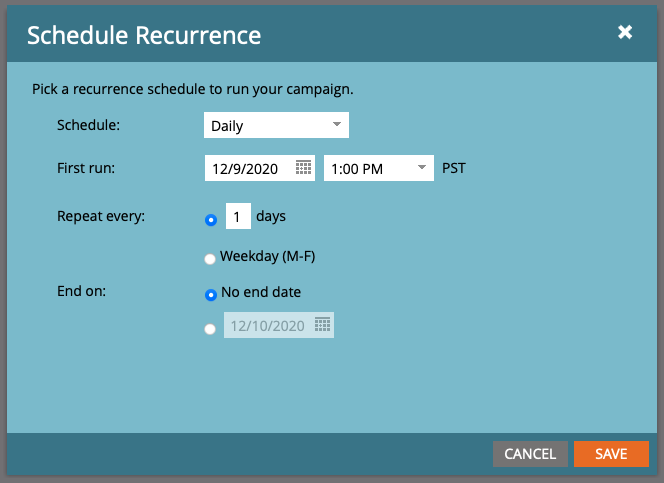

# Microsoft Dynamics 365およびMarketo用Adobe Signを使用してアラームを送信する

契約が一定期間署名されていない場合に、電子メールで通知を送信する方法を説明します。 この統合では、Adobe Sign、Adobe Sign for Microsoft Dynamics、Marketo、およびMarketo Microsoft Dynamics Syncが使用されます。

## 前提条件

1. Marketo Microsoft Dynamics Syncをインストールします。

   Microsoft Dynamics Syncの情報と最新のプラグインは、[ここで入手できます。](https://experienceleague.adobe.com/docs/marketo/using/product-docs/crm-sync/microsoft-dynamics/marketo-plugin-releases-for-microsoft-dynamics.html)

1. [Microsoft Dynamics用Adobe Sign](https://appsource.microsoft.com/ja-jp/product/dynamics-365/adobesign.f3b856fc-a427-4d47-ad4b-d5d1baba6f86)をインストールします。

   このプラグインに関する情報は、[ここで入手できます。](https://helpx.adobe.com/ca/sign/using/microsoft-dynamics-integration-installation-guide.html)

## カスタムオブジェクトを検索する

Marketo Microsoft Dynamics SyncとAdobe Sign for Dynamicsの構成が完了すると、Marketo管理者ターミナルに2つの新しいオプションが表示されます。


1. [**[!UICONTROL ダイナミクスエンティティ] [同期]**]をクリックします。

   カスタムエンティティを同期する前に、同期を無効にする必要があります。 初めての場合は、[**スキーマの同期**]をクリックします。 それ以外の場合は、**[スキーマの更新]**&#x200B;をクリックします。

   

## カスタムオブジェクトを同期する

1. 右側で、[!UICONTROL リード]、[!UICONTROL 連絡先]、[!UICONTROL アカウント]ベースのカスタムオブジェクトを探します。

   * **Leadが** Dynamicsで契約に署名していな **** い場合にアラームを送信する場合は、[Lead]の下のオ  ブジェクトに対して[同期]を有効にします。

   * **ContactasがDynamicsで契約に** 署名していない場合に、Contactifの下にあ **** るオブジェクトに対して[同期]を有効にし、  Contactasが通知を送信します。

   * **Accountsが** Dynamicsで契約に署名していな **** い場合に通知を送信する場合は、[アカウント]の下のオ  ブジェクトに対して[同期]を有効にします。

   * **希望す** る契約オブジェクトに対して「同期」を有効にします **[!UICONTROL (「連絡先]** 」、「連絡先」[!UICONTROL 、または「親」「取引先]  」「取引先」「取引先」)。

   

1. 新しいウィンドウで、[契約]で必要なプロパティを選択し、[**制約**]と[**トリガ**]のボックスを有効にして、マーケティング活動に公開します。

   

   

1. カスタムオブジェクトで同期を有効にした後、同期を再アクティブ化します。

   管理者ターミナルに戻り、**Microsoft Dynamics**&#x200B;をクリックし、**[同期を有効にする]**&#x200B;をクリックします。

   

   

## プログラムとトークンの作成

1. 「マーケティング」の「マーケティング活動」セクションで、左側のバーの「**マーケティング活動**」を右クリックします。

   [**新しいキャンペーンフォルダ**]を選択し、名前を付けます。

   

1. 作成したフォルダを右クリックし、[**新しいプログラム**]を選択して、名前を付けます。

   他の設定はデフォルトのままにし、**作成**&#x200B;をクリックします。

   

   

1. **マイ・トークン**&#x200B;をクリックし、**電子メール・スクリプト**&#x200B;をキャンバスにドラッグします。

   

1. 名前を付け、[**クリックして**&#x200B;を編集]をクリックします。

   

1. 右側の[**[!UICONTROL カスタムオブジェクト]**]を展開し、**[!UICONTROL 契約]**&#x200B;オブジェクトを展開します。

   [!UICONTROL 名前]、契約ステータス、送信日、現在の署名者のURLを検索し、キャンバスにドラッグします。

1. これらのトークンを使用してVelocityスクリプトを作成し、1週間の間署名されていない契約の契約URLを表示します。 現在の日付を[送信日]と比較する例を次に示します。

   ```
   #foreach($agreement in $adobe_agreementList)
       #if($agreement.adobe_esagreementstatus == "Out for Signature")
           #set($todayCalObj = $date.toCalendar($date.toDate("yyyy-MM-dd",$date.get('yyyy-MM-dd'))) )
           #set($dateSentCalObj = $date.toCalendar($date.toDate("yyyy-MM-dd",$agreement.adobe_datesent)) )
           #set($dateDiff = ($todayCalObj.getTimeInMillis() - $dateSentCalObj.getTimeInMillis()) / 86400000 )
   
           #if($dateDiff >= 7)
               #set($agreementName = $agreement.adobe_name)
               #set($agreementURL = $agreement.adobe_currentsignerurl.substring(8))
               #break
           #else
           #end
       #else
       #end
   #end
   
   #if(${agreementName})
       <a href="https://${agreementURL}">${agreementName}</a>
   #else
       Please contact us. 
   #end
   ```

1. 「**[!UICONTROL 保存]**」をクリックします。

## アラームを作成し、個人用設定を追加します

次に、個人用設定の例を示します。署名者の氏名、契約の名称、契約へのリンク等

1. 作成したプログラムを右クリックし、**[!UICONTROL 新しいローカル資産]**&#x200B;をクリックし、**[!UICONTROL 電子メール]**&#x200B;を選択します。

   

1. 新しいタブで、電子メールの&#x200B;**[!UICONTROL 名前]**&#x200B;と&#x200B;**[!UICONTROL 説明]**&#x200B;を入力し、テンプレートの選択からテンプレートを選択します。

   

1. 「**[!UICONTROL 作成]**」をクリックします。

1. **[!UICONTROL 差出人]**&#x200B;と&#x200B;**[!UICONTROL 差出人アドレス]**&#x200B;を設定します。

   

1. メッセージ本文をクリックして、エディタをアクティブにします。

   「**[!UICONTROL トークンの挿入]**」ボタンをクリックし、作成したカスタム契約URLトークンを探し、「**[!UICONTROL 挿入]**」をクリックします。 電子メールのカスタマイズを終了し、[**[!UICONTROL 保存]**]をクリックします。

   

1. 免除承諾が割り当てられたプロファイルを使用してプレビューします。

   URLへのリンクが表示され、「契約名」がラベルとして表示されます。

   

## スマートキャンペーンフィルタの設定

1. 作成したプログラムを右クリックし、**[!UICONTROL 「新規スマートキャンペーン]**」をクリックします。

   

1. 選択する名前を入力し、[**[!UICONTROL 作成]**]をクリックします。

   

1. を検索し、**[!UICONTROL 「同意あり」]**&#x200B;をスマート・リストにドラッグします。

   

   トリガに公開するフィールドは、**[!UICONTROL Add Constraint]**&#x200B;で使用できるはずです。

1. [**[!UICONTROL 契約ステータス]**]を選択し、フィルタに使用するその他のフィールドを選択します。

   追加する各フィールドに対して、フィルタに使用する値を定義します。 この場合、**[!UICONTROL 契約の状態]**&#x200B;が&#x200B;*署名*&#x200B;に対して送信&#x200B;**[!UICONTROL が&#x200B;*過去1週間*前に送信]**&#x200B;に対して送信された場合にのみトリガーされます。

   

   >[!NOTE]
   >
   > このキャンペーンを特定の契約に対してのみ実行する場合は、制約に一意の識別子（**名前**&#x200B;など）を追加します。

1. キャンペーンの対象ユーザーを確認し、「Schedule」タブで資格を得るユーザーを確認します。

   

## スマート・キャンペーン・フローの設定

キャンペーンフィルター&#x200B;**期限切れまでの日数**&#x200B;が使用されていたので、キャンペーンの定期的なスケジュールを使用できます。

1. [!UICONTROL スマートキャンペーン]の&#x200B;**[!UICONTROL 「フロー]**」タブをクリックします。

   「**電子メールの送信**」フローを検索してキャンバスにドラッグし、前のセクションで作成したアラーム電子メールを選択します。

   

1. スマート・キャンペーンの「**[!UICONTROL スケジュール]**」タブをクリックします。 **スマートキャンペーン設定**&#x200B;で、キャンペーンフローが1人に1回だけ実行されるように制限されていることを確認します。 次に、[**定期的なスケジュール**]タブをクリックします。

   

1. **スケジュール**&#x200B;を&#x200B;_日_&#x200B;に設定します。 必要に応じて、キャンペーンの開始日と開始時刻と終了日を選択します。

   

>[!TIP]
>
>このチュートリアルは、エクスペリエンスリーグで無料で入手できるAdobe Sign for Microsoft Dynamics and Marketo](https://experienceleague.adobe.com/?recommended=Sign-U-1-2021.1)を使用して、コース[セールスサイクルを短縮するコースの一部です。