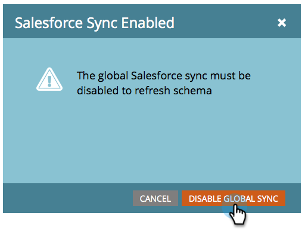
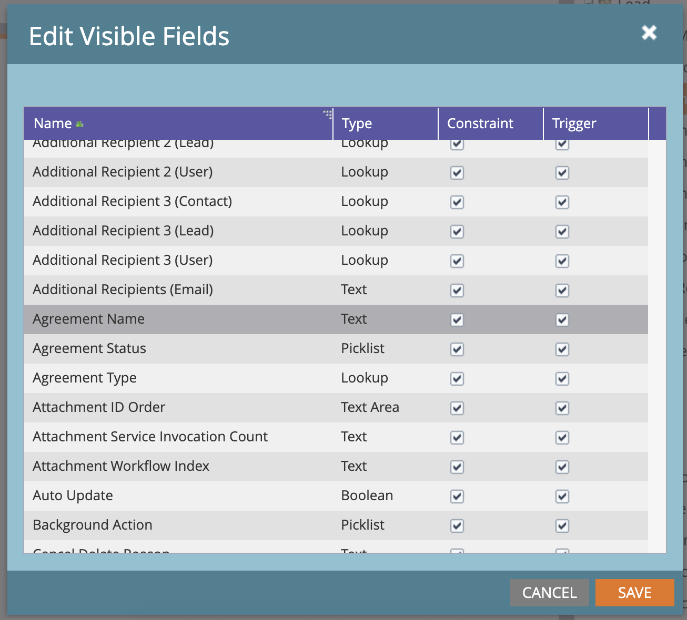

# Salesforce向けAcrobat SignおよびMarketo設定ガイドを使用したリマインダーの送信

一定期間後に契約書が未署名のままになったときに、Marketoから電子メールによるリマインダーを送信する方法について説明します。 この統合には、Acrobat Sign、Salesforce向けAcrobat Sign、Marketo、MarketoとSalesforce Syncが使用されます。

## 前提条件

1. Marketo Salesforce Syncをインストールします。

   情報およびSalesforce Syncの最新プラグインは、[こちら](https://experienceleague.adobe.com/docs/marketo/using/product-docs/crm-sync/salesforce-sync/understanding-the-salesforce-sync.html)から入手できます。

1. Salesforce用Acrobat Signをインストールします。

   このプラグインに関する情報は、[こちら](https://helpx.adobe.com/ca/sign/using/salesforce-integration-installation-guide.html)から入手できます。

## カスタムオブジェクトの検索

Marketo Salesforce SyncとSalesforce向けAcrobat Signの設定が完了すると、Marketo管理ターミナルに新しいオプションがいくつか表示されます。


1. 初めて使用する場合は、[**スキーマの同期**]をクリックします。 それ以外の場合は、[**スキーマの更新**]をクリックします。

   

1. グローバル同期が実行されている場合は、[**グローバル同期を無効にする**]をクリックして無効にします。

   

1. **[スキーマの更新]**&#x200B;をクリックします。

   

## カスタムオブジェクトの同期

右側には、リード、取引先担当者、およびアカウントベースのカスタムオブジェクトを参照してください。

リードがSalesforceで契約書に署名していないときにリマインダーを送信する場合は、リードの下にあるオブジェクトの&#x200B;**同期**&#x200B;を有効にします。

取引先担当者がSalesforceで契約書に署名していないときにリマインダーを送信する場合は、取引先担当者のオブジェクトに対して&#x200B;**同期**&#x200B;を有効にします。

アカウントがSalesforceで契約書に署名していないときにリマインダーを送信する場合は、「アカウント」のオブジェクトの&#x200B;**同期**&#x200B;を有効にします。

1. 目的の親（リード、取引先担当者、または取引先企業）の下に表示される&#x200B;**契約書**&#x200B;オブジェクトに対して&#x200B;**同期**&#x200B;を有効にします。 同期したい他のカスタムオブジェクトに対してこの操作を行います。

   

1. 次のアセットは、**同期を有効にする**&#x200B;方法を示しています。

   

   

## カスタムオブジェクトフィールドをトリガーに公開する

1. グローバル同期が無効になっている間に、同期を有効にした契約書のカスタムオブジェクトを選択し、**表示フィールドの編集**&#x200B;を行います。

1. トリガー列の「契約書名」フィールドを確認して、キャンペーンアクショントリガーに公開します。 フィルターの条件にする他のフィールドをオンにして、**保存**&#x200B;します。

   

   

1. カスタムオブジェクトに対する同期の有効化とトリガー値の表示が完了したら、同期を再アクティベートする必要があります。

   

## プログラムとトークンの作成

1. Marketoの「マーケティング活動」セクションで、左側のバーの&#x200B;**マーケティング活動**&#x200B;を右クリックし、**新規キャンペーンフォルダー**&#x200B;を選択して、名前を付けます。

   

1. 作成されたフォルダーを右クリックし、**新規プログラム**&#x200B;を選択して、名前を付けます。 その他はすべて既定のままにして、[**作成**]をクリックします。

   

   

1. **マイトークン**&#x200B;をクリックし、**電子メールスクリプト**&#x200B;をキャンバスにドラッグします。

   

1. 名前を付けて、**クリックして編集**&#x200B;をクリックしてください。

   

1. 右側の&#x200B;**カスタムオブジェクト**&#x200B;を展開し、**契約書**&#x200B;オブジェクトを展開します。 契約書名、契約書のステータス、署名日、署名URLを見つけてキャンバスにドラッグします。

1. これらのトークンを使用してVelocityスクリプトを記述し、1週間署名されていない契約書の契約書URLを表示します。 現在の日付と送信日を比較する例を次に示します。

   ```
   #foreach($agreement in $echosign_dev1__SIGN_Agreement__cList)
       #if($agreement.echosign_dev1__Status__c == "Out for Signature")
           #set($todayCalObj = $date.toCalendar($date.toDate("yyyy-MM-dd",$date.get('yyyy-MM-dd'))) )
           #set($dateSentCalObj = $date.toCalendar($date.toDate("yyyy-MM-dd",$agreement.echosign_dev1__DateSent__c)) )
           #set($dateDiff = ($todayCalObj.getTimeInMillis() - $dateSentCalObj.getTimeInMillis()) / 86400000 )
   
           #if($dateDiff >= 7)
               #set($agreementName = $agreement.Name)
               #set($agreementURL = $agreement.echosign_dev1__Signing_URL__c.substring(8))
               #break
           #else
           #end
       #else
       #end
   #end
   
   #if(${agreementName})
       <a href="https://${agreementURL}">${agreementName}</a>
   #else
       Please contact us. 
   #end
   ```

1. 「**保存**」をクリックします。

## リマインダーを作成してパーソナライズする

パーソナライズの例としては、署名者の名前、契約書の名前、契約書へのリンクなどがあります。

1. 作成したプログラムを右クリックして、**新しいローカルアセット**&#x200B;をクリックし、**電子メール**&#x200B;を選択します。

   

1. 新しいタブで、電子メールの&#x200B;**名前**&#x200B;と&#x200B;**説明**&#x200B;を入力し、テンプレートピッカーからテンプレートを選択します。 「**作成**」をクリックします。

   

1. **差出人の名前**&#x200B;と&#x200B;**差出人のアドレス**&#x200B;を設定します。

   

1. メッセージ本文をクリックして、エディターをアクティブにします。 「**トークンを挿入**」ボタンをクリックし、作成したカスタム契約書URLトークンを見つけて、「**挿入**」をクリックします。 電子メールのカスタマイズを完了し、[**保存**]をクリックします。

   

1. 契約書が割り当てられたプロファイルを使用してプレビューする。 契約書名をラベルとして含んだURLへのリンクが表示されます。

   

## スマートキャンペーンフィルターの設定

1. 作成したプログラムを右クリックし、[**新しいスマートキャンペーン**]をクリックします。

   

1. 選択した名前を指定して、[**作成**]をクリックします。

   

1. 「**契約書あり**」を検索してクリック&amp;ドラッグし、スマートリストに追加します。

   

1. これで、トリガーに公開したフィールドが、**制約の追加**&#x200B;で使用できるようになります。 **契約書のステータス**&#x200B;と、フィルター処理に使用するその他のフィールドを選択します。 追加した各フィールドについて、フィルターに使用する値を定義します。 この場合、**契約書のステータス**&#x200B;が署名用に送信されておらず、**送信日**&#x200B;が7日前を経過した場合にのみトリガーされます。

   

   >[!NOTE]
   >
   > 特定の契約書に対してのみキャンペーンを実行する場合は、**契約書名**&#x200B;など、制約に対する一意のIDを指定します。

1. 「スケジュール」タブで、キャンペーン対象ユーザーを確認し、資格を付与するユーザーを確認します。

   

## スマートキャンペーンフローの設定

キャンペーンフィルター&#x200B;**Days Unsigned**&#x200B;が使用されたため、スケジュールされた定期的なキャンペーンを使用できます。

1. スマートキャンペーンの「**フロー**」タブをクリックします。 **電子メールを送信**&#x200B;フローを検索してキャンバスにドラッグし、前のセクションで作成したリマインダー電子メールを選択します。

   

1. スマートキャンペーンの「**スケジュール**」タブをクリックします。 キャンペーンフローが、**スマートキャンペーン設定**&#x200B;で1人につき1回のみ実行されるように制限されていることを確認してください。 次に、「**定期的なアイテムのスケジュール**」タブをクリックします。

   

1. **スケジュール**&#x200B;を毎日に設定し、必要に応じてキャンペーンの開始日時と終了日を選択します。

   

