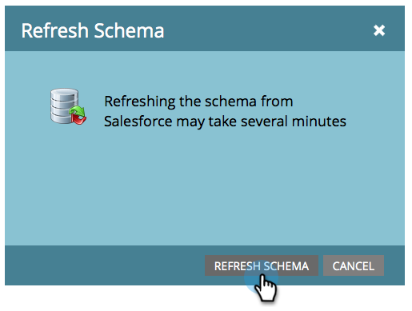

# Salesforce 用Acrobat SignおよびMarketo設定ガイドを使用したリマインダーの送信

一定期間が経過しても契約書が署名されていない場合に、Marketoから電子メールでリマインダーを送信する方法について説明します。 この統合では、Acrobat Sign、Salesforce 用Acrobat Sign、Marketo、Marketoと Salesforce の同期を使用します。

## 前提条件

1. Marketo Salesforce Sync をインストールします。

   情報と Salesforce Sync 用の最新プラグインが利用可能です [はい。](https://experienceleague.adobe.com/docs/marketo/using/product-docs/crm-sync/salesforce-sync/understanding-the-salesforce-sync.html)

1. Salesforce 用Acrobat Signをインストールします。

   このプラグインに関する情報は利用可能です [はい。](https://helpx.adobe.com/ca/sign/using/salesforce-integration-installation-guide.html)

## カスタムオブジェクトの検索

Marketo Salesforce 同期と Salesforce 用Acrobat Signの設定が完了すると、Marketo管理ターミナルにいくつかの新しいオプションが表示されます。


1. クリック **スキーマの同期** 初めての方は。 それ以外の場合は、「 **スキーマの更新**&#x200B;を選択します。

   

1. グローバル同期が実行されている場合は、「 **グローバル同期を無効にする**&#x200B;を選択します。

   

1. クリック **スキーマの更新**&#x200B;を選択します。

   

## カスタムオブジェクトの同期

右側のセクションでは、リード、コンタクト、アカウントベースのカスタムオブジェクトを参照してください。

**同期を有効にする** Salesforce でリードが契約書に署名していないときにリマインダーを送信する場合は、リードの下にあるオブジェクトに対してリマインダーを送信します。

**同期を有効にする** 取引先担当者が Salesforce で契約書に署名していないときにリマインダーを送信する場合は、取引先担当者の下のオブジェクトに対してリマインダーを送信します。

**同期を有効にする** を参照してください。

1. **同期を有効にする** 」を **契約書** 目的の親（リード、取引先担当者または取引先企業）の下に表示されるオブジェクト。 同期したい他のカスタムオブジェクトに対してこの操作を行います。

   

1. 次のアセットは、 **同期を有効にする**&#x200B;を選択します。

   

   

## カスタムオブジェクトフィールドのトリガーへの公開

1. グローバル同期が無効になっている間に、同期を有効にした契約書カスタムオブジェクトを選択し、 **表示フィールドの編集**&#x200B;を選択します。

1. 「トリガー」列の「契約書名」フィールドをオンにして、キャンペーンのアクショントリガーに公開します。 フィルタリングに使用する他のフィールドをオンにして、 **保存**&#x200B;を選択します。

   

   

1. カスタムオブジェクトの同期を有効にしてトリガー値を表示し終わったら、同期を再度有効にしてください。

   

## プログラムとトークンの作成

1. Marketoの「Marketing Activities」セクションで、 **マーケティング活動** 左側のバーで、「 **新しいキャンペーンフォルダー**&#x200B;に名前を付けます。

   

1. 作成したフォルダを右クリックし、「 **新規プログラム**&#x200B;に名前を付けます。 その他はすべてデフォルトのままにして、「 **作成**&#x200B;を選択します。

   

   

1. クリック **マイトークン**&#x200B;ドラッグします  **電子メールスクリプト** キャンバスに移動します。

   

1. ファイル名を指定して、「 **クリックして編集**&#x200B;を選択します。

   

1. 展開 **カスタムオブジェクト** 右側で、 **契約書** します。 契約名、契約状況、署名日、署名 URL を見つけて、キャンバスにドラッグします。

1. これらのトークンを使用して Velocity スクリプトを記述し、1 週間署名されていない契約書の契約書 URL を表示します。 現在の日付と送信日を比較する例を次に示します。

   ```
   #foreach($agreement in $echosign_dev1__SIGN_Agreement__cList)
       #if($agreement.echosign_dev1__Status__c == "Out for Signature")
           #set($todayCalObj = $date.toCalendar($date.toDate("yyyy-MM-dd",$date.get('yyyy-MM-dd'))) )
           #set($dateSentCalObj = $date.toCalendar($date.toDate("yyyy-MM-dd",$agreement.echosign_dev1__DateSent__c)) )
           #set($dateDiff = ($todayCalObj.getTimeInMillis() - $dateSentCalObj.getTimeInMillis()) / 86400000 )
   
           #if($dateDiff >= 7)
               #set($agreementName = $agreement.Name)
               #set($agreementURL = $agreement.echosign_dev1__Signing_URL__c.substring(8))
               #break
           #else
           #end
       #else
       #end
   #end
   
   #if(${agreementName})
       <a href="https://${agreementURL}">${agreementName}</a>
   #else
       Please contact us. 
   #end
   ```

1. 「**保存**」をクリックします。

## リマインダーの作成とパーソナライゼーションの追加

パーソナライゼーションの例は次のとおりです。署名者の名前、契約書の名前、契約書へのリンクなど

1. 作成したプログラムを右クリックし、「 **新しいローカルアセット**&#x200B;を選択し、 **電子メール**&#x200B;を選択します。

   

1. 新しいタブで、 **名前** および **説明** を入力し、テンプレートピッカーからテンプレートを選択します。 「**作成**」をクリックします。

   

1. 設定 **名前から** および **差出人住所**&#x200B;を選択します。

   

1. メッセージ本文をクリックして、エディタをアクティブにします。 ツールバーの「 **トークンの挿入** 」ボタンをクリックし、作成したカスタム契約書 URL トークンを見つけて、「 **挿入**&#x200B;を選択します。 電子メールのカスタマイズを終了し、「 **保存**&#x200B;を選択します。

   

1. 契約書が割り当てられているプロファイルを使用してプレビューします。 URL へのリンクが表示され、ラベルに契約書名が表示されます。

   

## スマートキャンペーンフィルターの設定

1. 作成したプログラムを右クリックし、「 **新しいスマートキャンペーン**&#x200B;を選択します。

   

1. 名前を指定して、「 **作成**&#x200B;を選択します。

   

1. を検索し、クリック&amp;ドラッグ **契約あり** をスマート・リストに追加します。

   

1. トリガーに公開したフィールドが **拘束を追加**&#x200B;を選択します。 選択 **契約状況** およびフィルタに使用する他のフィールドを選択します。 追加するフィールドごとに、フィルタの基準となる値を定義します。 この場合は、 **契約状況** は署名用に送信され、 **送信日** は 7 日前に過去の日付です。

   

   >[!NOTE]
   >
   > 制約に対する一意の識別子を追加します。 **契約書名**」を選択します。

1. 「スケジュール」タブでキャンペーンのオーディエンスを確認し、対象となるオーディエンスを確認します。

   

## スマート・キャンペーン・フローの設定

キャンペーンフィルター **未署名の日数** を使用した場合は、キャンペーンの定期的なスケジュールを使用できます。

1. ツールバーの「 **流量** タブをクリックします。 テキストを検索して **電子メールを送信** カンバスにフローし、前のセクションで作成したリマインダーメールを選択します。

   

1. ツールバーの「 **スケジュール** タブをクリックします。 キャンペーンフローが、 **スマートキャンペーン設定**&#x200B;を選択します。 次に、「 **定期的なスケジュール** タブを選択します。

   

1. 設定 **スケジュール** 「毎日」に、必要に応じてキャンペーンの開始日時と終了日を選択します。

   

>[!TIP]
>
>このチュートリアルはコースの一部です [Salesforce 向けAcrobat SignとMarketoで販売サイクルを加速](https://experienceleague.adobe.com/?recommended=Sign-U-1-2021.1) それは無料で利用できますExperience League!
