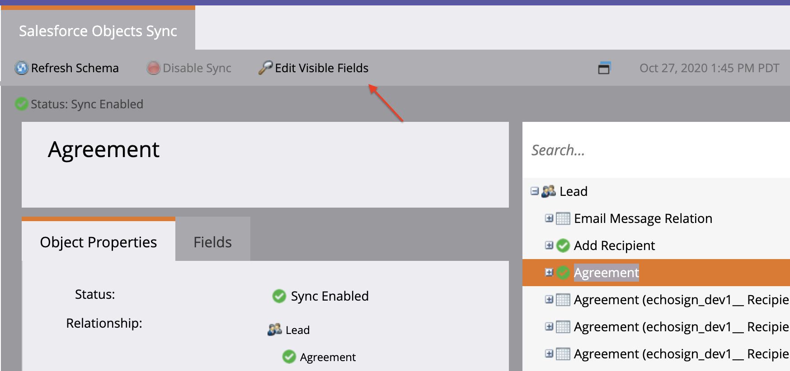

# Salesforce向けAcrobat SignおよびMarketo設定ガイドを使用したリマインダーの送信

一定期間後に契約書が未署名のままになったときに、Marketoから電子メールによるリマインダーを送信する方法について説明します。 この統合には、Acrobat Sign、Salesforce向けAcrobat Sign、Marketo、MarketoとSalesforce Syncが使用されます。

## 前提条件

1. Marketo Salesforce Syncをインストールします。

   情報およびSalesforce Syncの最新プラグインが利用可能です。 [はい。](https://experienceleague.adobe.com/docs/marketo/using/product-docs/crm-sync/salesforce-sync/understanding-the-salesforce-sync.html)

1. Salesforce用Acrobat Signをインストールします。

   このプラグインに関する情報が利用可能です [はい。](https://helpx.adobe.com/ca/sign/using/salesforce-integration-installation-guide.html)

## カスタムオブジェクトの検索

Marketo Salesforce SyncとSalesforce向けAcrobat Signの設定が完了すると、Marketo管理ターミナルに新しいオプションがいくつか表示されます。


1. クリック **スキーマの同期** 初めてお使いの場合 それ以外の場合は、 **スキーマの更新**.

   

1. グローバル同期が実行されている場合は、をクリックして無効にします。 **グローバル同期を無効にする**.

   

1. クリック **スキーマの更新**.

   

## カスタムオブジェクトの同期

右側には、リード、取引先担当者、およびアカウントベースのカスタムオブジェクトを参照してください。

**同期を有効にする** は、リードがSalesforceで契約書に署名していないときにリマインダーを送信する場合のリードの下のオブジェクトです。

**同期を有効にする** （取引先担当者がSalesforceで契約書に署名していないときにリマインダーを送信する場合の取引先担当者のオブジェクト）。

**同期を有効にする** は、アカウントがSalesforceで契約書に署名していないときにリマインダーを送信する場合の「アカウント」のオブジェクトです。

1. **同期を有効にする** のために **契約書** 目的の親（リード、取引先担当者または取引先企業）の下に表示されるオブジェクト。 同期したい他のカスタムオブジェクトに対してこの操作を行います。

   

1. 以下のアセットは、以下の方法を示しています **同期を有効にする**.

   

   

## カスタムオブジェクトフィールドをトリガーに公開する

1. グローバル同期がディアクティベートされている間に、同期を有効にした契約書カスタムオブジェクトを選択し、 **表示フィールドを編集**.

1. トリガー列の「契約書名」フィールドを確認して、キャンペーンアクショントリガーに公開します。 フィルターに使用するその他のフィールドをオンにし、 **保存**.

   

   

1. カスタムオブジェクトに対する同期の有効化とトリガー値の表示が完了したら、同期を再アクティベートする必要があります。

   

## プログラムとトークンの作成

1. Marketoの「Marketing Activities」セクションで、次を右クリックします。 **マーケティング活動** 左側のバーで、 **新規キャンペーンフォルダー**&#x200B;名前を付けてください。

   

1. 作成したフォルダを右クリックし、 **新しいプログラム**&#x200B;名前を付けてください。 それ以外をデフォルトのままにして、 **作成**.

   

   

1. をクリック **マイトークン**&#x200B;をドラッグします  **電子メールスクリプト** カンバスに向かって

   

1. 名前を付けてからクリックしてください **クリックして編集**.

   

1. 展開 **カスタムオブジェクト** 右側で、 **契約書** オブジェクトです。 契約書名、契約書のステータス、署名日、署名URLを見つけてキャンバスにドラッグします。

1. これらのトークンを使用してVelocityスクリプトを記述し、1週間署名されていない契約書の契約書URLを表示します。 現在の日付と送信日を比較する例を次に示します。

   ```
   #foreach($agreement in $echosign_dev1__SIGN_Agreement__cList)
       #if($agreement.echosign_dev1__Status__c == "Out for Signature")
           #set($todayCalObj = $date.toCalendar($date.toDate("yyyy-MM-dd",$date.get('yyyy-MM-dd'))) )
           #set($dateSentCalObj = $date.toCalendar($date.toDate("yyyy-MM-dd",$agreement.echosign_dev1__DateSent__c)) )
           #set($dateDiff = ($todayCalObj.getTimeInMillis() - $dateSentCalObj.getTimeInMillis()) / 86400000 )
   
           #if($dateDiff >= 7)
               #set($agreementName = $agreement.Name)
               #set($agreementURL = $agreement.echosign_dev1__Signing_URL__c.substring(8))
               #break
           #else
           #end
       #else
       #end
   #end
   
   #if(${agreementName})
       <a href="https://${agreementURL}">${agreementName}</a>
   #else
       Please contact us. 
   #end
   ```

1. 「**保存**」をクリックします。

## リマインダーを作成してパーソナライズする

パーソナライズの例としては、署名者の名前、契約書の名前、契約書へのリンクなどがあります。

1. 作成したプログラムを右クリックし、 **新しいローカルアセット**&#x200B;を選択します **電子メール**.

   

1. 新しいタブで、aと入力します。 **名前** および **説明** 電子メールの場合は、テンプレートピッカーからテンプレートを選択します。 「**作成**」をクリックします。

   

1. 設定する **名前から** および **アドレスから**.

   

1. メッセージ本文をクリックして、エディターをアクティブにします。 アイコンをクリック **トークンの挿入** ボタンをクリックし、作成したカスタム契約書URLトークンを見つけて、 **挿入**. 電子メールのカスタマイズを完了して、 **保存**.

   

1. 契約書が割り当てられたプロファイルを使用してプレビューする。 契約書名をラベルとして含んだURLへのリンクが表示されます。

   

## スマートキャンペーンフィルターの設定

1. 作成したプログラムを右クリックし、 **新しいスマートキャンペーン**.

   

1. 選択した名前を入力し、 **作成**.

   

1. を検索し、クリック&amp;ドラッグします **契約書あり** をスマート・リストに追加します。

   

1. これで、トリガーに公開したフィールドが **拘束を追加**. 選択 **契約書ステータス** およびフィルターに使用するその他のフィールド。 追加した各フィールドについて、フィルターに使用する値を定義します。 この場合、トリガーされるのは **契約書ステータス** が署名用に送信され、 **送信日** が7日前に過ぎています。

   

   >[!NOTE]
   >
   > 制約に一意の識別子を付けます。例： **契約書名**&#x200B;特定の契約書に対してのみ、このキャンペーンを実行する場合は、

1. 「スケジュール」タブで、キャンペーン対象ユーザーを確認し、資格を付与するユーザーを確認します。

   

## スマートキャンペーンフローの設定

キャンペーンフィルターです **未署名の日数** が使用されました。キャンペーンに対してスケジュールされた定期的なアイテムを使用できます。

1. アイコンをクリック **流量** タブをクリックします。 検索してドラッグ **電子メールを送信** キャンバスに移動し、前のセクションで作成したリマインダーメールを選択します。

   

1. アイコンをクリック **スケジュール** タブをクリックします。 キャンペーンフローが個人に1回のみ実行されるように制限されていることを確認します。 **スマートキャンペーン設定**. 次に、 **繰り返しのスケジュール** タブをクリックします。

   

1. 設定する **スケジュール** 「毎日」に、キャンペーンの開始日時と終了日を選択します（必要な場合）。

   

>[!TIP]
>
>このチュートリアルはコースの一部です [SalesforceおよびMarketo向けAcrobat Signで販売サイクルを加速](https://experienceleague.adobe.com/?recommended=Sign-U-1-2021.1) それはExperience Leagueで無料で入手できます！
