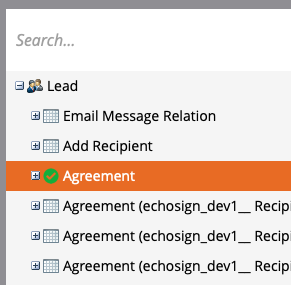

# Adobe Sign for SalesforceおよびMarketo設定ガイドを使用して事前通知を送信する

契約が一定期間署名されていない場合に、Marketoから電子メールで通知を送信する方法を説明します。 この統合では、Adobe Sign、Adobe Sign for Salesforce、Marketo、MarketoとSalesforce Syncを使用します。

## 前提条件

1. Marketo Salesforce Syncをインストールします。

   Salesforce Syncの情報と最新のプラグインは、[ここで入手できます。](https://experienceleague.adobe.com/docs/marketo/using/product-docs/crm-sync/salesforce-sync/understanding-the-salesforce-sync.html)

1. Salesforce用Adobe Signをインストールします。

   このプラグインに関する情報は、[ここで入手できます。](https://helpx.adobe.com/ca/sign/using/salesforce-integration-installation-guide.html)

## カスタムオブジェクトを検索する

Marketo Salesforce SyncとAdobe Sign for Salesforceの設定が完了すると、Marketo Admin Terminalにいくつかの新しいオプションが表示されます。


1. 初めての場合は、[**スキーマの同期**]をクリックします。 それ以外の場合は、**[スキーマの更新]**&#x200B;をクリックします。

   

1. グローバル同期が実行中の場合は、**[グローバル同期を無効にする]**&#x200B;をクリックして無効にします。

   

1. [**スキーマの更新**]をクリックします。

   

## カスタムオブジェクトを同期する

右側の「Lead」、「Contact」、「Account」の各カスタム・オブジェクトを参照してください。

**LeadがSalesforceで** 契約に署名していない場合にリマインダを送信する場合は、「Lead」の下のオブジェクトに対して「Sync」を有効にします。

**連絡先がSalesforceで** 契約に署名していない場合に通知を送信する場合は、[連絡先]の下のオブジェクトに対して[同期]を有効にします。

**AccountがSalesforceで** 契約に署名していない場合にアラームを送信する場合は、Accountの下のオブジェクトに対してSyncを有効にします。

1. **希望す** る親(リード、 **** 連絡先、またはアカウント)の下に表示される「Agreement」オブジェクトの「Sync」を有効にします。同期する他のカスタムオブジェクトに対して、この操作を行います。

   

1. 次のアセットは、**Enable Sync**&#x200B;の方法を示します。

   

   

## カスタムオブジェクトフィールドをトリガに公開します

1. Global Syncが非アクティブ化されている間に、同期を有効にしたAgreementカスタムオブジェクトを選択し、**Edit Visible Fields**&#x200B;を選択します。

1. トリガー列の「契約名」フィールドをチェックして、キャンペーン処理トリガーに公開します。 フィルタに使用する他のフィールドを選択し、**保存**&#x200B;を選択します。

   

   

1. カスタム・オブジェクトで同期を有効にし、トリガー値を公開した後は、yncを再度有効にします。

   

## プログラムとトークンの作成

1. 「マーケティング」の「マーケティング活動」セクションで、左側のバーの「**マーケティング活動**」を右クリックし、「**新規キャンペーンフォルダ**」を選択して名前を付けます。

   

1. 作成したフォルダを右クリックし、[**新しいプログラム**]を選択して、名前を付けます。 他の設定はデフォルトのままにし、**作成**&#x200B;をクリックします。

   

   

1. **マイ・トークン**&#x200B;をクリックし、**電子メール・スクリプト**&#x200B;をキャンバスにドラッグします。

   

1. 名前を付け、[**クリックして**&#x200B;を編集]をクリックします。

   

1. 右側の[**カスタムオブジェクト**]を展開し、**契約**&#x200B;オブジェクトを展開します。 「契約名」、「契約ステータス」、「署名日」および「署名URL」を検索し、キャンバスにドラッグします。

1. これらのトークンを使用してVelocityスクリプトを作成し、1週間の間署名されていない契約の契約URLを表示します。 次に、現在の日付と送信日を比較する例を示します。

   ```
   #foreach($agreement in $echosign_dev1__SIGN_Agreement__cList)
       #if($agreement.echosign_dev1__Status__c == "Out for Signature")
           #set($todayCalObj = $date.toCalendar($date.toDate("yyyy-MM-dd",$date.get('yyyy-MM-dd'))) )
           #set($dateSentCalObj = $date.toCalendar($date.toDate("yyyy-MM-dd",$agreement.echosign_dev1__DateSent__c)) )
           #set($dateDiff = ($todayCalObj.getTimeInMillis() - $dateSentCalObj.getTimeInMillis()) / 86400000 )
   
           #if($dateDiff >= 7)
               #set($agreementName = $agreement.Name)
               #set($agreementURL = $agreement.echosign_dev1__Signing_URL__c.substring(8))
               #break
           #else
           #end
       #else
       #end
   #end
   
   #if(${agreementName})
       <a href="https://${agreementURL}">${agreementName}</a>
   #else
       Please contact us. 
   #end
   ```

1. 「**保存**」をクリックします。

## アラームを作成し、個人用設定を追加します

次に、個人用設定の例を示します。署名者の氏名、契約の名称、契約へのリンク等

1. 作成したプログラムを右クリックし、**新しいローカル資産**&#x200B;をクリックし、**電子メール**&#x200B;を選択します。

   

1. 新しいタブで、電子メールの&#x200B;**名前**&#x200B;と&#x200B;**説明**&#x200B;を入力し、テンプレートの選択からテンプレートを選択します。 「**作成**」をクリックします。

   

1. **差出人**&#x200B;と&#x200B;**差出人アドレス**&#x200B;を設定します。

   

1. メッセージ本文をクリックして、エディタをアクティブにします。 「**トークンの挿入**」ボタンをクリックし、作成したカスタム契約URLトークンを探し、「**挿入**」をクリックします。 電子メールのカスタマイズを終了し、[**保存**]をクリックします。

   

1. 免除承諾が割り当てられたプロファイルを使用してプレビューします。 URLへのリンクが表示され、「契約名」がラベルとして表示されます。

   

## スマートキャンペーンフィルタの設定

1. 作成したプログラムを右クリックし、**「新規スマートキャンペーン**」をクリックします。

   

1. 選択する名前を入力し、[**作成**]をクリックします。

   

1. を検索し、**「同意あり」**&#x200B;をスマート・リストにドラッグします。

   

1. トリガに公開したフィールドは、**Add Constraint**&#x200B;で使用できるはずです。 [**契約ステータス**]を選択し、フィルタに使用するその他のフィールドを選択します。 追加する各フィールドに対して、フィルタに使用する値を定義します。 この場合、**契約ステータス**&#x200B;が署名のために不在で、**送信日**&#x200B;が過去7日前になった場合にのみ、このメッセージがトリガーされます。

   

   >[!NOTE]
   >
   > dこのキャンペーンを特定の契約に対してのみ実行する場合は、制約に対する一意の識別子（**契約名**&#x200B;など）。

1. キャンペーンの対象ユーザーを確認し、「Schedule」タブで資格を得るユーザーを確認します。

   

## スマート・キャンペーン・フローの設定

キャンペーンフィルター&#x200B;**未署名の日**&#x200B;が使用されたため、キャンペーンの定期的なスケジュールを使用できます。

1. スマート・キャンペーンの「**フロー**」タブをクリックします。 「**電子メールの送信**」フローを検索してキャンバスにドラッグし、前のセクションで作成したアラーム電子メールを選択します。

   

1. スマート・キャンペーンの「**スケジュール**」タブをクリックします。 **スマートキャンペーン設定**&#x200B;で、キャンペーンフローが1人に1回だけ実行されるように制限されていることを確認します。 次に、[**定期的なスケジュール**]タブをクリックします。

   

1. 「**スケジュール**」を「日」に設定し、開始日と時刻を選択し、必要に応じてキャンペーンの終了日を選択します。

   

>[!TIP]
>
>このチュートリアルは、エクスペリエンス・リーグで無料で利用できるAdobe Sign for SalesforceとMarketo](https://experienceleague.adobe.com/?recommended=Sign-U-1-2021.1)を使用して、セールス・サイクルを短縮するコース[の一部です。
